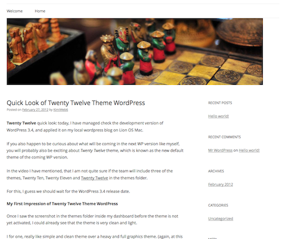

В Wordpress вот уже два года подряд, с наступлением нового года, появляется новая тема по-умолчанию. В 2012 году новая тема Wordpress будет называться **Twenty Twelve**, продолжая сложившуюся традицию: уже были Twenty Ten в 2010, и Twenty Eleven в 2011 годах. Однако новый год наступил уже довольно давно, а новой темы 2012 года все еще нет. Может быть, разработчики готовят нечто совершенно особенное?

Новые функции темы Twenty Twelve [были описаны в блоге разработчиков](http://wpdevel.wordpress.com/2011/12/20/default-theme-twenty-twelve/) еще в декабре. Они обещают, что новая тема будет "отличной от предыдущих, и очень вкусной" :)

### Что нового будет в Twenty Twelve?

Смотрите сами, что появится в новой темя для **Wordpress Twenty Twelve**:

- просмотр поста с форматами записей, если это необходимо;
- изменяемая высота изображения в шапке;
- версия для мобильных устройств (советую прочитать, как [сделать мобильную версию для темы Wordpress](http://oriolo.ru/wordpress/kak-sdelat-mobilnuyu-versiyu-shablona-dlya-wordpress/ "Как сделать мобильную версию шаблона для WordPress"));
- по-умолчанию, статичная страница на главной;
- одинаковый стиль редактора и страниц;
- отказ от неиспользуемых вещей (таких как виджет ephemera);
- в шапке, по-умолчанию, нет изображения.

Эти, и некоторые другие **функции темы Twenty Twelve** можно посмотреть в действии на видео:

<iframe width="560" height="315" src="http://www.youtube.com/embed/x4nihvJf3KQ" frameborder="0" allowfullscreen></iframe>

Также, новая тема обладает [минималистичным дизайном](http://oriolo.ru/web-design/idealnyiy-dizayn/ "Что такое хороший дизайн и как его достичь"), возможностью добавить виджеты, настроить пользовательские меню, изменить цвет фона страницы и картинку в шапке. Теперь, по-умолчанию с темой не поставляются изображения для шапки: теперь их надо загружать со своего компьютера.

Разработчики [сообщают](http://wpdevel.wordpress.com/2012/02/28/team-update-twenty-twelve-4/ "Twenty Twelve"), что тема **Twenty Twelve** выйдет только в Wordpress 3.5, так что еще несколько месяцев мы не сможем оценить новую тему в действии.
