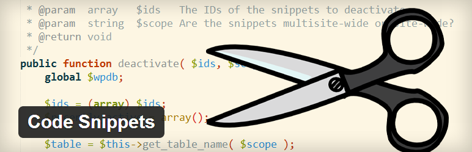
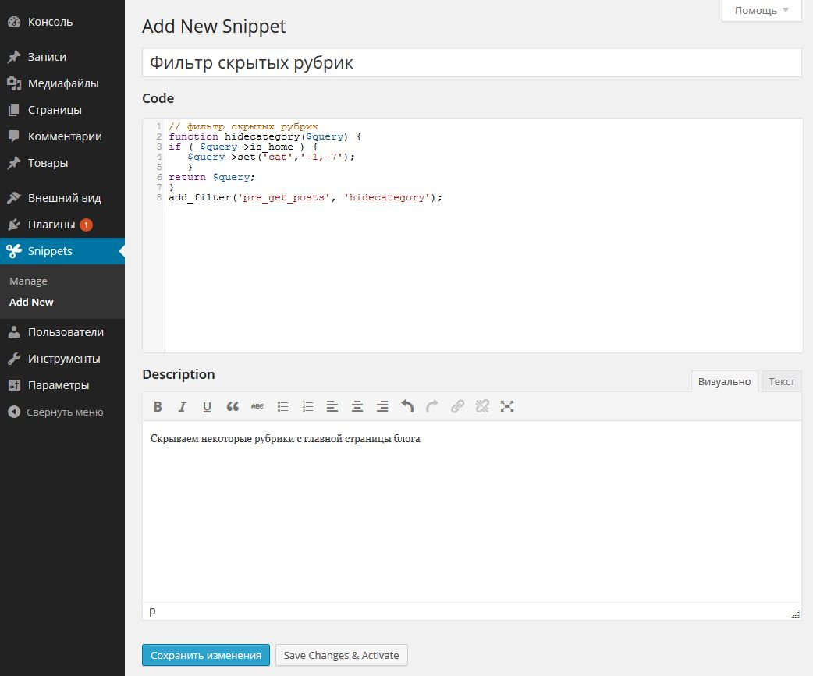
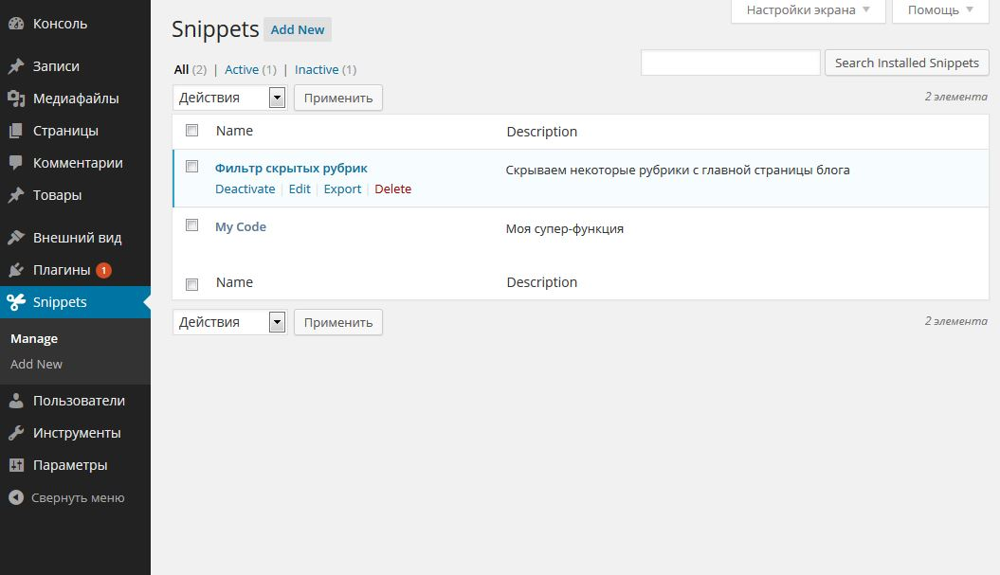

Совсем недавно я писала о том, что в некоторых случаях намного лучше использовать плагин, чем вносить изменения в файл functions.php. Так что если такой вопрос у вас возник, смотрите инфографику, которая поможет определить, [что лучше, плагин или код в functions](http://oriolo.ru/infografika-plagin-ili-snippet/ "Что использовать: плагин или сниппет? Инфографика"). Но кроме того способа, который я описала, существует еще один, не менее удобный способ управления пользовательскими функциями в WordPress. Он связан с использованием специального плагина, который позволяет удобно организовать работу со сниппетами: Code Snippets.

Плагин [Code Snippets](http://wordpress.org/plugins/code-snippets/) позволяет эффективно организовать работу с дополнительными функциями, которые обычно пользователи вставляют в файл functions.php.

То есть, вместо того, чтобы что-то вставлять в functions, можно при помощи этого плагина создать сниппет, и включить его. Это позволит не потерять функции при смене темы, а также упростит поиск конфликтов, если вдруг что-то перестанет работать.

Плагин устанавливается как обычно. После установки в левом меню добавится новый пункт: Snippets. Добавление новых функций происходит также, как добавление новых записей в блог.

Для примера, давайте возьмем мой пост о том, как [скрыть некоторые рубрики с главной](http://oriolo.ru/skryivaem-zapisi-opredelennyih-rubrik-s-glavnoy-stranitsyi/ "Скрываем записи определенных рубрик с главной страницы") страницы блога. Нажимаем "Add New", и добавляем свой код, даем ему название, и описываем, что он делает:

После этого можно нажать на кнопку "Сохранить", чтобы код записался в систему, или "Сохранить и активировать", чтобы код начал работать.

Управление сниппетами организовано также, как управление плагинами: их можно активировать, деактивировать, и даже делать экспорт:

Очень рекомендую попробовать, плагин Code Snippets намного упрощает работу с пользовательскими функциями.
