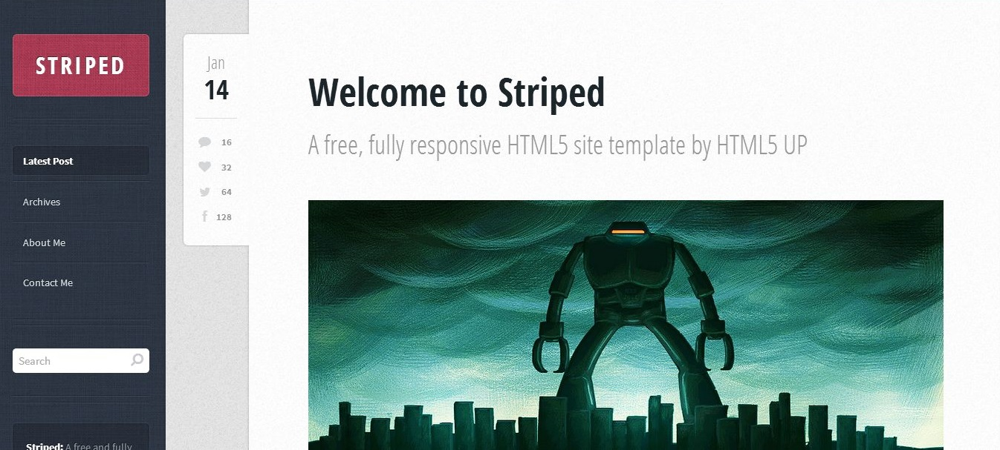

Это четвертый пост из серии о том, **как создать собственную тему для блога**. Из него вы узнаете, как добавить к теме поддержку миниатюр изображений, и сделать вывод миниатюр на главной странице блога.

Урок обновлен 6 сентября 2015 г. Файлы урока вы можете скачать [здесь](https://github.com/ierhyna/wp-theme-howto/archive/Step_4.zip).

Предыдущие посты из серии можно найти по метке: [создание темы из верстки](http://oriolo.ru/series/create-wp-theme-from-html/).

### Что такое миниатюры изображений?

Миниатюры изображений  для записей используются во всех современных темах для WordPress. Миниатюра - это изображение, которое можно назначить для каждой записи, и которое будет выводиться в шаблоне рядом с текстом.

Раньше они были достаточно маленькие по размеру, от чего и произошло название "миниатюра", или, по-английски, thumbnail. Но сейчас в темах могут использоваться и очень большие миниатюры, которые могут быть размером как ширина страницы. Например, в шаблоне Striped, из которого мы делаем тему, миниатюры представляют собой полноформатные изображения.

[](http://oriolo.ru/wp-content/uploads/2014/02/screenshot.jpg)

 

Но наша тема пока не поддерживает вывод миниатюр. Давайте это исправим.

### Поддержка миниатюр в functions.php

Для того, чтобы добавить к теме поддержку миниатюр, необходимо будет внести изменения в файл functions.php. Поэтому сначала создадим этот файл, а затем добавим в него функцию для поддержки миниатюр:

```php
<?php
if ( function_exists( 'add_theme_support' ) ) { 
	add_theme_support( 'post-thumbnails' ); 
}
?>
```

Теперь вы можете зайти в консоль, нажать "Добавить новую запись" и задать миниатюру для одной или нескольких записей.

Если вы хотите изменить размер миниатюр, то функцию нужно дополнить еще одной строкой:

```php
<?php
if ( function_exists( 'add_theme_support' ) ) { 
	add_theme_support( 'post-thumbnails' ); 
	add_image_size( 'full-thumbnail', 650, 250, true ); // название, ширина, высота, жесткая обрезка
}
?>
```

В этом примере я добавляю собственный размер изображений, который будет называться full-thumbnail, и будет иметь размеры 650х250 пикселей.

### Вывод миниатюр в блоге

Наш следующий шаг - сделать так, чтобы миниатюры были видны на страницах блога.

Сначала, давайте заменим вывод картинки-заглушки на код вывода миниатюр. Для этого в файле index.php, найдите строку

```php

```

и замените ее на функцию, которая будет выводить миниатюры:

```php
<?php if ( has_post_thumbnail() ) {
	the_post_thumbnail( 'full-thumbnail', array( 'class' => 'thumbnail' ) );
}  ?>
```

Сначала мы проверяем, присвоена ли записи миниатюра, и затем, если присвоена, выводим ее. В параметрах функции передаются два значения: первое - размер миниатюры, я указала full-thumbnail, это то название размера изображений, которое мы настроили в файле функций. Второе значение - массив, в котором мы назначили для миниатюры класс.

### Миниатюры как ссылки на пост

Еще немного дополним наш код, и сделаем так, чтобы миниатюра записи была ссылкой на саму запись:

```php
<a href="<?php the_permalink(); ?>">
<?php the_post_thumbnail( 'full-thumbnail', array( 'class' => 'thumbnail' ) ); ?>
</a>
```

Как и в [предыдущем уроке](http://oriolo.ru/create-theme-from-html-3/), мы добавили the\_permalink(), функцию, которая выводит ссылку на текущий пост.

### Итоги

Следуя этому уроку, мы добавили к нашей теме поддержку миниатюр, а затем сделали вывод миниатюр в шаблоне. Чтобы не пропустить следующий урок, [подписывайтесь на RSS блога](http://feeds.feedburner.com/oriolo_ru), или присоединяйтесь в [фейсбуке](https://www.facebook.com/oriolo.ru)!
