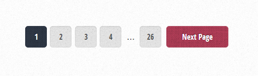
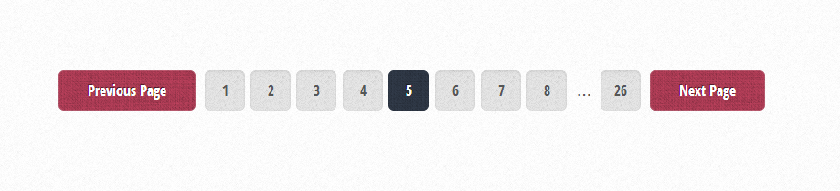

Это шестой урок из серии о том, как создать тему для WordPress из верстки. Из него вы узнаете, как добавить в тему постраничную навигацию и создать шаблоны для страницы записи и архивов single.php и archives.php

## Функция постраничной навигации

Чтобы добавить в тему поддержку постраничной навигации, можно воспользоваться [функцией пагинации](http://oriolo.ru/paginatsiya/), которую я уже приводила в своем блоге, только немного ее изменив и настроив CSS.

Сначала нужно посмотреть, какие теги и классы используются для вывода страниц в верстке. Открываем наш файл index.php, и в самом низу видим:

```html
<!-- Pager -->
<div class="pager">
	<!--<a href="#" class="button previous">Previous Page</a>-->
	<div class="pages">
		<a href="#" class="active">1</a>
		<a href="#">2</a>
		<a href="#">3</a>
		<a href="#">4</a>
		<span>&hellip;</span>
		<a href="#">20</a>
	</div>
	<a href="#" class="button next">Next Page</a>
</div>
```

Теперь нам нужно немного модифицировать код функции для вывода пагинации, чтобы HTML-код, который она генерирует, был таким же, как этот. Другой вариант - оставить код функции как есть, но внести изменения в CSS файлы темы.

Сначала нужно скопировать код постраничной навигации в файл function.php, и вызвать его в файле index.php. Давайте сделаем это ниже существующей навигации из верстки, чтобы были видны отличия. Код и его вызов можно взять [в этом посте](http://oriolo.ru/paginatsiya/).

Посмотрим, какой HTML сейчас генерирует функция:

```html
<div class='clearfix navigation-top'>
  <div class='pagination'>
    <span>
      Pages: 
    </span>
    <span class='current'>
      1
    </span>
    <a href='/page/2/' class='inactive' >
      2
    </a>
    <a href='/page/3/' class='inactive' >
      3
    </a>
    <a href='/page/2/'>
      &rsaquo;
    </a>
    <a href='/page/6/'>
      &raquo;
    </a>
  </div>
</div>
```

Не совсем то, что нам нужно, правда? Поэтому внесем изменения в код функции.

## Изменяем код вывода пагинации

В комментариях я написала, какие значения были изменены:

```php
/* 
* Pagination
*/

// $range - сколько страниц выводить до и после текущей страницы, я поставила 3
function oriolo_pagination($pages = '', $range = 3)
{
     $showitems = ($range * 2)+1;
     global $paged;
     if(empty($paged)) $paged = 1;
     if($pages == '')
     {
         global $wp_query;

         // $pages - это общее число страницы, запомним это, дальше оно нам понадобится
         $pages = $wp_query->max_num_pages;

         if(!$pages)
         {
             $pages = 1;
         }
     }

     // здесь начинается вывод навигации
     if(1 != $pages)
     { 
        
        // я изменила название класса на pager
         echo "<div class='pager'>";
         
         // изменен порядок вывода кнопок со ссылками на первую страницу и на предыдущую
         // добавлен класс button previous для кнопки со ссылкой на предыдущую страницу
         if($paged > 1 && $showitems < $pages) echo "<a href='".get_pagenum_link($paged - 1)."' class='button previous'> " . __('Previous Page', 'striped') . " </a>";
         
         // добавлена строка с <div class='pages'> - внутри него будут кнопки со страницами
         echo "<div class='pages'>";

         // кнопка первой страницы
         if($paged > 2 && $paged > $range+1 && $showitems < $pages) echo "<a href='".get_pagenum_link(1)."'>1</a>";

         // вывод всех остальных страниц
         for ($i=1; $i <= $pages; $i++)
         {
             if (1 != $pages &&( !($i >= $paged+$range+1 || $i <= $paged-$range-1) || $pages <= $showitems ))
             {
                // к текущей странице добавим класс active
                 echo ($paged == $i)? "<a class='active'>".$i."</a>":"<a href='".get_pagenum_link($i)."' >".$i."</a>";
             }
         }
         
         // перед выводом кнопки с последней страницей добавлен <span> с многоточием
         // текстом ссылки будет общее количество страниц: $pages
         if ($paged < $pages-1 &&  $paged+$range-1 < $pages && $showitems < $pages) echo "<span>…</span><a href='".get_pagenum_link($pages)."'> $pages </a>";

         // закроем div со страницами
         echo "</div>";
         
         // выведем кнопку со следующей страницей
         if ($paged < $pages && $showitems < $pages) echo "<a href='".get_pagenum_link($paged + 1)."' class='button next'>" . __('Next Page', 'striped') . "</a>";
         
         echo "</div>\n";
     }
}
```

После изменения функции, HTML код из верстки нужно удалить. На первой странице навигация будет выглядеть так: [](http://oriolo.ru/wp-content/uploads/2014/03/pager1.png)

А на второй и следующей - добавится ссылка на предыдущую страницу:

[](http://oriolo.ru/wp-content/uploads/2014/03/pager2.png)

На этом мы практически закончили с настройкой главной страницы нашей темы. В следующей части мы создадим шаблон archive.php, который будет выводить страницы архивов и рубрик.
