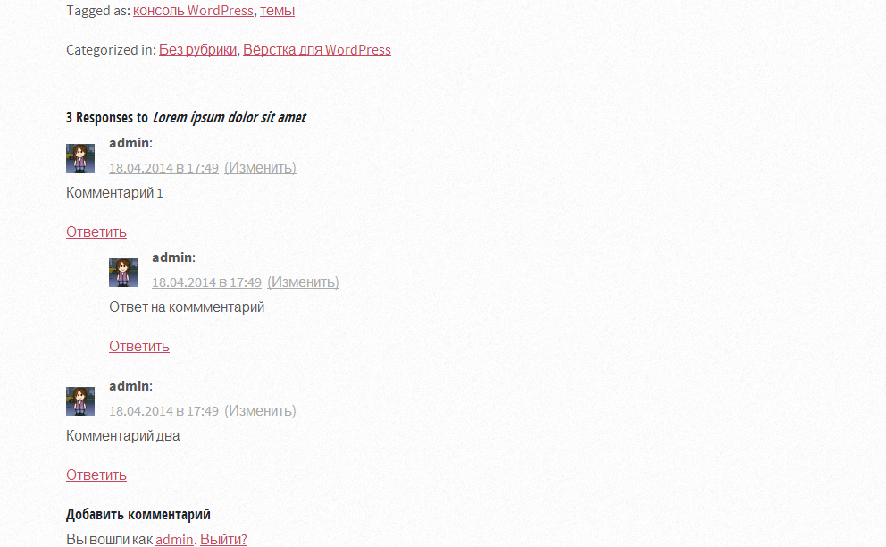

Это восьмой урок о том, как **создать тему для WordPress** из верстки. Вы узнаете, как сделать шаблон для одиночной записи - файл single.php.

Что обычно выводится на странице записи? Заголовок и содержимое записи, мета-данные (такие как дата, рубрики, метки), и, конечно, комментарии и форма для отправки комментария. Давайте создадим страницу, на которой будут присутствовать все эти элементы.

## Шаг 1 Подготовительные работы

Для начала, давайте немного оптимизируем структуру файла index.php. Как вы уже знаете, это основной шаблон темы для вордпресс, и именно он будет срабатывать, если более подходящий шаблон не найден. Сейчас в этом файле содержится достаточно большая часть кода, которая отвечает за вывод содержимого записи. Вот она:

```
<!-- Post Start -->
	<article class="is-post is-post-excerpt" class="<?php post_class(); ?>" id="post-<?php the_ID(); ?>">
		<header>
			<h2 class="entry-title"><a title="<?php printf( esc_attr__( 'Permalink to %s', 'striped' ), the_title_attribute( 'echo=0' ) ); ?>" href="<?php the_permalink(); ?>" rel="bookmark">
			<?php the_title(); ?>
			</a></h2>
			<!-- <span class="byline">A free, fully responsive HTML5 site template by HTML5 UP</span> -->
		</header>
		<div class="info">
			<span class="date">
			<span class="day"><?php the_time('j'); ?></span>
			<span class="month"><?php the_time('M'); ?></span>
			<span class="year"><?php the_time('Y'); ?></span>
<!-- <span class="month">Jan<span>uary</span></span> <span class="day">14</span><span class="year">, 2013</span> -->

			</span>
			<ul class="stats">
				<li><a href="#" class="fa fa-comment">16</a></li>
				<li><a href="#" class="fa fa-heart">32</a></li>
				<li><a href="#" class="fa fa-twitter">64</a></li>
				<li><a href="#" class="fa fa-facebook">128</a></li>
			</ul>
		</div>
		<a href="<?php the_permalink(); ?>" class="image image-full"><?php if ( has_post_thumbnail() ) {
the_post_thumbnail();
}  ?></a>
		<?php the_content(); ?>
	</article>
<!-- Post End -->
```

Именно эта часть кода отрабатывает на всех страницах темы, где есть хоть какое-то содержимое. Поэтому, чтобы упроситить дальнейшую работу над темой, этот кусок кода нужно **вынести в отдельный файл**, который будет называться **content.php**. Копируем, вставляем, удаляем эту часть в index.php :) Сейчас нужно подключить вывод этого фрагмента. Сделаем это при помощи функции `get_template_part()`:

```
<?php get_template_part('content') ?>
```

В итоге, файл index.php будет выглядеть вот так:

```
<?php get_header(); ?>
<?php while ( have_posts() ) : the_post(); ?>
<?php get_template_part('content') ?>
<?php endwhile; ?>

<!-- Pager -->
<?php
if (function_exists('oriolo_pagination')) oriolo_pagination(); 
else posts_nav_link();
?>

</div>
</div>
<?php get_sidebar(); ?>
<?php get_footer(); ?>
```

То же самое давайте проделаем с файлом [archive.php](http://oriolo.ru/create-theme-from-html-7/ "Как создать тему для WordPress. Часть 7: страница archive.php"), который мы создали в прошлом уроке.

Теперь создайте копию файла index.php и переименуйте ее в single.php. Сделаем небольшие изменения в этом файле. Для начала, удалим оттуда вывод постраничной навигации, так как она все равно не будет использоваться на этой странице. В итоге, файл single.php должен получиться таким:

```
<?php get_header(); ?>
<?php while ( have_posts() ) : the_post(); ?>
<?php get_template_part('content') ?>
<?php endwhile; ?>
</div>
</div>
<?php get_sidebar(); ?>
<?php get_footer(); ?>
```

## Шаг 2 Вывод мета-данных записи

Если Вы все верно сделали, то сейчас при переходе на страницу записи должен появиться полный текст и заголовок. В первом шаге мы добавим вывод информации о записи: автора, рубрики и метки.

А теперь начинается магия :) Создайте копию файла content.php, и назовите ее content-single.php. Затем поменяйте функцию `get_template_part` в файле single.php, чтобы она выглядела вот так:

```

<?php get_template_part('content', 'single') ?>
```

Этим мы сделаем так, чтобы на странице одиночной записи содержимое выводилось из файла content-single.php.

И далее, уже в файле content-single.php, перед закрывающим тегом `article`, добавляем:

```
<footer class="entry-meta">
	<?php edit_post_link( __( 'Edit', 'striped' ), '<div class="edit-link">', '</div>' ); ?>
	<p class="tags"><?php the_tags(__( 'Tagged as: ', 'striped' ),', '); ?></p>
	<p class="categories"><?php _e( 'Categorized in&#58; ', 'striped' ) . the_category(', '); ?></p>
</footer>
```

Мы создали новый элемент - футер записи. В него добавили:

- Строка 2 - это вывод ссылки на редактирование записи для администатора,
- строка 3 - добавление списка тегов,
- строка 4 - добавление списка рубрик.

Теперь, при желании, можете их стилизовать при помощи CSS. Кстати, если хотите, то в футере записи также можно разместить ссылки типа "поделиться в социальных сетях" и многое другое.

## Шаг 3 Вывод комментариев

Следующим, и наверное самым сложным шагом, будет вывод комментариев для записи. Во-первых, откройте файл single.php, и сразу после `get_template_part` добавьте эту функцию:

```
<?php // If comments are open or we have at least one comment, load up the comment template.
 if ( comments_open() || '0' != get_comments_number() ) :
 	comments_template();
 endif;
?>
```

Так мы проверим, во-первых, разрешено ли добавление комментариев к записи, и есть ли к ней комментарии, и если одно из этих условий соблюдается, то выведем список комментариев. За то, как именно комментарии будут выведены, отвечает файл comments.php.

## Шаг 4 Файл comments.php

Создайте новый пустой PHP-файл с названием comments.

Создадим в этом файле блок, в котором будет выводится список комментариев:

```
<div id="comments">

</div><!-- #comments -->
```

Сначала давайте проверим, не защищена ли запись паролем.:

```

<div id="comments">
<?php if ( post_password_required() ) : ?>
				<p class="nopassword"><?php _e( 'This post is password protected. Enter the password to view any comments.', 'striped' ); ?></p>
			</div><!-- #comments -->
<?php
		/*
		 * Stop the rest of comments.php from being processed,
		 * but don't kill the script entirely -- we still have
		 * to fully load the template.
		 */
		return;
	endif;
?>
</div><!-- #comments -->

```

Потом проверим, есть ли к записи коммментарии:

```

<div id="comments">
<?php if ( post_password_required() ) : ?>
				<p class="nopassword"><?php _e( 'This post is password protected. Enter the password to view any comments.', 'striped' ); ?></p>
			</div><!-- #comments -->
<?php
		/*
		 * Stop the rest of comments.php from being processed,
		 * but don't kill the script entirely -- we still have
		 * to fully load the template.
		 */
		return;
	endif;
?>
<?php if ( have_comments() ) : ?>

<?php endif; // end have_comments() ?>
</div><!-- #comments -->

```

Если комментарии есть, то их нужно вывести:

```
<ol class="commentlist">
	<?php
	wp_list_comments();
	?>
</ol>
```

Теперь добавим заголовок для списка комментариев. Он будет содержать число комментариев и название записи:

```
<h3 id="comments-title">
<?php
printf( _n( 'One Response to %2$s', '%1$s Responses to %2$s', get_comments_number(), 'striped' ),
number_format_i18n( get_comments_number() ), '<em>' . get_the_title() . '</em>' );
?>
</h3>
```

Также нужно добавить постраничную навигацию, она будет появляться, если страниц с комментариями много. Для этого добавим такой код до и после вывода списка комментариев:

```
<?php if ( get_comment_pages_count() > 1 && get_option( 'page_comments' ) ) : // Are there comments to navigate through? ?>
			<div class="navigation">
				<div class="nav-previous"><?php previous_comments_link( __( '<span class="meta-nav">&larr;</span> Older Comments', 'striped' ) ); ?></div>
				<div class="nav-next"><?php next_comments_link( __( 'Newer Comments <span class="meta-nav">&rarr;</span>', 'striped' ) ); ?></div>
			</div> <!-- .navigation -->
<?php endif; // check for comment navigation ?>
```

Ну и напоследок сделаем уведомление на случай, если комментариев к записи нет, и комментирование запрещено:

```
	<?php
	/*
	 * If there are no comments and comments are closed, let's leave a little note.
	 */
	$num_comments = get_comments_number();
	if ( ! comments_open() && $num_comments == 0 ) : ?>
		<p class="nocomments"><?php _e( 'Comments are closed.' , 'striped' ); ?></p>
	<?php endif;  ?>
```

В итоге, содержание файла comments.php должно получиться примерно следующее:

```
<div id="comments">
<?php if ( post_password_required() ) : ?>
				<p class="nopassword"><?php _e( 'This post is password protected. Enter the password to view any comments.', 'striped' ); ?></p>
			</div><!-- #comments -->
<?php
		/*
		 * Stop the rest of comments.php from being processed,
		 * but don't kill the script entirely -- we still have
		 * to fully load the template.
		 */
		return;
	endif;
?>

<?php if ( have_comments() ) : ?>
			<h3 id="comments-title"><?php
			printf( _n( 'One Response to %2$s', '%1$s Responses to %2$s', get_comments_number(), 'striped' ),
			number_format_i18n( get_comments_number() ), '<em>' . get_the_title() . '</em>' );
			?></h3>

<?php if ( get_comment_pages_count() > 1 && get_option( 'page_comments' ) ) : // Are there comments to navigate through? ?>
			<div class="navigation">
				<div class="nav-previous"><?php previous_comments_link( __( '<span class="meta-nav">&larr;</span> Older Comments', 'striped' ) ); ?></div>
				<div class="nav-next"><?php next_comments_link( __( 'Newer Comments <span class="meta-nav">&rarr;</span>', 'striped' ) ); ?></div>
			</div> <!-- .navigation -->
<?php endif; // check for comment navigation ?>

			<ol class="commentlist">
				<?php
					/*
					 * Loop through and list the comments.
					 */
					wp_list_comments();
				?>
			</ol>

<?php if ( get_comment_pages_count() > 1 && get_option( 'page_comments' ) ) : // Are there comments to navigate through? ?>
			<div class="navigation">
				<div class="nav-previous"><?php previous_comments_link( __( '<span class="meta-nav">&larr;</span> Older Comments', 'striped' ) ); ?></div>
				<div class="nav-next"><?php next_comments_link( __( 'Newer Comments <span class="meta-nav">&rarr;</span>', 'striped' ) ); ?></div>
			</div><!-- .navigation -->
<?php endif; // check for comment navigation ?>

	<?php
	/*
	 * If there are no comments and comments are closed, let's leave a little note.
	 */
	$num_comments = get_comments_number();
	if ( ! comments_open() && $num_comments == 0 ) : ?>
		<p class="nocomments"><?php _e( 'Comments are closed.' , 'striped' ); ?></p>
	<?php endif;  ?>

<?php endif; // end have_comments() ?>

</div><!-- #comments -->
```

## Шаг 5 Вывод формы для добавления комментариев

Вывести форму для добавления комментариев можно при помощи функции `comment_form`:

```

<?php comment_form(); ?>

```

Добавьте эту функцию в конце файла comments.php до закрывающего тега `div`.

Подробнее о том, как настроить форму для комментариев, можно почитать [в этом посте](http://oriolo.ru/nastroyka-formyi-kommentariev-v-wordpress-3-0/ "Настройка формы комментариев в WordPress 3.0+") в моем блоге.

На этом работа с файлом шаблона комментариев закончена. Осталось немного настроить стили вывода комментариев через CSS.

## Шаг 6 Оформление списка комментариев

В самом общем виде, минимальное оформление списка комментариев будет таким. В отмеченные строки я внесла изменения, остальные привожу, если вы захотите самостоятельно что-то поменять. В принципе, копировать все это оформление необязательно, можно ограничиться только необходимыми вам строками, или, в самом минимальном варианте, выделенными строками?

```
ol.commentlist { list-style:none; margin:0 0 1em; padding:0; }
ol.commentlist li { margin:0 0 1em 0; }
ol.commentlist li.alt { }
ol.commentlist li.bypostauthor {}
ol.commentlist li.byuser {}
ol.commentlist li.comment-author-admin {}
ol.commentlist li.comment {}
ol.commentlist li.comment div.comment-author { }
ol.commentlist li.comment div.vcard {}
ol.commentlist li.comment div.vcard cite.fn { font-size: 16px; font-weight:bold; }
ol.commentlist li.comment div.vcard cite.fn a.url {}
ol.commentlist li.comment div.vcard img.avatar { float:left; margin: 1em 1em 0 0; }
ol.commentlist li.comment div.vcard img.avatar-32 {}
ol.commentlist li.comment div.vcard img.photo {}
ol.commentlist li.comment div.vcard span.says {}
ol.commentlist li.comment div.commentmetadata {}
ol.commentlist li.comment div.comment-meta { }
ol.commentlist li.comment div.comment-meta a { color:#aaa; }
ol.commentlist li.comment p { }
ol.commentlist li.comment ul { margin:0 0 1em 2em; }
ol.commentlist li.comment div.reply { }
ol.commentlist li.comment div.reply a { }
ol.commentlist li.comment ul.children { list-style:none; margin:0;  }
ol.commentlist li.comment ul.children li {}
ol.commentlist li.comment ul.children li.alt {}
ol.commentlist li.comment ul.children li.bypostauthor {}
ol.commentlist li.comment ul.children li.byuser {}
ol.commentlist li.comment ul.children li.comment {}
ol.commentlist li.comment ul.children li.comment-author-admin {}
ol.commentlist li.comment ul.children li.depth-2 { margin:0 0 0 3em; }
ol.commentlist li.comment ul.children li.depth-3 { margin:0 0 0 3em; }
ol.commentlist li.comment ul.children li.depth-4 { margin:0 0 0 3em; }
ol.commentlist li.comment ul.children li.depth-5 {}
ol.commentlist li.comment ul.children li.odd {}
ol.commentlist li.even { }
ol.commentlist li.odd { }
ol.commentlist li.parent { }
ol.commentlist li.thread-alt { }
ol.commentlist li.thread-even {}
ol.commentlist li.thread-odd {}
```

Эти строки нужно добавить в файл стиле темы, или, если брать пример той темы, которую переношу на WordPress в этом примере я, в файл /css/style.css.

## Шаг 7 Важные мелочи

Все практически готово, осталось совсем чуть-чуть: необходимо вывести число комментариев к записи на главной странице блога, странице архивов и странице отдельной записи. Поэтому, будем редактировать файлs content.php и content-single.php.

Там есть вот такой список, который выводится слева от заголовка записи рядом с датой:

```
<ul class="stats">
	<li><a href="#" class="fa fa-comment">16</a></li>
	<li><a href="#" class="fa fa-heart">32</a></li>
	<li><a href="#" class="fa fa-twitter">64</a></li>
	<li><a href="#" class="fa fa-facebook">128</a></li>
</ul>
```

Заменим первую строку, чтобы получилось вот так:

```
<ul class="stats">
	<li><a href="<?php echo get_comments_link(); ?>" class="fa fa-comment"><?php echo get_comments_number(); ?></a></li>
	<li><a href="#" class="fa fa-heart">32</a></li>
	<li><a href="#" class="fa fa-twitter">64</a></li>
	<li><a href="#" class="fa fa-facebook">128</a></li>
</ul>
```

Теперь, на страницах блога будет выводится количество комментариев для каждой записи. В дальнейшем мы вернемся к этому списку, и сделаем остальные кнопки динамическими тоже.

## Итоги

После всех проделанных действий, мы получили вот такой список комментариев и форму для их добавления:



Из этого урока вы узнали, как создать страницу для вывода одиночной записи, а также создали файлы content.php, content-single.php, comments.php. Чтобы не пропустить следующий урок, подписывайтесь на обновления блога.
