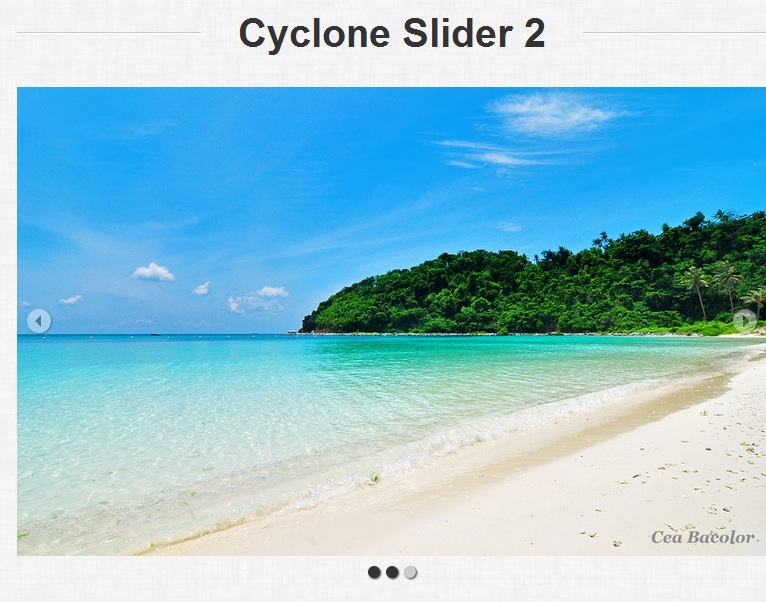
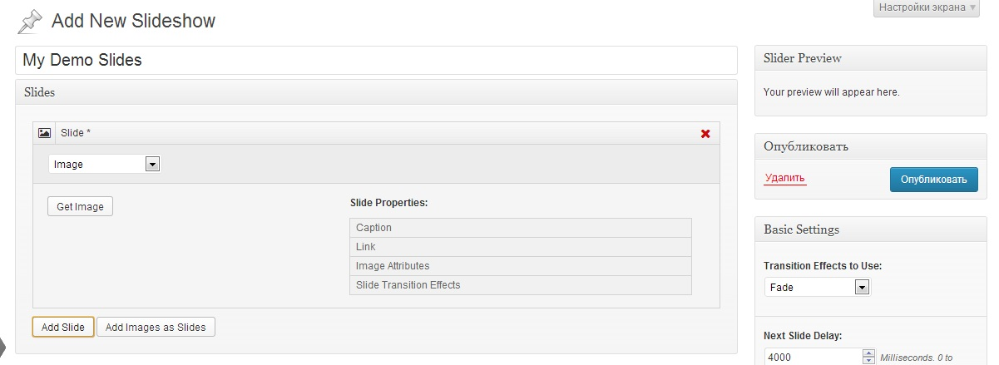
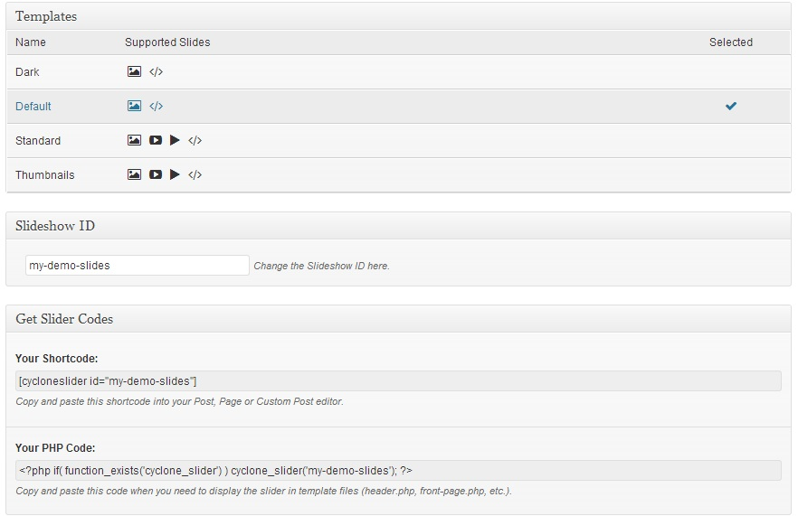

Очень часто при создании темы бывает необходимо добавить на одну или несколько страниц сайта слайдер. Еще совсем недавно для меня найти подходящий слайдер, который можно было бы использовать в темах, было проблемой. Но после того, как я открыла для себя возможности плагина [Cyclone Slider 2](http://www.codefleet.net/cyclone-slider-2/), добавление слайдера к теме стало очень простой задачей.

Скачать слайдер можно с официального сайта Wordpress из [раздела с плагинами](http://wordpress.org/extend/plugins/cyclone-slider-2/).

Сразу после установки в боковой панели админки появится новый пункт меню, нажав на который можно управлять Cyclone Slider 2.

При помощи этого плагина можно добавлять **неограниченное количество слайдшоу**. Добавление слайдшоу производится также, как написание поста. То есть по сути, плагин представляет собой пользовательский тип записи со слайдшоу.

Вот так выглядит окошко для добавления новых слайдов:

 

Также доступны дополнительные опции, такие как выбор типа слайдера, и назначение ID для слайдшоу.

Доступны следующие типы слайдеров:

- Dark, с темными элементами управления, индикатор слайдов внизу под изображением,
- Default, со светлыми элементами управления, индикатор слайдов на изображении справа вверху,
- Standard, со светлыми элементами управления, индикатор слайдов внизу под изображением,
- Thumbnails,  со светлыми элементами управления, под изображением внизу находятся миниатюры других слайдов.

  

Самое замечательное в этом слайдере - то, что он позволяет вставлять код в тему, в виде php кода, но также как шорткод в записи или страницы.

Для слайдера доступны следующие настройки:

- выбор эффекта
- время отображения эффекта
- время отображения одного слайда
- размеры слайда
- подгонка размера изображния
- отключение \\ включение элементов навигации
- порядок слайдов
