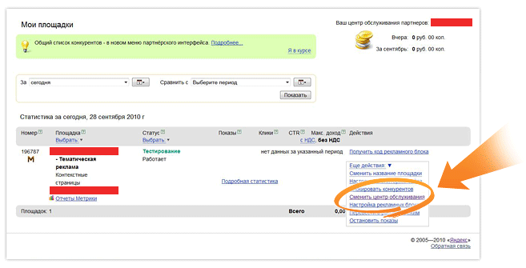

Привет, друзья! ЦОП **Profit-Partner проводит акцию** для владельцев сайтов, которые еще не участвуют в рекламной сети Яндекса. Добавив новый сайт в Profit-Partner, или перенеся существующий из другого ЦОП, за первый клик по рекламе вы **гарантированно** получаете флешку на 4 Гб, и становитесь участником розыгрыша MacBook!

### Что такое ЦОП Profit-Partner?

ЦОП - это центр обслуживания партнеров рекламной сети Яндекса (РСЯ). ЦОП Profit-Partner, бесспорно, самый известный и популярный. К его преимуществам относятся:

- высокая оплата за клик,
- вывод доходов без комиссии,
- отсутствие минимального порога выплат,
- проведение регулярных акций и конкурсов с замечательными призами,
- приятные подарки и сувениры всем партнерам на праздники,
- система бонусов и скидок,
- круглосуточная поддержка.

### Как получить флешку от Profit-Partner?

В течение февраля, добавив новый сайт в Profit-Partner, за первый клик по рекламе вы 100% получаете флешку на 4 Гб за первый клик по рекламе, и выигрываете MacBook, если ваш сайт будет самым доходным в период с 1 по 12 марта.

Согласитесь, условия весьма заманчивые! Чтобы принять участие в акции и получить флешку, достаточно [зарегистрироваться в Profit-Partner](http://profit-partner.ru/user/register/?r=2fbb9cc03d3ab1444dfeffa73b267345), добавить новый сайт, дождаться его одобрения модератором, и разместить код. После того, как первый посетитель нажмет на рекламную ссылку, вы становитесь обладателем флешки, которую отправят вам по почте после 12 марта.

### Но я уже пользуюсь РСЯ!

В случае, если вы уже являетесь партнером другого ЦОП, или работаете с РСЯ напрямую, вы можете перенести сайт в Profit-Partner. Проще всего это сделать, обратившись в службу поддержки по ICQ 361855340, и вам помогут.

Если у вас есть аккаунт на partner.yandex.ru, то для переноса сайта надо нажать на ссылку "Сменить центр обслуживания", и выбрать Profit-Partner:

После чего [создать аккаунт  в Profit-Partner](http://profit-partner.ru/user/register/?r=2fbb9cc03d3ab1444dfeffa73b267345), или войти с использованием существующего. После входа вы увидите подтверждение переноса сайта. Необходимо нажать кнопку "Подтвердить".

Как видите, все просто :) Спешите принять участие и получить призы, до конца февраля осталось не так много!
