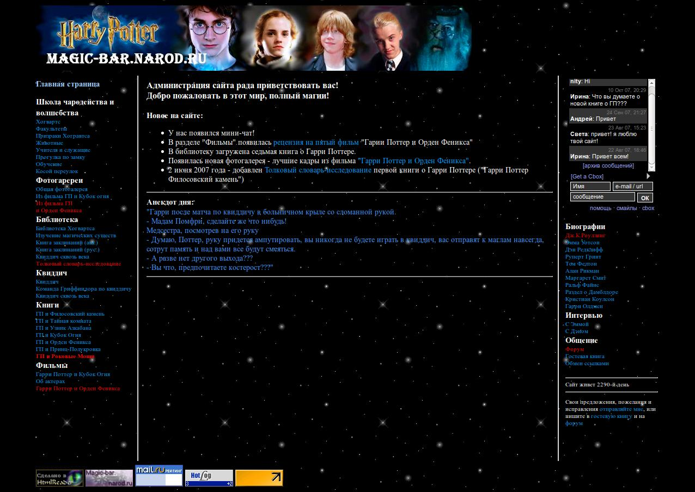

Привет! Сегодня увидела эстафету "[Мой первый сайт](http://blognat.ru/mojj-pervyjj-sajjt/)" в блоге у **Russkii**, и решила поучаствовать :)

Мой первый сайт был о Гарри Поттере, и появился примерно в конце 2005 года.

Вот, собственно, и он:

Размещено это чудо было на народе.ру.

Как можно видеть по информеру в правой колонке, он был создан 2290 дней назад (то есть почти шесть с половиной лет назад). Оказалось, его исходники до сих пор лежат у меня на компе :)

Ушло около двух недель изучения html, и ещё около недели написания кода. Инфа добывалась так: искалось несколько статей по подобной теме, и из них делалась одна (получался своеобразный рерайтинг). Разрешение экрана у меня тогда было поменьше, поэтому сейчас шрифт выглядит очень маленьким.

Там даже была интерактивность в виде меняющихся при обновлении страницы анекдотов: был найден и допилен методом научного тыка скрипт на JS.

Потом я установила рекламу от tak.ru, и заработала 200 рублей :).

Затем я изучала css, еще позже - php. И перенесла сайт на платный хостинг, купленный с заработанных рекламой денег, слегка обновила внешний вид, и добавила cms для публикации новых статей. И он бы там висел до сих пор, если бы домены в зоне org.ru не стали платными...

Все желающие могут продолжить эстафету, написав об этом в комментариях!
