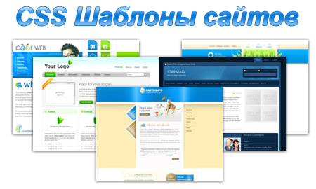

Иногда, в поисках идей, я просматриваю каталоги шаблонов для сайтов. В этой статье я расскажу, что такое **CSS-шаблоны** для сайта, где лучше всего их искать.

## Что такое шаблон для сайта

Под шаблоном в этой статье я понимаю сверстанный макет, то есть набор HTML и CSS файлов, изображений и, возможно, скриптов.

Шаблон отличается от PSD-макета (несверстанного, т.е. изображения), и темы оформления (которая чаще всего является уже конечным продуктом, полностью готовым к установке на CMS). Шаблон является промежуточным продуктом между PSD-макетом и темой оформления.

## Зачем нужны готовые CSS-шаблоны?

Используя сверстанный шаблон, можно быстро и без особых проблем сделать тему оформления для любой CMS. В одном из ближайших постов я расскажу, как на основе сверстанного шаблона и темы Toolbox создать собственную тему для блога на WordPress. Также их можно использовать и без CMS, для создания простых сайтов типа визиток.

Ну а можно просто изучать с их помощью верстку, смотреть что и как сделал автор, пробовать как-то изменить, добавлять что-то свое, ну и так далее. В общем, готовый **CSS-шаблон** - это полезный инструмент для веб-творчества :)

На бесплатные шаблоны действуйт, как правило, лицензия [Creative Commons](http://creativecommons.org/), поэтому у вас не возникнет проблем с его использованием, изменением, и последующим распространением.

## Где можно найти CSS-шаблоны?

Обыно я ищу бесплатные шаблоны на следующих сайтах:

- [http://www.freecss.in](http://www.freecss.in/) - около 170 шаблонов, для каждого выводится дата добавления в каталог
- [http://templated.org](http://templated.org) - очень удобная система поиска и сортировки: по цвету, лицензии; около 500 шаблонов, для каждого выводится количество скачиваний и дата добавления
- [http://www.templatemo.com](http://www.templatemo.com/) - много шаблонов, выводится количество загрузок и дата добавления в каталог
- [http://www.freewebsitetemplates.com](http://www.freewebsitetemplates.com/) - много шаблонов, но каталог практически никак не организован
- [http://www.freecsstemplates.org](http://www.freecsstemplates.org/) - большой каталог, около 700 шаблонов, есть поиск

Конечно, существует большое количество других каталогов. Также можно поискать обзоры шаблонов, я обычно ищу по запросу _free HTML CSS templates_, и просматриваю обзоры в зарубежных блогах.
