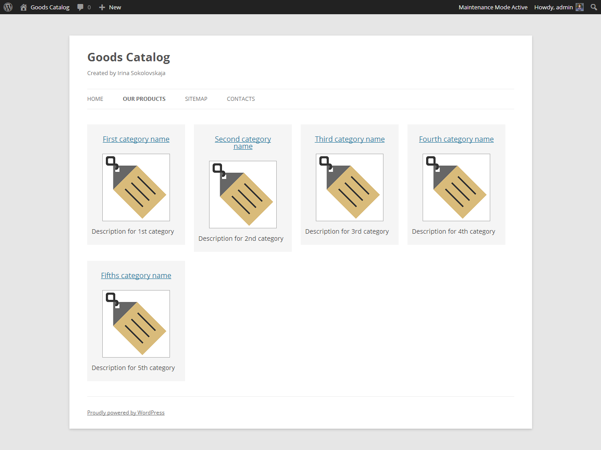
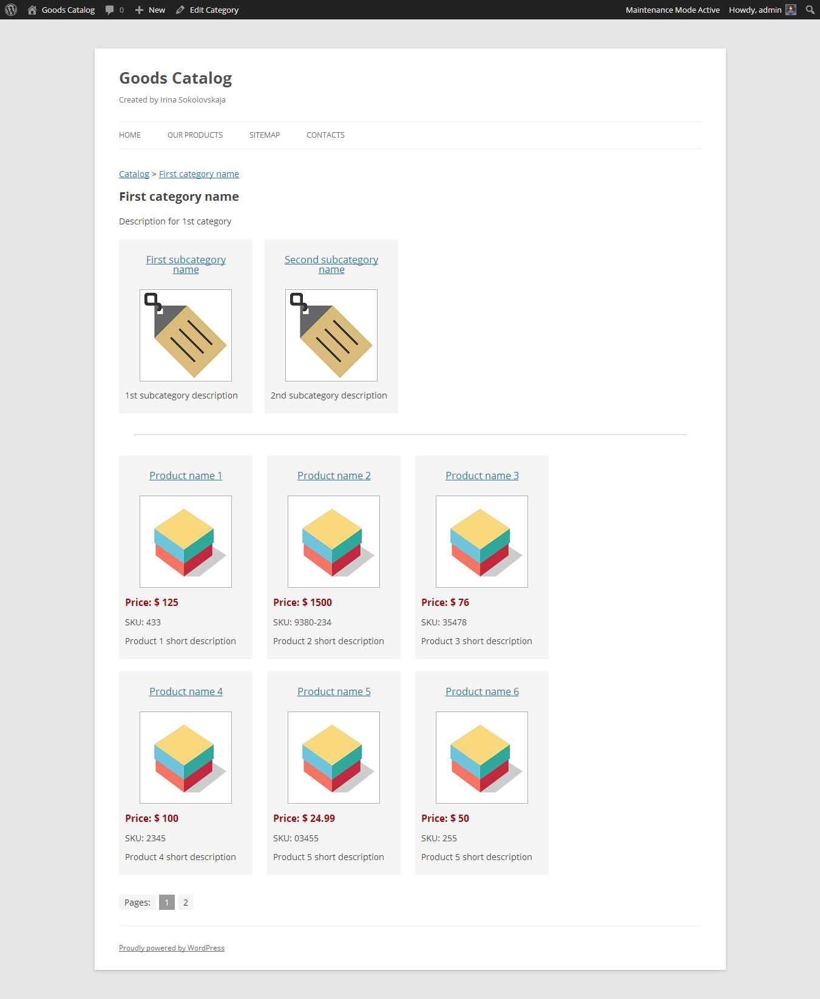
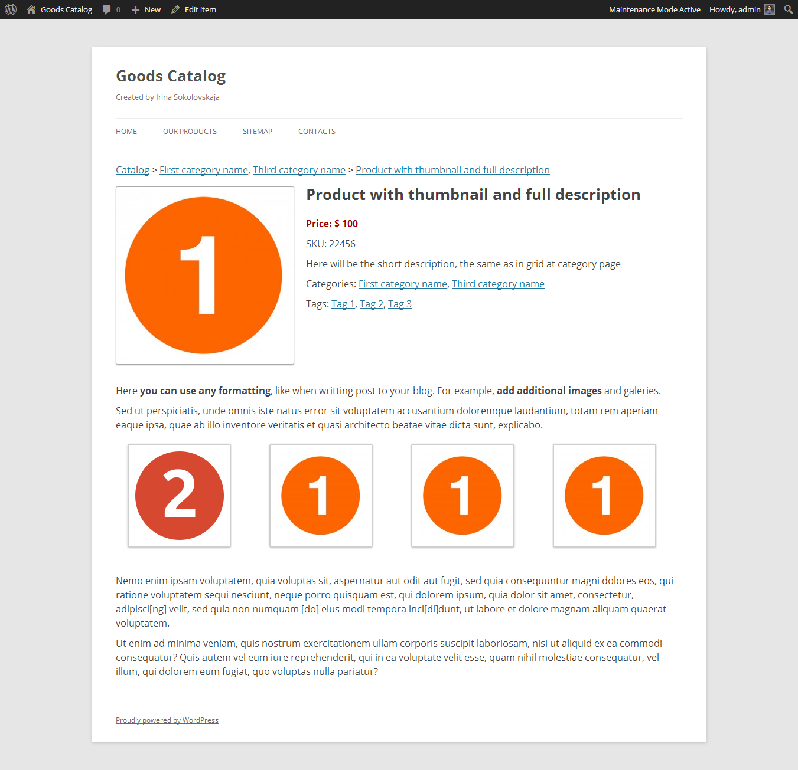
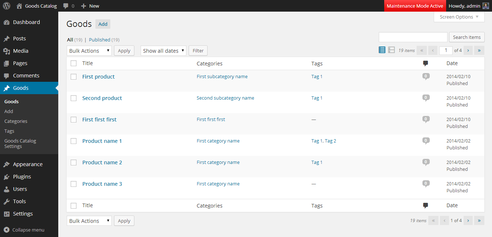
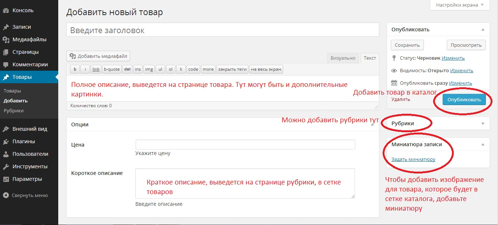
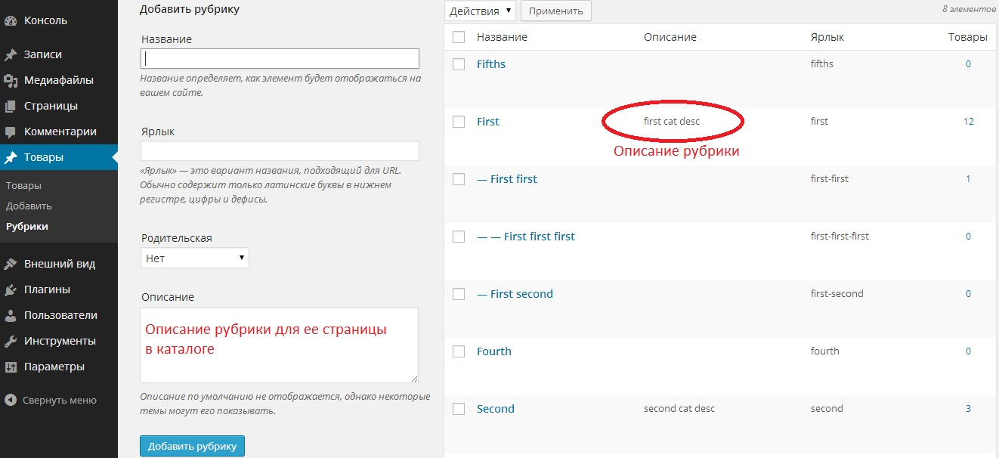
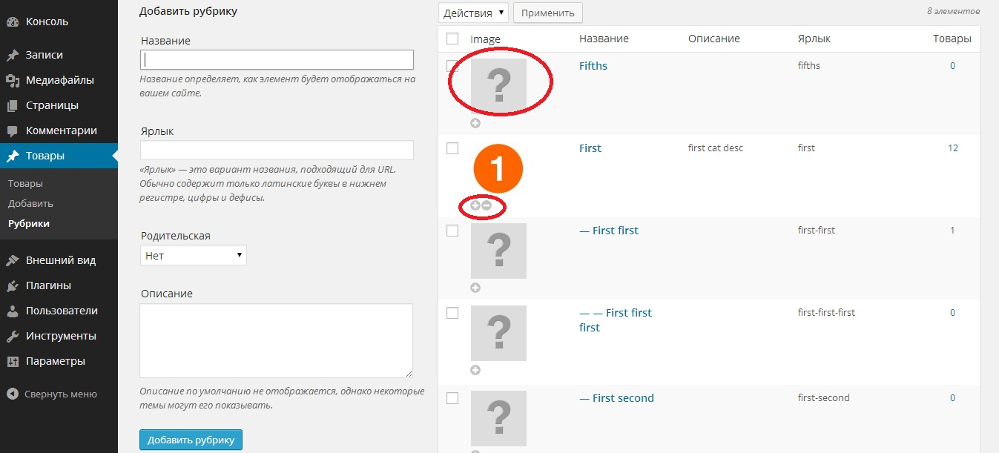
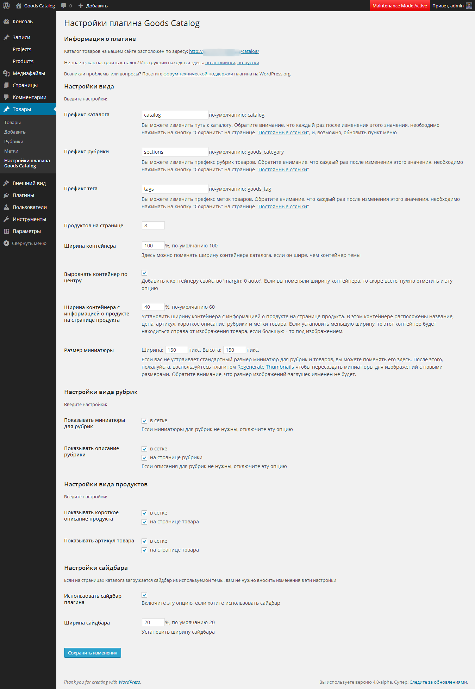

Всем привет! Представляю мой первый плагин Goods Catalog, с помощью которого можно создать **каталог товаров на WordPress**.

If you would like to read the description of Goods Catalog Plugin in English, please visit [that page](http://oriolo.wordpress.com/2014/03/25/goods-catalog-wordpress-plugin-that-creates-catalog-of-products/).

Инструкция по первоначальной настройке плагина размещена [здесь](http://oriolo.ru/dev/goods-catalog).

Плагин создает каталог, по внешнему виду и принципу работы напоминающий "Проводник" в виндовсе. То есть, на главной странице каталога размещены все рубрики (только верхнего уровня, родительские). При нажатии на рубрику открывается ее страница, где сначала выводится список подрубрик, если они есть, а потом список товаров в этой рубрике (товары из дочерних рубрик не выводятся).

**Скачать** самую последнюю версию плагина **Goods Catalog** всегда можно здесь: [http://wordpress.org/plugins/goods-catalog/](http://wordpress.org/plugins/goods-catalog/), или просто выполнить в консоли поиск плагина по запросу "Goods Catalog".

Содержание

- [Пользовательская часть](#gc-front)
    - [Главная страница каталога](#gc-front-home)
    - [Страница рубрики товаров](#gc-front-category)
    - [Страница товара](#gc-front-single)
- [Администраторская часть каталога](#gc-admin)
    - [Добавление и редактирование товаров](#gc-admin-goods)
    - [Добавление и редактирование рубрик](#gc-admin-category)
    - [Настройки плагина](#gc-admin-settings)
        - [Общие настройки каталога](#gc-admin-settings-general)
        - [Настройки вида рубрик и товаров](#gc-admin-settings-view)
        - [Настройка сайдбара](#gc-admin-settings-sidebar)
        - [Дополнительные сведения](#gc-admin-settings-other)
    - [Шорткоды](#gc-admin-shortcodes)
- [Проблемы и ограничения](#gc-problems)
    - [Известные проблемы](#gc-problems-1)
    - [Что плагин не может](#gc-problems-2)
- [Где скачать?](#gc-download)
- [Вопросы и предложения](#gc-support)
- [Поддержать автора](#gc-donate)

## Пользовательская часть

### Главная страница каталога

После установки плагина и добавления рубрик и товаров, главная страница каталога будет доступна по адресу http://ваш-сайт.ру**/catalog**

Главная страница представляет собой список всех родительских рубрик, и выглядит вот так:

Для каждой рубрики выводятся:

- Название
- Изображение (если добавлено при помощи [Taxonomy Images](http://oriolo.ru/wordpress/spisok-rubrik-opisaniem-izobrazheniem/ "Вывод описаний и изображений рубрик на сайте"), об этом чуть ниже)
- Описание

### Страница рубрики товаров

При нажатии на заголовок рубрики или изображение, пользователь попадает на страницу рубрики. Она выглядит так:

На этой странице выводятся:

- "Хлебные крошки" - путь от главной страницы каталога до текущей
- Название рубрики и ее описание
- Список подрубрик
- Список товаров в рубрике

Ддля каждого товара показана цена, миниатюра и краткое описание. Если миниатюра не задана - то картинка по-умолчанию.

Если товаров будет много, то внизу списка добавляется [постраничная навигация](http://oriolo.ru/wordpress/paginatsiya/ "Постраничная навигация для WordPress блога").

### Страница товара

Страница товара выглядит так.

На странице товара есть:

- Хлебные крошки
- Увеличенное изображение (по нажатию картинка еще больше увеличивается, если возможно)
- Название
- Цена
- Артикул
- Краткое описание
- Рубрики товара (если больше чем одна, то они будут через запятую)
- Метки товара (с версии 0.4.5)
- Полное описание.

А теперь давайте посмотрим на страницы управления каталогом.

## Администраторская часть каталога

Установка

Плагин устанавливается точно также, как и любой плагин для WordPress. Скачайте архив с плагином, ссылка на который есть в конце этого поста, перейдите в консоли "Плагины -> Добавить новый -> Загрузить" и загрузите архив к себе на сайт. После этого плагин надо активировать. После активации в меню слева появляется пункт "Товары"

### Добавление и редактирование товаров

Добавление товаров сделано через пользовательские типы записей. На вкладке "Товары" выводится полный список товаров:

Новые товары добавляются точно так же, как и обычные посты в блог. Для каждого товара можно задать:

- Название
- Полное описание
- Цену
- Артикул
- Краткое описание
- Изображение
- Рубрику
- Метки

Полное описание выводится только на странице товара. Краткое описание выводится в сетке товаров в каталоге.

Изображения товаров в каталоге реализованы через миниатюры. Миниатюры товаров добавляются также, как и миниатюры обычных постов.

### Добавление и редактирование рубрик

Работа с рубриками товаров сделана также, как и работа с рубриками постов. Если ввести описание рубрики, то оно будет отображаться на странице этой рубрики каталога.

По-умолчанию, для рубрик нет изображений. Если вы хотите добавить эту функцию, установите плагин [Taxonomy Images](http://wordpress.org/plugins/taxonomy-images/).

После установки необходимо перейти в Консоли по адресу "Параметры -> Taxonomy Images" и поставить галочку напротив рубрик. Больше никаких дополнительных действий не потребуется, плагин каталога автоматически поддерживает изображения для рубрик, которые можно добавить при помощи Taxonomy Images.

Если вы не укажете изображения для всех рубрик, то будет загружаться картинка по-умолчанию.

### Настройки плагина

Настройки плагина разелены на четыре основные группы:

- Общие настройки вида каталога
- Настройки вида рубрик
- Настройки вида продуктов
- Настройки сайдбара

Вот скриншот настроек плагина в версии 0.6.3:

#### Общие настройки каталога

- Вы можете назначить собственные пути к каталогу, рубрикам и меткам товаров, изменив соответствующие префиксы
- Здесь же производится изменение количества продуктов на страницу
- Настройка ширины контейнера с каталогом - нужна в тех случаях, если каталог вывелся шире, чем основная область вашей темы. Попробуйте изменить значение ширины со 100% на меньшее.
- Выравнивание контейнера по центру, путем добавления свойства `margin: 0 auto;`, которое необходимо в некоторых темах, если была изменена ширина контейнера
- Ширина контейнера с информацией о товаре. Если задать маленькое значение, то этот контейнер будет справа от изображения товара, если большое - то под ним.
- Размер миниатюры - по-умолчанию, 150х150, но вы можете его поменять

#### Настройки вида рубрик и товаров

Здесь вы можете выбрать, какие элементы нужно выводить для рубрик и товаров, например, показывать ли артикул товаров только на странице товара, или же в сетке продуктов тоже.

#### Настройка сайдбара

Тут можно включить или выключить сайдбар, и задать его ширину.

#### И еще немного о функциях и возможностях плагина

- Язык по-умолчанию английский, перевод на русский язык выполнен через po-файлы, поэтому плагин можно использовать как в русскоязычных, так и в англоязычных проектах, файлы локализации лежат в папке /languages/;
- Картинки по-умолчанию для рубрик и продуктов лежат в папке /img/, их можно заменить на собственные картинки с теми же именами файлов и размером 150х150;
- Сетка товаров не ограничена в ширину, то есть, должна подстраиваться под ширину основной колонки используемой темы оформления. Если же это не происходит, то можно вручную поменять настройки ширины контейнера с товарами.

О добавлении собственного оформления для каталога можно почитать тут: [Goods Catalog: собственное оформление каталога](http://oriolo.ru/goods-catalog-oformlenie/ "Goods Catalog: собственное оформление каталога")

### Шорткоды

#### Последние добавленные товары

В плагине Goods Catalog версии 0.6.2 добавлен шорткод для вывода последних добавленных товаров: `[goods_newest]`. Чтобы указать, какое количество последних товаров каталога нужно вывести, используйте параметр number. Например, чтобы показать последние 12 товаров, нужно написать: `[goods_newest number=12]`

#### Список рубрик

В версии 0.6.3 добавлен шорткод `[goods_categories]`, который позволяет вывести список рубрик каталога.

За реализацию шорткода огромное спасибо Александру Чижову и [дизайн-студии Pineapple](http://pineapple-design.ru).

Этот шорткод можно использовать как на статических страницах, так и в постах блога.

## Проблемы и ограничения

### Известные проблемы

- Если после добавления рубрик и товаров главная страница или страницы рубрик или товаров не открываются и **появляется ошибка 404** или сообщение "Страница не найдена", необходимо обновить структуру постоянных ссылок. Для этого нужно просто зайти в "Параметры -> Постоянные сслыки", и **ничего не меняя**, нажать "Сохранить".
- При использовании с темой Twenty Fourteen левое меню перекрывает часть каталога. Я работаю на исправлением этой проблемы. Проблема исправлена в плагине версии 0.4.7, теперь можно задать нужную ширину контейнера и выровнять его по центру
- Если у Вас в блоге уже есть страница /catalog, то плагин работать не будет. Чтобы исправить это, Вам придется удалить дублирующую страницу Исправлено в версии 0.6, теперь можно ввести собственные пути к каталогу, рубрикам и меткам товаров

### Плагин не может, и никогда не сможет

- Делать сортировку или фильтрацию товаров;
- "Продавать" - то есть, это только **каталог товаров**, а не интернет-магазин. Здесь нет корзины, кнопки купить, и других соответствующих интернет-магазину функций.

## Где скачать?

Скачать самую последнюю версию плагина всегда можно здесь: [http://wordpress.org/plugins/goods-catalog/](http://wordpress.org/plugins/goods-catalog/), или просто выполнить в консоли поиск плагина по запросу "Goods Catalog".

Полный список изменений плагина по версиям находится здесь (на английском языке): [http://wordpress.org/plugins/goods-catalog/changelog/](http://wordpress.org/plugins/goods-catalog/changelog/)

## Вопросы и предложения

Я хочу сделать плагин удобным для использования, поэтому, если у вас есть какие-то вопросы или предложения, пишите их [на форум техподдержки](http://wordpress.org/support/plugin/goods-catalog).

Также пишите, если что-то вдруг не заработало или появилась ошибка: по мере возможности, буду исправлять.

## Поддержать автора

Вам понравился мой плагин? Тогда вы можете поддержать его дальнейшее развитие, отправив любую сумму через форму ниже :) Я буду очень благодарна :) Если вы укажете свое имя и адрес блога, то ваше имя и блог будут выводится на этой странице ниже в списке поддержавших развитие плагина.

<iframe frameborder="0" allowtransparency="true" scrolling="no" src="https://money.yandex.ru/embed/donate.xml?account=410011680957431&amp;quickpay=donate&amp;payment-type-choice=on&amp;default-sum=300&amp;targets=%D0%9F%D0%BB%D0%B0%D0%B3%D0%B8%D0%BD+Goods+Catalog&amp;target-visibility=on&amp;project-name=%D0%97%D0%B0%D0%BF%D0%B8%D1%81%D0%BA%D0%B8+%D0%BE+WordPress&amp;project-site=http%3A%2F%2Foriolo.ru&amp;button-text=05&amp;comment=on&amp;hint=%D0%90%D0%B4%D1%80%D0%B5%D1%81+%D0%B1%D0%BB%D0%BE%D0%B3%D0%B0+%D0%B8+%D0%B2%D0%B0%D1%88%D0%B5+%D0%B8%D0%BC%D1%8F%2C+%D0%B8%D0%BB%D0%B8+%D0%BB%D1%8E%D0%B1%D1%8B%D0%B5+%D0%BA%D0%BE%D0%BC%D0%BC%D0%B5%D0%BD%D1%82%D0%B0%D1%80%D0%B8%D0%B8+%3A)" width="507" height="206"></iframe>

**Поддержали развитие плагина:**

- Александр Иванов
- Василий Чужой
- Александр

Внимание! Комментарии к этой записи временно закрыты. Все обсуждение плагина пожалуйста, ведите на форуме
