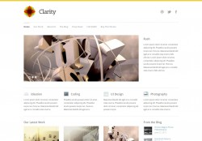

Всем привет! Мне тут [пишут](http://oriolo.ru/wordpress/optimizatsiya-zagolovkov-vidzhetov-v-shablone-wordpress/#comments "Оптимизация заголовков виджетов в шаблоне WordPress"), что мои "Записки о WordPress" непонятны читателям, которые только начинают осваивать сайтостроение. Что ж, исправляюсь. Теперь иногда я буду писать статьи, которые будут отмечены тегом "[новичку](http://oriolo.ru/tag/novichku/ "новичку")" (не вижу смысла заводить рубрику).

Однако я не буду писать об основах html и css - есть огромное количество качественных ресурсов, посвященных этой теме. От себя могу порекомендровать сайты [Постройка.ру](http://postroika.ru/ "Постройка"), на котором я сама когда-то скачала свой первый (и я считаю, что лучший из прочитанных мной) учебник по html, и [HTMLBook](http://htmlbook.ru/ "htmlbook"), который я постоянно использую как справочник.

Лучше я расскажу о том, о чем обычно не рассказывается на в учебниках по созданию сайтов, и о чем обычно умалчивают на курсах.

С чего начинается обучение на курсах по основам создания сайтов? Правильно, с изучения основ HTML, а затем CSS. Я считаю, что это в корне не правильно, и сначала надо узнать про **создание дизайна сайта**. И вот почему.

### Что  такое плохой дизайн сайта?

Выпускник подобных курсов, возомнив себя крутым специалистом, начинает один за другим делать сайты, которые даже хуже [моего первого сайта](http://oriolo.ru/lichnoe/estafeta-moy-pervyiy-sayt/ "Эстафета: мой первый сайт"). В особо запущенных случаях, добавляются красные мерцающие буквы на цветастом кислотно-зеленом фоне. Как вам такой [креатив](http://supercreativ.narod.ru/)? Исходный код, кстати, еще больше доставляет :D

Если вдруг кому-то понравилось, то ещё на уродливые сайты можно посмотреть тут: [wcloset.org](http://wcloset.org).

Впрочем, я не уверена, что на всех курсах не учат основам дизайна. Просто это мое предположение, основанное на бесконечно плодящемся количестве ужасных сайтов. Я имею в виду как сайты фирм, которые оформляются в соответствии с требованиями заказчиков, так и персональные страницы, которые пользователи оформляют в соответствии со своими пожеланиями. В любом случае, это не говорит ни о чем, кроме как об отсутствии вкуса.

### Что такое хороший дизайн сайта?

Ну, не будем о грустном. Посмотрев на пример плохих сайтов, вы наверняка заходите **как сделать лучший дизайн**, чем на них. Давайте лучше поговорим о том, что такое **хороший дизайн сайта**. Следует заранее сказать о том, что тут я буду рассуждать о дизайне как о внешнем виде готового сайта. Я не буду говорить о требованиях к макету сайта, и о том как его оформлять.

Что такое дизайн? Существует мнение, что дизайн - это визуальное оформление сайта. Однако это не совсем так. Дизайн - это взаиморасположение элементов на сайте, структура страниц, навигация по сайту, удобство и понятность навигации  для пользователя.

Когда-то мне попалась мысль о том, что образец идеального дизайна - это лист чистой белой бумаги. Почему, спросите вы? Потому что **в хорошем дизайне нет лишних элементов**. И если какой-то элемент оформления сайта можно убрать, то его надо убрать. Посмотрите на главную страницу Гугла: кроме ссылок в верхнем ряду, логотипа и строки поиска там больше ничего нет. Или посмотрите на сайт компании, в которой я работаю: mip-f1.com. Я не говорю, что он идеален, но убрать больше ничего нельзя, а добавление дополнительных элементов будет явно лишним.

Главное на любом сайте, а в особенности блоге, это тексты. Конечно, бывают исключения в виде видео- и фотоблогов. Но в любом случае, посетитель приходит на сайт за информацией. А поэтому в идеальном дизайне **отсутствуют элементы, отвлекающие от информации**. Вот скажите, на скриншоте, который я приводила выше, удобно читать текст? Естественно, нет. Потому что там фон ярко-зелёный. Фон лучше делать нейтрального цвета (белый, серый), или пастельного. Посмотрите на дизайн на втором скриншоте. Он просто нереально красивый! Можете [посмотреть на него "вживую"](http://themetrust.com/demos/clarity/ "Красивый дизайн").

В идеальном дизайне используется **не более трёх различных цветов** плюс нейтральный, потому что «пёстрые» страницы раздражают глаз.

Это значит, что текст тоже должен быть одного цвета. Наиболее важные фразы можно выделить жирным, но не надо делать их цветом, отличным от цвета основного текста! Ваш посетитель не дурак, он умеет читать, и сам обратит внимание на нужные моменты статьи, даже если они никак не будут отличаться по цвету.

А вот ссылки должны выделяться. Причём  просто ссылка и посещенная ссылка должны быть разных цветов. Навигация, основное меню сайта, должно быть удобным и интуитивно понятным для всех посетителей. И одинаковой на всех страницах. О таких очевидных вещах, как наличие ссылки на главную страницу со всех страниц сайта, и ссылки на разделы и рубрики, я не говорю.

Сейчас можно подвести итог. **Признаки хорошего дизайна** таковы:

1. графические элементы не должны отвлекать от текстов
2. отсутствуют элементы, не несущие функциональную и смысловую нагрузку
3. используется не более трёх цветов

Как видите, всё просто. И я уверена, что **чем проще дизайн, тем он привлекательнее**. Если вы считаете, что минимализм это скучно и однообразно, посмотрите [эту подборку](http://superdit.com/2010/08/31/25-favorite-clean-and-minimalist-blog-design/) дизайна блогов, и ваше мнение изменится!
