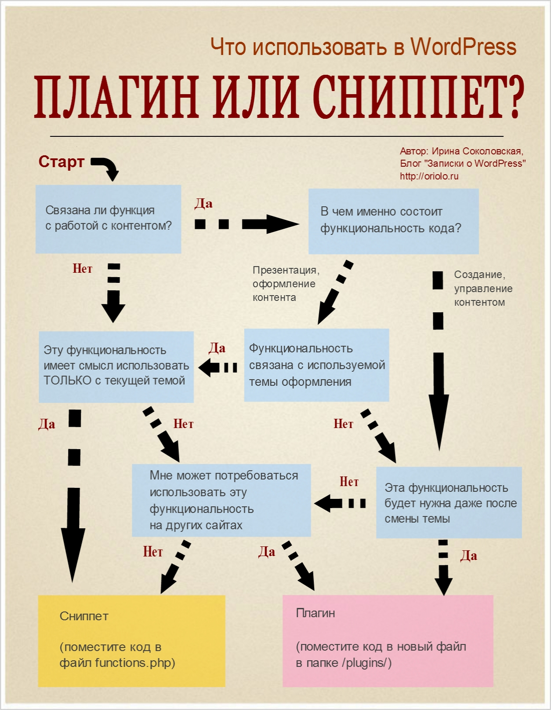

Многие сталкиваются с вопросом: использовать ли в WordPress плагин, или лучше найти решение без плагина, и прописать код в файле functions.php (который еще называется сниппет)? В разных ситуациях ответы на этот вопрос будут разными.

Основное правило - если ваша функция нужна для **оформления контента**, используйте сниппет. Если функция нужна для **создания нового контента**, и вы не хотите потерять функциональность после смены темы, то используйте плагин.

На официальном сайте WordPress в разделе для разработчиков [приводится](http://make.wordpress.org/themes/guidelines/guidelines-plugin-territory/) следующий список тех возможностей, которые следует выносить в плагины:

- Скрипты статистики посещаемости
- SEO-настроки
- Кнопки типа "поделиться в соц. сетях"
- Шорткоды для вывода контента
- Пользовательские типы записей и пользовательские таксономии
- Удаление или модификация функций ядра WordPress
- Отключение админ-бара
- Сжатие и кеширование

Причем этот список, как сказано в документации, далеко не полный. Поэтому, особенно новичкам, иногда бывает трудно определить, когда лучше использовать код в файле функций, а когда - плагин.

Хотелось бы сразу сказать, что распространенное мнение о том, что плагины тормозят работу сайта - это миф. Нагрузку на сайт создает криво написанный, неоптимизированный код, и не важно, где он расположен - в плагине или в теме.

## Что лучше: код в functions.php или плагин?

Чтобы облегчить выбор, я создала инфографику, которая поможет определить, что лучше использовать для создания определенной функциональности в WordPress в конкретном случае: плагин или сниппет для functions.php



Разберем на примере. Я хочу сделать шорткод, который будет оформлять текст в рамочку, и делать заливку фона зеленым цветом. Вот так: \[success\]это образец действия шорткода\[/success\] Моя тема сделана на Bootstrap, поэтому для того, чтобы сделать такое оформление, мне нужно дописать классы `alert alert-success` к `div`, в котором расположен текст. Идем по схеме:

- функция связана с работой с контентом
- ее основное применение - оформление контента
- и функциональность связана с текущей темой оформления, так как без Bootstrap'а работать не будет
- есть смысл использовать это не только в текущей теме
- но на других сайтах я так делать не буду, потому что нужно будет создать дополнительные CSS-стили, которые по-умолчанию идут с бутстрапом

Поэтому я разместила свой код в файле функций.

Другой пример. Сейчас я публикую [серию постов о создании темы](http://oriolo.ru/series/create-wp-theme-from-html/). Для удобства читателей, я решила создать специальную таксономию, кроме рубрик и меток, и назвать ее Серии. Я это сделала при помощи вот этого генератора: [http://generatewp.com/taxonomy/](http://generatewp.com/taxonomy/). Куда я должна положить этот код? Согласно схеме:

- функция нужна для работы с контентом
- она им управляет и создает новый контент, то есть создает Серии и позволяет назначить пост к серии
- и после смены темы я бы не хотела потерять серии постов

Поэтому этот код я оформила как плагин. Но как сделать плагин из кода для файла functions? Читайте об этом далее.

## Как превратить сниппет в плагин?

Допустим, вы нашли интересный код, который хотели разместить в файле functions.php, но после прочтения этого поста передумали, и решили воспользоваться плагином. Вам совсем не обязательно искать плагин с таким же функционалом, как и сниппет. Ведь его можно легко преврарить в плагин!

Чтобы сделать такой плагин, потребуется:

- создать в папке /plugins/ новую подпапку, и назвать ее английскими буквами без пробелов и заглавных букв
- в этой папке создать новый пустой файл, и тоже назвать его английскими буквами без пробелов и заглавных

Теперь в файл, который вы только что создали, нужно вставить такой код:

```php{12}
<?php
/**
 * Plugin Name: Название плагина
 * Plugin URI: http://ваш-сайт
 * Description: Описание плагина
 * Version: версия плагина, например, 1.0
 * Author: Ваше имя
 * Author URI: http://ваш-сайт
 * License: GPL2
 */

// ниже начинается мой плагин

?>
```

Сохраняем файл. После этого уже можно зайти в Консоли WordPress в плагины, и найти там ваш только что созданный плагин.

Далее, нам нужно вставить код функции (сниппета) в этот файл, ниже комментария в 12 строке. 12 строку, кстати, можно удалить. Покажу на примере.

Вот эта функция добавляет к посту css-класс `has_thumb`, если у поста есть миниатюра:

```php
function has_thumb_class($classes) {
    global $post;
    if( has_post_thumbnail($post->ID) ) { $classes[] = 'has_thumb'; }
        return $classes;
}
add_filter('post_class', 'has_thumb_class');
```

Она очень маленькая, поэтому на ее примере удобно научиться делать плагины. Давайте это сделаем:

```php{12}
<?php
/**
 * Plugin Name: Add Image Class
 * Plugin URI: http://oriolo.ru
 * Description: Добавляет класс к постам с миниатюрами
 * Version: 1.0
 * Author: Irina Sokolovskaja
 * Author URI: http://oriolo.ru
 * License: GPL2
 */
 
// функция добавляет класс к постам с миниатюрой
function has_thumb_class($classes) {
    global $post;
    if( has_post_thumbnail($post->ID) ) { $classes[] = 'has_thumb'; }
        return $classes;
}
add_filter('post_class', 'has_thumb_class');
 
?>
```

Такой способ преобразования сниппетов в плагины будет работать в 99% случаев. Это очень удобно, так как управлять плагинами намного проще, чем вставками в файл functions.php. И, вопреки распространенному мнению, нагрузки на сайт от такого плагина не будет больше, чем от того же самого кода, вставленного в functions.

Если у вас есть какие-то вопросы, или вы не согласны с моим мнением, пишите в комментарии!
