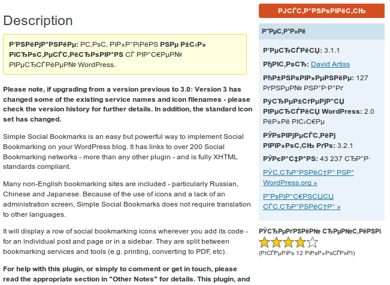

На странице установки плагинов при нажатии на кнопку "Подробности" у меня во всех блогах появлялось окно с текстом в неправильной кодировке.

Примерно то же самое отображалось и на странице в процессе обновления плагинов и самого движка.

[](http://oriolo.ru/wp-content/uploads/2012/01/screenshot_006.png)

Сначала это не очень меня напрягало, но потом начало надоедать, особенно, когда попадаются плагины с описанием на русском. Стала разбираться.

Оказалось, что на моем хостинге по-умолчанию установлена кодировка win-1251. Вариантов решения было два: либо прописать кодировку в php.ini (но у меня нет к нему доступа), либо в папке /wp-content/plugins/ создать файл .htaccess со следующим содержанием:

```
AddDefaultCharset UTF-8
```

После этого все стало работать так, как надо. Теперь бы ещё узнать, как [исправить кодировку в "фокусе по ключевой фразе"](http://mywordpress.ru/support/viewtopic.php?pid=103123) в SEO плагине от Yoast, и будет вообще замечательно.
