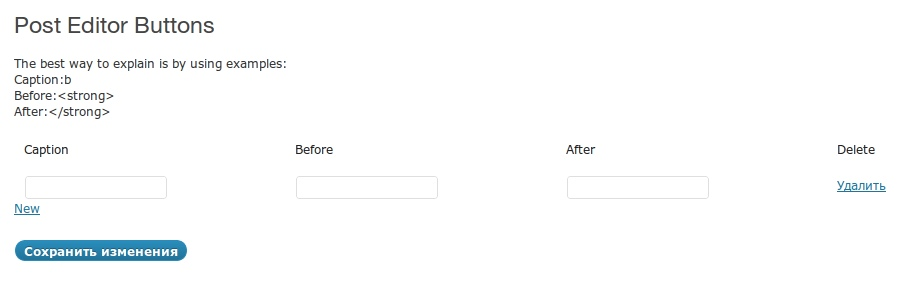
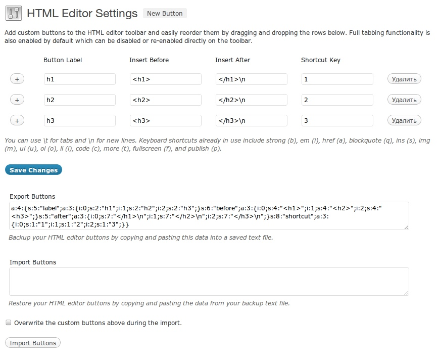
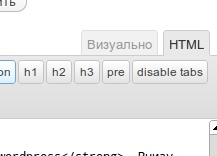

Привет, друзья! Не так давно я писала пост о самых [полезных шорткодах WordPress](http://oriolo.ru/wordpress/poleznyie-shotrkodyi-wordpress/ "Top-10 полезных шорткодов WordPress"), в конце которого приводила код, добавляющий список шорткодов в редактор. И мне показалось, что было бы очень удобно **добавить в редактор дополнительные кнопки**, такие как теги заголовков, или pre, который я использую для вывода кода.

Как оказалось, добавить кнопки в редактор можно несколькими способами. Во-первых, можно установить специальный плагин, в котором уже можно будет добавлять нужные кнопки. И во-вторых, прописать необходимые кнопки вручную.

## Плагин Post Editor Buttons

Это первый плагин, добавляющий в панель редактора новые кнопки. Скачать последнюю версию можно с официального сайта WordPress, или установить через установщик плагинов на вашем блоге.

Как видно из скриншота, он предельно прост в использовании:



Его функции ограничиваются только **добавлением новых кнопок в редактор wordpress**. Внизу есть реклама, я не стала включать ее в скриншот :)

## Плагин HTML Editor Reloaded

Этот плагин более интересен в плане своей функциональности.

Он позволяет добавлять новые кнопки не в низ списка, а после какой-то определенной - это делается нажатием на "плюсик" слева. Также для всех дополнительных тегов можно назначить клавишу быстрого доступа. Для того, чтобы после тега добавить перенос строки или табуляцию, можно использовать /t или /n соответственно.



Кроме того, реализована возможность импорта и экспорта используемого списка дополнительных тегов.

В результате использования любого из плагинов, дополнительные кнопки появлятся в редакторе HTML-разметки:

[](http://oriolo.ru/wp-content/uploads/2012/04/screenshot_022.jpeg)

## Добавление дополнительных кнопок в редактор без плагина

Для тех, кто по каким-то причинам не хочет использовать плагины, можно посоветовать следующий способ добавления новых кнопок в редактор.

Найдите файл `quicktags.dev.js`, который лежит в папке `/wp-includes/js/`. Откройте его, и в самом конце (у меня это 609 строка) найдите такой код:

```

edButtons[10] = new qt.TagButton('strong','b','','','b');
edButtons[20] = new qt.TagButton('em','i','','','i'),
edButtons[30] = new qt.LinkButton(), // special case
edButtons[40] = new qt.TagButton('block','b-quote','\n\n','\n\n','q'),
edButtons[50] = new qt.TagButton('del','del','','','d'),
edButtons[60] = new qt.TagButton('ins','ins','','','s'),
edButtons[70] = new qt.ImgButton(), // special case
edButtons[80] = new qt.TagButton('ul','ul','\n','\n\n','u'),
edButtons[90] = new qt.TagButton('ol','ol','\n','\n\n','o'),
edButtons[100] = new qt.TagButton('li','li','\t','\n','l'),
edButtons[110] = new qt.TagButton('code','code','','','c'),
edButtons[120] = new qt.TagButton('more','more','','','t'),
edButtons[130] = new qt.SpellButton(),
edButtons[140] = new qt.CloseButton(),

```

Это теги, которые у вас сейчас выводятся на панель визуального редактора. Чтобы добавить новую кнопку, надо в нужном месте добавить код ее вызова, например:

```

edButtons[150] = new qt.TagButton('span','span','','','span')

```

Так мы добавим на панель кнопку с тегом `span`.

Если вы хотите добавить кнопку не в конец списка, а в середину, то тогда вам придется поменять нумерацию у всех кнопок, которые идут после нее.

Теперь, когда все необходимые настройки совершены, надо снова зайти в каталог `/wp-includes/js/`, скопировать себе на компьютер файл `quicktags.js`, потом удалить его с сервера и переименовать `quicktags.dev.js` в `quicktags.js`. После этого вы сможете увидеть изменения в вашем редакторе. Если что-то не будет работать, то восстановите сохраненный файл с компа :)

К преимуществу ручного добавления относится то, что вы можете как захотите менять порядок кнопок.

**Внимание!** После обновления версии WordPress все настройки собьются, и вам придется делать все заново, поэтому советую сделать резервную копию файла настроек, и заменять его при обновлении системы.

На этом все. Если что-то непонятно, пишите!
