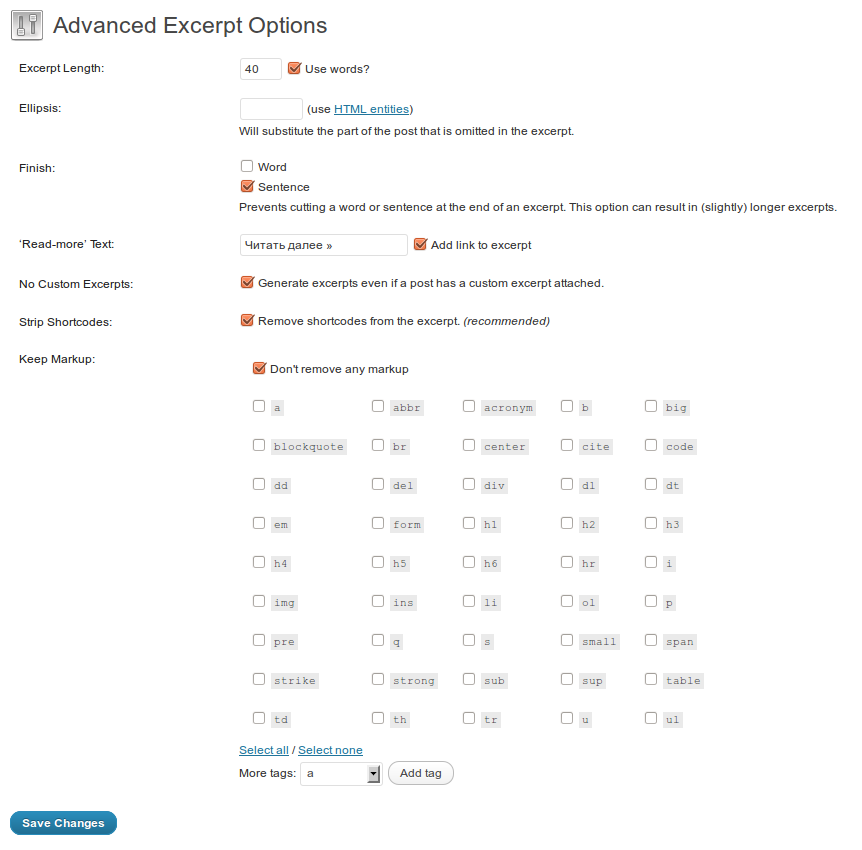

При использовании функции _the\_excerpt()_ в WordPress, анонс выводится без форматирования. Лично мне такая логика не очень понятна (за исключением, пожалуй, удаления тега <a>), поэтому я стала искать способы исправить это недоразумение.

В результате нашёлся плагин [Advanced Excerpt](http://wordpress.org/extend/plugins/advanced-excerpt/). С его использованием существенно упрощается **настройка анонсов Wordpress**.

В панели управления страница с его настройками выглядит так:

[](http://oriolo.ru/wp-content/uploads/2012/01/excerpts.png)

То есть, в плагине **Advanced Excerpt** присутствуют следующие функции:

- изменение длины анонса
- обрезка анонса по слову или по окончании предложения
- сохранение HTML-тегов с возможностью выбора
- настройка ссылки "read more"

И, что для меня немаловажно, плагин "живой" - последний раз он обновлялся 44 дня назад.

Кстати, если вы не любите использовать плагины, то можно воспользоваться способом, который предложил [Владимир](http://www.howtomake.com.ua/):

Чтобы использовать в анонсах теги, в файле functions.php нужно добавить строки

```
add_filter( 'the_excerpt', 'shortcode_unautop');
add_filter( 'the_excerpt', 'do_shortcode');
```

а чтобы не обрезались слова, изменить вот этот параметр:

```
function twentyten_excerpt_length( $length ) {
return 80; // здесь надо задать необходимое количество слов
}
```

В вашем шаблоне вместо функции `twentyten_excerpt_length` может использоваться другая.

Кстати, если кто-нибудь знает, почему в анонсах по умолчанию обрезаются теги - расскажите пожалуйста!
