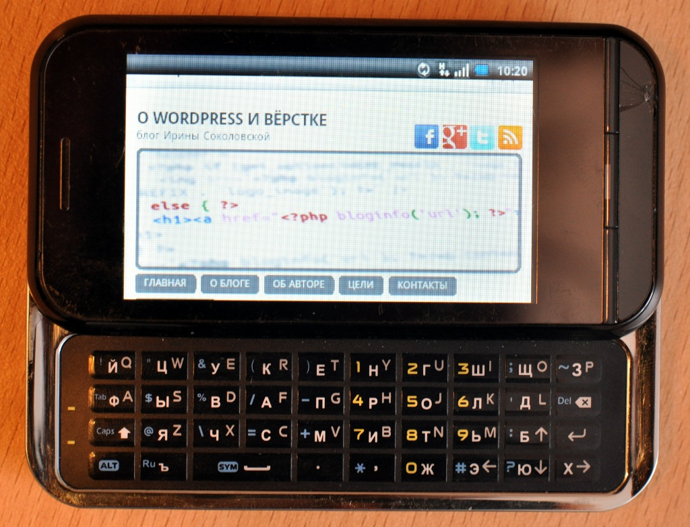

Сегодня я расскажу о том, как без плагинов и скриптов **создать мобильную версию шаблона** для вашего блога на WordPress. Ни для кого не секрет, что сейчас увеличивается количество людей, посещающих сайты с помощью смартфонов. Например, на одном из моих блогов около 2000 просмотров в месяц, а это 10-12% от общего числа, происходит с мобильных устройств. Кстати, это на 3% больше, чем посетителей с браузером Internet Explorer. Так почему, если на практически каждом сайте прописываются специальные теги для IE, не позаботиться и о пользователях мобильных телефонов?

Большинство современных для телефонов, с которых совершается просмотр сайтов, управляются OS Android или iOS, на Symbian в 90% случаев используется браузер Opera Mini (Mobile). А значит, браузеры для телефонов поддерживают CSS3, что мы и будем использовать при создании мобильной версии темы.

К **особенностям** браузеров мобильных устройств относятся:

- отсутствие управления с помощью мыши, а также, часто, и клавиатуры,
- управление с помощью сенсорного экрана,
- небольшой рабочего пространства в окне браузера, из-за маленького разрешения экрана.

Поэтому шаблон блога просто необходимо адаптировать под экран телефона! Это даст заметное улучшение его отображения в мобильном браузере. Вот так, например, выглядит мой сайт с телефона:



Давайте теперь определимся, каким должен быть **дизайн сайта для телефона**:

- адаптированным под небольшое разрешение экрана
- предусматривать управление нажатием на сенсорный экран
- достаточно контрастным, чтобы хорошо отображался на ярком экране телефона
- одноколоночным, чтобы отсутствовала горизонтальная прокрутка
- "резиновым" - так как мы не можем предусмотреть все разрешения экранов

## Шаг 1. Путь к мобильной теме в header.php

Во-первых, сделайте копию файла стилей вашей темы, и назовите ее style-mob.css.

### Определяем мобильное устройство. Способ 1

Сейчас давайте немного изменим файл hearder.php. Найдите, где подключается файл стилей (обычно это первые несколько строк кода):

```html

```

и замените ее на следующее:

```html
  
```

Мы разделили все экраны пользователей на две группы: те, которые больше 640 px, и те, которые меньше. Если экран больше 640 px, то будет загружаться обычный файл стилей style.css, а если меньше, то style-mob.css.

Если вы решили использовать этот способ, то перед строками, которые вы только что вставили, необходимо добавить специальные строки для IE 6-8.

Да-да, телефоны поддерживают media="screen and (max-width: 641px)", а ослик до 9 версии - нет :D

### Определяем мобильное устройство. Способ 2

Есть второй способ. Можно задать значение `media="handheld"` для пути к "мобильному" стилю, и там прописать путь к файлу стиля для телефона:

```html
  
```

В этом случае, если просмотр совершается с компьютера, грузится обычный стиль, а если с телефона, то style-mob.css. Я не проверяла, как это будет работать.

## Шаг 2. Редактируем style-mob.css

Если вы использовали способ 1 для вставки файла стилей, то просто уменьшите окно браузера, чтобы увидеть, как ваш сайт выглядит с телефона! Если вы использовали способ 2, то временно замените его на способ 1, и сделайте то же самое :D. Ну, или просмотрите сайт непосредственно с телефона. На самом деле, первый способ хорош в процессе **разработки мобильной темы**, а второй - уже когда она готова к использованию.

Теперь откройте style-mob.css вашим любимым файловым редактором.

Я сделала такие правки:

- установила ширину страницы (body) в 100%, а блока с контентом (page) в 95%, чтобы сделать небольшие поля
- включила "видимость" для кнопки "поиск"
- увеличила размер шрифта, перевела все значения шрифтов в em
- убрала float:left для центральной колонки, чтобы шаблон стал одноколоночным
- и еще некоторые "косметические" правки

На самом деле, невозможно сказать, что именно необходимо поменять, чтобы сделать шаблон мобильным, все зависит от конкретного используемого шаблона.

Если возникли какие-то вопросы, пишите, обязательно отвечу. И подписывайтесь на [RSS](http://feeds.feedburner.com/oriolo_ru "RSS"), чтобы не пропустить ничего интересного!
