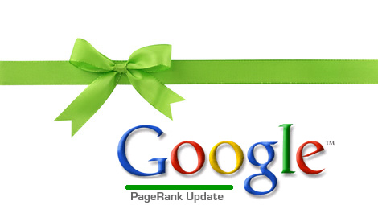

Привет, друзья! Сегодня произошел очередной **апдейт Google PR**, который оказался для [моего блога](http://oriolo.ru "Блог Записки о WordPress") весьма позитивным. По результатам апдейта блогу был присвоен **PR 3**! Я даже не ожидала таких результатов! Гугл очень обрадовал, что еще сказать :)

Как вы наверное заметили, первый пост в блоге был опубликован 10 января 2012 года. Какие действия с моей стороны в течение этого месяца помогли **поднять PR**?

Прежде всего, я старалась **писать интересные и уникальные тексты**. И, судя по комментариям, у меня это получается :)

Теперь что касается входящих ссылок на мой блог.

Во-первых, я приняла участие в [эстафете "Мой первый сайт"](http://oriolo.ru/lichnoe/estafeta-moy-pervyiy-sayt/ "Эстафета: мой первый сайт"), и [конкурсе "TOP-10"](http://oriolo.ru/wordpress/poleznyie-shotrkodyi-wordpress/ "Top-10 полезных шорткодов WordPress"). Я считаю, что именно **обратные ссылки с блогов-организаторов** дали большую часть этого PR.

Во-вторых, я публиковала анонсы своих постов в **социальные сети для блогеров** (а именно в Grabr, Webice, SeoGang). В каждой социальной сети я писала уникальный анонс и подбирала подходящие ключевые слова.

В-третьих, я достаточно активно **комментировала блоги** схожие с моим по тематике. Я особо не следила, но возможно, среди них были и dofollow блоги, и ссылки с них повлияли на поднятие PR. Кроме того, комментирование блогов привело на мой блог первых посетителей (но это уже не имеет отношения к PR).

В-четвертых, я зарегистрировалась в проекте HelpMyBlog, и получила около **20-и ссылок из социальных сетей и блогов** других участников.

А ещё я добавила ссылки на свой блог в своих профилях на различных сайтах. Но их было не больше 10, и не все они индексируются. Так что я думаю, что этот пункт не очень важен.

Я очень рада результатам **апдейта PR от 6.02.2012**. Теперь я буду делать все, чтобы не потерять этот результат :)

А как вы думаете, что влияет на рост PR? И как наращиваете его на своих сайтах, если это не секрет, конечно?
