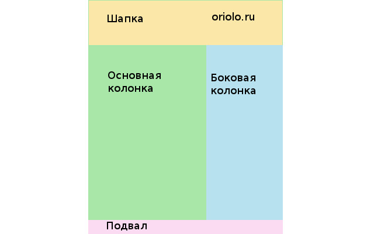
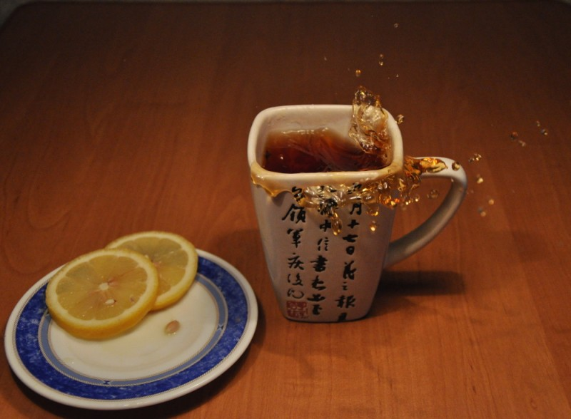

Привет всем читателям блога [Записки о WordPress](http://oriolo.ru)! Мой сегодняшний пост посвящен тому, **как я верстаю сайты**. Из него вы узнаете, какие программы необходимы для верстки сайта, как происходит процесс верстки и что мне помогает и мешает в этом деле.

Идея этого поста перешла ко мне по эстафете от УтБ, автора блога [gtalk.kz](http://www.gtalk.kz/). Вот, кстати, [его пост](http://www.gtalk.kz/konkursy/estafeta-kak-ya-verstayu.html), положивший начало эстафете.

## С чего начинается верстка сайта?

Обычно верстка страницы сайта начинается с изучения макета, отрисованного дизайнером. Этот макет я разбиваю на составные части, не обращая внимания на мелочи:

- шапка;
- основная часть, где будет располагаться контент;
- боковая колонка, если есть;
- подвал;
- другие элементы.

Получится примерно так:

Это так называемый **каркас страницы**. Все остальные элементы будут располагаться внутри этих.

Затем я создаю html-файл, в котором содержатся основные элементы страницы. В этом html-файле пока нет подробностей, просто структура. Мне нравится верстать на html5.

Потом я создаю соответствующий CSS файл, содержание которого зависит от многого:

- фиксированный ли это макет или резиновый,
- должна ли боковая колонка быть "прикреплена" к подвалу или нет,
- должен ли подвал быть прижат к низу страницы,
- какого цвета должен быть фон главных элементов,
- и так далее.

## Как происходит верстка?

После этого я открываю графический редактор, и вырезаю отдельные графические элементы оформления, которые нельзя сделать на одном CSS, и складываю их в папку /images/.

Затем я начинаю оформлять шапку, основную и боковую колонки и подвал. Обычно это происходит сверху вниз.

Следующим шагом будет верстка более мелких элементов, таких как меню (советую прочитать, как создать красивое [вертикальное меню](http://oriolo.ru/vyorstka/sozdaem-effektnoe-vertikalnoe-menyu-na-html5-i-css3/ "Создаем эффектное вертикальное меню на HTML5 и CSS3") на CSS3), отдельные элементы боковой колонки или статьи если это блог.

После каждого изменения я просматриваю в браузере, что же у меня получилось.

И так, шаг за шагом, постепенно будет оживляться идея дизайнера.

В самом конце я просматриваю сайт в разных браузерах, и проверяю html и css код на валидность, и исправляю ошибки, если они есть.

## Какие программы для верстки я использую?

На моем компьютере установлен Ubuntu Linux, поэтому программы, которые я использую для верстки, будут немного специфичными :) Но я уверена, что для всех из них есть аналоги под Windows.

Итак, вот мои **программы для верстки**:

- **gedit** - это мой любимый блокнот, с подсветкой, нумерацией строк и другими полезными функциями;
- **Eclipse** - редактор кода, который удобно использовать для больших проектов с огромным количеством файлов;
- браузеры **Firefox**, **Chrom**, **Opera** и онлайн-эмулятор IE;
- Иногда приходится использовать и сам IE, тогда запускаю виртуальную машину **VirtualBox** с виндой. Его же использую, если надо посмотреть, как верстка выглядит на винде;
- графический редактор **GIMP**

Также использую такие **онлайн-сервисы для верстки**, как

- [pxtoem.com](http://pxtoem.com/ "pxtoem.com") - для перевода px в em;
- [генератор CSS3 кода](http://css3generator.com/) - позволяет быстро создать красивые эффекты на CSS3;
- [генератор шаблонов](http://csstemplater.com/) - очень полезно, когда надо быстро создать типичный шаблон.

## Обстановка во время верстки

Обычно я люблю работать в тишине, когда ничего не отвлекает, и не слышно ничего, кроме звука клавиатуры. Также в процессе работы я люблю пить чай из большой кружки, или есть что-нибудь типа изюма или орехов :)

Когда что-то не получается, то я перехожу к следующему элементу, а если не получается ничего - иду отдыхать :)

## Принимайте участие!

Кстати, т.к. этот пост участвует в эстафете **"Как я верстаю"**, то каждый может отписаться в комментариях и принять в ней участие, написав в своем блоге собственную версию рассказа о том, как надо верстать сайты.

Если вы напишите, что получили эстафету от меня, то получите обратную ссылку с этого поста на свой блог. Все участники получат _бесплатную обратную ссылку_ с блога организатора ;)
