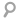

В этой статье рассматривается пример создания **формы поиска для блога** на WordPress, с использованием HTML5 и CSS3.

Форма будет одинаково отображаться во всех браузерах, и иметь валидный HTML5 и CSS3 код. Созданная форма будет обладать такими качествами, как:

- закругленные уголки,
- изображение внутри input,
- размер input изменяется при щелчке на нем,
- кнопка для очистки формы.

### Шаг 1. Настройки functions.php

Для начала, в папке с вашей темой найдите файл functions.php. Убедитесь, что функции get\_search\_form там нет. Это можно сделать через поиск. Теперь добавьте следующее:

```

function search_form( $form ) {
	$form = '
	' . __('Найти:') . '
	
	
	';
 
	return $form;
}
add_filter( 'get_search_form', 'search_form' );
```

Мы создали HTML5-код формы поиска.

Обратите внимание на 4-5 строки: там используется новый HTML5 атрибут placeholder, который добавляет **замещающий текст для строки поиска input**.

Также, в 4 строке для input задан тип type="search". Это добавляет кнопку-крестик, при помощи которой можно быстро очистить форму поиска.

Теперь давайте создадим стиль CSS3 для формы.

### Шаг 2. Добавляем стили формы

Откройте файл style.css. Если в нем уже прописаны какие-то свойства для формы поиска, то их надо удалить.

Теперь надо добавить следующий код:

```
#searchform {
	margin: 0; /* удаляем отступы */
	vertical-align: middle; /* вертикальное выравнивание формы по середине */
	float: right; /* обтекание по правому краю */
}
```

Сейчас вы создали стиль для самой формы. Теперь надо добавить стили для полей.

### Шаг 3. Добавляем стили полей

Сначала пропишем основные стили input:

```
input#s {
	border: 1px solid #DDD; /* цвет и ширина рамки */
	color: #585858; /* цвет замещающего текста */
	font-size: 1em; /* размер шрифта внутри формы */
	margin: 0; /* удаляем отступы */
	height: 25px; /* высота формы */
	width: 200px; /* длина формы */
}
```

Теперь добавим изображение лупы внутрь формы:

[](http://oriolo.ru/wp-content/uploads/2012/02/search.png)

```
input#s {
	background: url("images/search.png") no-repeat scroll 5px 2px #FFFFFF;
	padding: 0px 10px 0px 25px;

```

Padding нужен для того, чтобы вводимый текст начинался после изображения.

Сейчас сделаем уголки закругленными:

```
input#s {
	border-radius: 5px; /* закругляем уголки на 5px */
	-webkit-border-radius: 5px; /* закругляем уголки для webkit */
	-moz-border-radius: 5px; /* закругляем уголки для firefox */

```

В итоге, стили для поля input должны выглядеть так:

```
input#s {
	background: url("images/search.png") no-repeat scroll 5px 2px #FFFFFF;
	padding: 0px 10px 0px 25px;
	border: 1px solid #DDD;
	border-radius: 5px;
	-webkit-border-radius: 5px; /* закругляем уголки для webkit */
	-moz-border-radius: 5px; /* закругляем уголки для firefox */
	color: #585858; /* цвет замещающего текста */
	font-size: 1em;
	margin: 0;
	height: 25px;
	width: 200px;
}
```

### Шаг 4. Настройка активного поля input

Сейчас, если вы откроете вашу форму в браузере, то увидите, что при нажатии на нее, она будет подсвечиваться по контуру. Давайте уберем рамку у активного input:

```
input#s:focus {
	outline: none;
}
```

Далее, можно **сделать изменяющийся размер input**, когда при нажатии на него мышкой, он будет увеличиваться влево:

```
input#s:focus {
	outline: none;
	width: 250px;
}
```

Помните, когда в самом начале написали `float: right`? Так вот, кроме выравнивания, это свойство дает эффект увеличения влево.

### Шаг 5. Последние штрихи

И последнее, уберем отображение кнопки "Поиск" и надписи "Найти:".

```
#searchsubmit {
	display: none;
}

#searchform label {
	display: none;
}
```

### Шаг 6. Вставим форму поиска в шаблон

Вставить форму поиска в шаблон можно такой функцией:

Также вы можете использовать виджет "Поиск".

Форма будет выглядеть так:

[](http://oriolo.ru/wp-content/uploads/2012/02/screenshot_003.jpeg)

Если у вас появились какие-то вопросы, пишите, я обязательно отвечу :)
