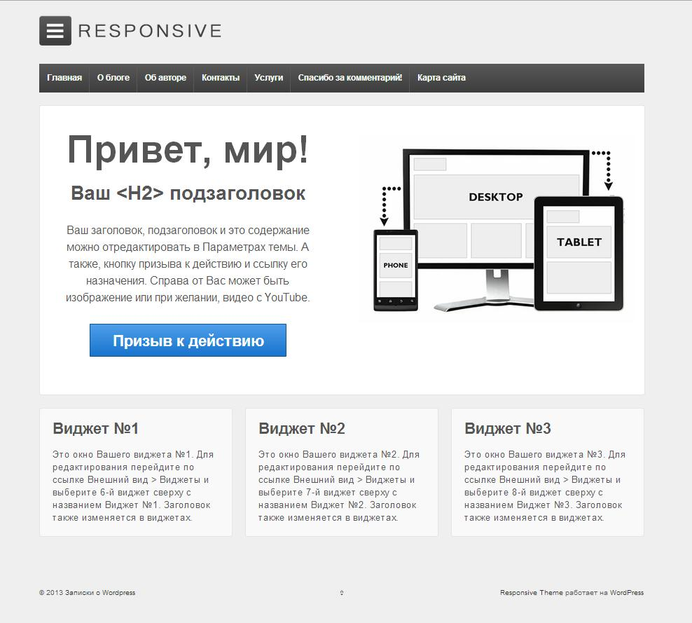

Когда-то я писала о том, как [добавить к теме поддержку мобильных устройств](http://oriolo.ru/wordpress/kak-sdelat-mobilnuyu-versiyu-shablona-dlya-wordpress/ "Как сделать мобильную версию шаблона для WordPress"). Прошло много времени, и дизайн, автоматически подстраивающийся под размеры экрана, давно стал стандартом. Поэтому сейчас я опубликую обзор пяти самых интересных фреймворков, которые позволят без особых проблем создать собственную адаптивную тему для WordPress.

## Responsive

Скачать тему Responsive можно с [официального сайта](http://wordpress.org/extend/themes/responsive) Wordpress, либо найти через установщик тем в блоге. Вот как она выглядит сразу после установки и активации:

К особенностям темы относятся:

- Настраиваемая статичная главная страница,
- Возможность перевода на другие языки через po-файлы,
- Большое количество областей виджетов, которые я отобразила на скриншоте внизу.

А также наличие страницы "Theme Options":

Эта тема, при желании, может быть использована сразу после активации, без каких-либо дополнительных изменений, так как обладает простым современным дизайном. На ее основе можно без особых проблем создать собственную тему.

## Reverie

Эту тему можно скачать с [сайта разработчика](http://themefortress.com/reverie).

Среди особенностей темы:

- Две области виджетов, в боковой колонке и в подвале,
- Хорошо комментированный код,
- Возможность перевода на другие языки через po-файлы.

## The Bootstrap

Тема доступна на [сайте Wordpress](http://wordpress.org/extend/themes/the-bootstrap) в разделе "Темы", либо ее можно найти в установщике тем блога.

Также как и Responsive, это тема, практически готовая к использованию. Однако минималистичный дизайн, продуманная структура файлов и наличие шаблонов для пользовательских типов записей позволяют использовать ее как фреймворк.

## Skeleton

Тему Skeleton можно скачать с [сайта разработчика](http://themes.simplethemes.com/skeleton/).

Особенности:

- Использование PIE,
- Большое количество шаблонов страниц, форм и т.д.,
- Адаптированность для BBpress,
- Есть отдельные шаблоны страницы для пользовательских типов записей и пользовательских таксономий.

В отличие от предыдущих тем, использовать Skeleton сразу после установки не получится, но ее внешняя простота в сочетании с внутренней продуманностью открывает обширное поле для творчества.

## Bones

Эта тема также доступна для скачивания на [сайте разработчика](http://themble.com/bones/).

Особенности темы:

- Великолепно прокомментированный код (причем нельзя не отметить чувство юмора автора),
- Предусмотрены отдельные шаблоны страницы для пользовательских типов записей и пользовательских таксономий.

Эта тема, также как и Skeleton, является отличной стартовой темой для создания нового проекта.

Таким образом, все рассмотренные темы достойны того, чтобы использовать их в качестве фреймворка для создания собственной темы.

А какие стартовые темы для WordPress используете вы? В чем видите их преимущества?
