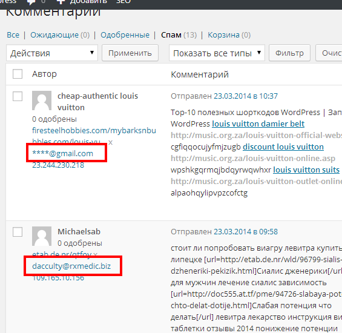
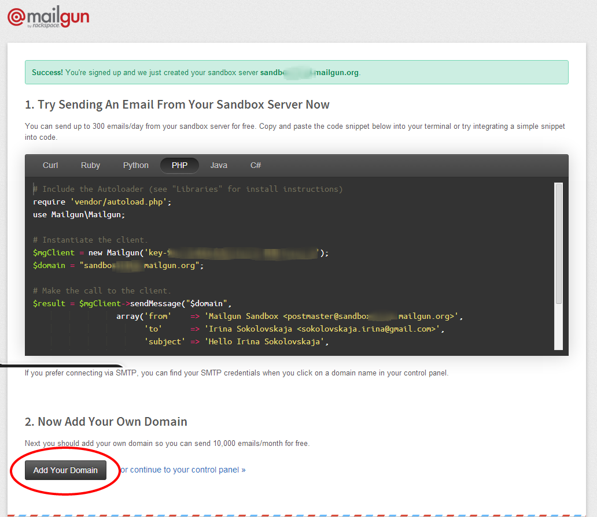
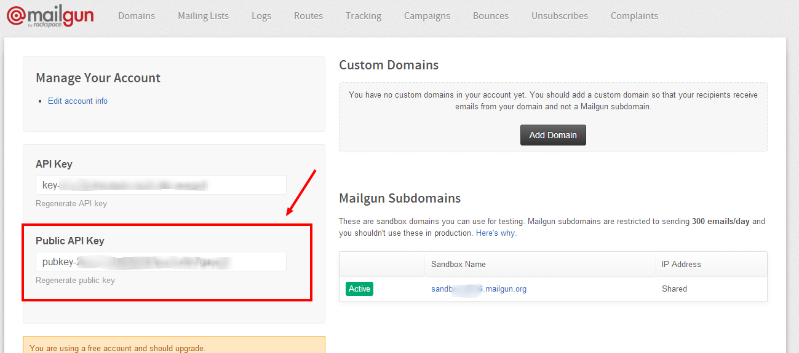
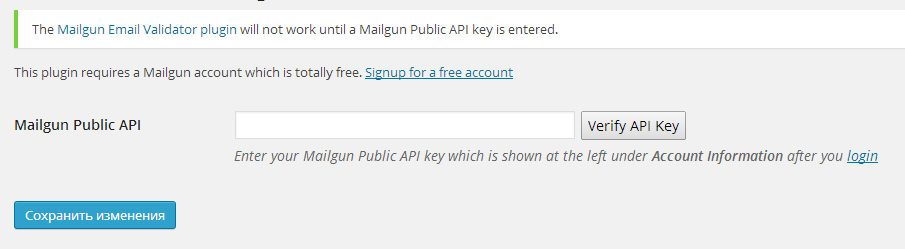
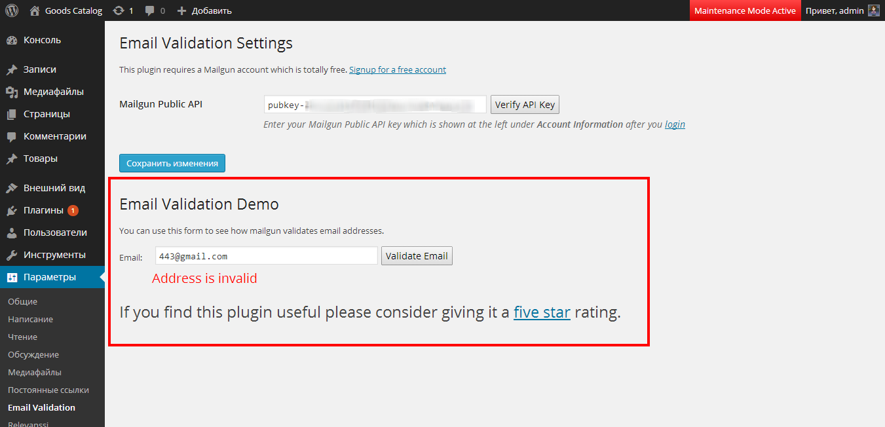

Одним из способов борьбы со спамом является валидация email-адреса. Кроме того, эта возможность будет полезна и во многих других случаях, например, чтобы предупредить случайные ошибки в адресе электронной почты.

Плагин [Mailgun Email Validator](http://wordpress.org/plugins/mailgun-email-validator/) предоставляет интеграцю вашего блога на WordPress с сервисом [Mailgun](http://mailgun.com).

Этот сервис, помимо email-рассылок, предоставляет API для проверки email на корректность. Он проверяет, отвечает ли введенный емаил-адрес требованиям, предъявляемым к регистрируемым ящикам в различных популярных сервисов, и существует ли домен, к которому ящик относится. Подробнее об алгоритме проверки можно [почитать в официальном блоге](http://developer.rackspace.com/blog/mailgun-offers-free-email-validation-api.html) (на английском).

## Как происходит валидация email в WordPress?

Плагин работает очень просто:

- Он интегрируется с функцией [is\_email()](http://codex.wordpress.org/Function_Reference/is_email), поэтому будет работать со всеми формами, которые используют эту функцию, в том числе с формой комментариев, плагиноми Contact Form 7 и Jetpack/Grunion
- Если был введен некорректный адрес, то пользователю будет показано сообщение об ошибке.

В случае рассылки спама, отправка формы не будет происходить, и комментарий не будет записан в базу данных, если введен заведомо несуществующий емаил, как здесь:

Конечно, этот плагин не поможет избавиться от спама полностью, но отсекает заметную его часть. А также предупреждает ошибки пользователей, если они случайно ошиблись при вводе адреса (я, например, часто вместо gmail.co**m** пишу gmail.co**n**).

К недостаткам сервиса Mailgun можно отнести то, что он проверяет соответствие введенного адреса формальным требованиям, то есть, например, Gmail не разрешает регистрировать ящики короче чем 6 знаков, поэтому формально ящик вида "6-случайных-букв @gmail.com" будет считаться корректным.

## Получение ключа Mailgun Public API

Чтобы совершить настройку плагина **Mailgun Email Validator**, нужно получить ключ Mailgun Public API. Для этого, зарегистрируйтесь на сайте по адресу: [https://mailgun.com/signup](https://mailgun.com/signup). После регистрации вы окажетесь на странице, где вам сообщат об удачной регистрации, и предложет воспользоваться тестовым доменом. В самом низу страницы будет кнопка для добавления собственного домена, и текстовая ссылка для перехода в панель управления:

Вы можете как добавить домен, так отложить это, и просто перейти в панель управления. Для проверки email-адреса на валидность домен вводить не нужно.

В панели управления находим свой Public API key, и копируем его:

## Настройка плагина Mailgun Email Validator

Затем вставляем его в настройках плагина в Консоли (Параметры - Email Verification):

Нажимаем Verify API Key, и потом сохраняем изменения. Если ключ был введен верно, то после сохранения настроек на этой же странице появится тестовая форма, где можно "поиграть" и посмотреть, как Mailgun производит **проверку email на корректность**.

На этом настройка плагина закончена :) Теперь он интегрируется со всеми формами на вашем сайте, и будет производить проверку email на корректность автоматически при заполнении пользователем форм комментариев, обратной связи и даже при регистрации.
