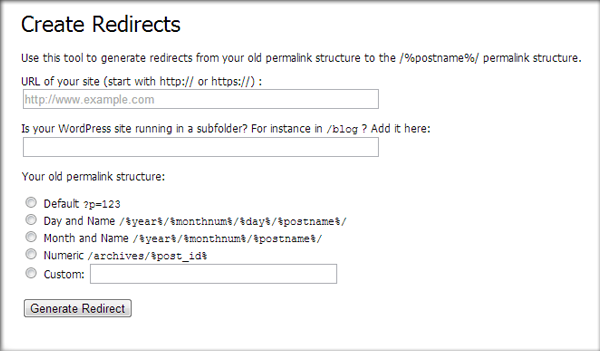
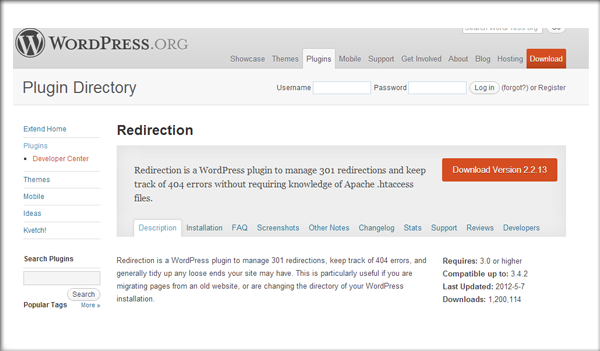

Добрый день, уважаемые читатели! Сейчас существует несколько вариантов реализации мультиязычного сайта на Wordpress. Однако при работе с мультиязычным сайтом, какой бы метод его создания вы не выбрали, всегда возникают проблемы. И именно решению некоторых из возможных проблем посвящен этот гостевой пост. Автор публикации - Артем, член  команды сервиса [UptimePal](http://uptimepal.com/ru/) для веб-мастеров и владельцев сайтов.

Сервис  [UptimePal](http://uptimepal.com/ru/) предназначен для эффективного мониторинга сайта, который проводится из 20 точек земного шара. Среди функций сервиса - уведомление о неполадках и детализированный просмотр отчетности.

Итак, слово Артему.

Вопрос настройки сайта на CMS Wordpress всегда порождает огромное количество вопрос, особенно если это касается интернационального сайта. Довольно часто я получаю вопросы связанные с этой темой и решил собрать всё воедино и изложить в данной статье.

Конечно, существует множество способов решения данных проблем, поскольку Wordpress является гибкой платформой. В этом посте я собрал решения, которые применял в прошлом, но вы также можете написать свои идеи в комментариях, возможно и я чему-то у вас поучусь. :)

## Правильная система структуры ссылок

В ходе моей работы с Wordpress я неоднократно сталкивался с проблемой скорости работы сайта, особенно когда количество постов превышало определенный предел. И дело тут не в самой CMS, а в том какая структура наших статей и страниц. Приведу простой пример: www.site.com/blog/2013/интересная-статья/ будет работать быстрее нежели www.site.com/blog/маркетинг/интересная-статья/. Это происходит потому что Wordpress имеет определенную проблему в расшифровке порядка статей.

Говоря проще, отсутствует «понятная дата» для нашей базы данных, что ведет к ухудшению скорости работы. Данная проблема была публично озвучена разработчиками Wordpress и встречалась на прошлой версии. К счастью, новая версия Wordpress под цифрой 3.3 не имеет данной проблемы. Поэтому если желаете избавиться от проблемы скорости работы сайта, то помните: версия 3.3 или выше не имеет таких «багов»:

Wordpress 3.3 или более поздняя:

/%имя постя%/ /%категория%/%имя поста%/

Ранняя версия Wordpress (До 3.3):

/%id поста%/%имя поста%/ /%год%/%/%имя поста%/

Вывод из всего вышесказанного следующий: лучшая практика применения ссылок (если у вас Wordpress 3.3 или более поздняя) использовать что-то вроде этого: /%категория%/%имя поста%/, или даже /%имя поста%/, поскольку более нагляднее для пользователя, а также иерархия сайта при этом выглядит более логично, что уже говорить про SEO составляющую.

Конечно, если вы не поставили апдейт Wordpress и пользуетесь старой версией по той или иной причине (установлены старые плагины, которые нужны но не обновляются, внесли серьезные изменения в тему Wordpress и т.д.), и при этом не имеете структуру сайта с использованием даты, то ожидайте снижения скорости работы. Лучшим вариантом в данном случае будет изменение структуры сайта, что лучше скажется на пользователях и поисковых системах.

## Верный способ изменения структуры ссылок сайта

Какой способ изменения структуры является наиболее правильным? Как уже было сказано, причин для изменения такого типа целое множество, поэтому к данному вопросу нужно подходить осторожно.

Изменение адреса внутренних страниц может повлечь за собой изменения «веса страницы», который уже был распределен поисковой системой. Именно поэтому нужно применять 301 редирект чтобы предудыщуая работа не была напрасной. Wordpress имеет гибкую систему изменения адресов, но к сожалению если вы меняете старый URL на новый, то будет применен 302 редирект, что нам определенно не подходит.

В случае если эти страницы крайне важны для вас и вы не хотите потерять позиции в выдаче поисковика, то у меня есть два решения:

### Решение 1: Редактирование кода в файле .htaccess

Если вы измените структуру линков на /%имя поста%/ (и в дальнейшем собираетесь придерживаться именно этой структуры), то я рекомендую внести измения в файл .htaccess для внедрения 301 редиректа со старых адресов на новые.

Вариант с изменением .htacess мне кажется наиболее удачным, поскольку установка простая и не потребует установку дополнительных плагинов, которые вызовут у вас сложности с освоением.

Итак, что для этого нужно сделать:

1\. Сделайте резервную копию текущего файла .htaccess в том случае если что-то пойдем не так 2. Скопируйте фрагмент .htaccess кода зайдя на [сайт Yoast](http://yoast.com/change-wordpress-permalink-structure/) и прокрутив страницу вниз вы увидете оранжевую кнопку «Generate Redirects» 3. Заполните поля указанной формы и нажмите «Generate Redirect»

4\. Скопируйте полученный код и вставьте его в самый верх файла .htaccess 5. Смените структуру файла на /%имя поста%/ через интерфейс Wordpress’а. 6. Убедитесь в том, что редирект со старого URL на новый действительно 301 редирект.

Сделать это можно при помощи [вот этой утилиты](http://www.internetofficer.com/seo-tool/redirect-check/).

Таким образом мы можем быстро настроить .htaccess. Однако если что-то не работает, вы где-то ошиблись и т.д., то всегда можете вернуть назад ваш файл из резервной копии.

### Решение 2: Плагин для редиректа

Если вы хотите использовать другую структуру, отличную от /%имя поста%/, то тогда лучше воспользоваться сторонними плагинами для Wordpress. Существует большое многообразие плагинов для таких операций, однако я рекомендую воспользоваться [Redirection от John Godley](http://wordpress.org/extend/plugins/redirection/).

Данный плагин необходимо установить ДО ВНЕСЕНИЯ ИЗМЕНЕНИЙ со ссылками. Порядок следующий: вы поставили плагин, с легкостью внесли изменения, используя простой интерфейс данного расширения и затем дважды провели ссылки и убедились что это действительно 301 редирект. Решение достаточно простое, не так ли?

## Мультиязычный сайт на Wordpress

Достаточно интересная ситуация возникает, когда необходимо применить возможность перевода контента. Например, чтобы при заходе на www.ваш-сайт.com/fr/ была французская версия контента, а при заходе на www.ваш-сайт.com/ru/ была русская.

Штатными средствами Wordpress этого не добиться, однако существует замечательный плагин, который позволяет создавать языковые директории, такие как /fr/ или /ru/. Таким образом мы можем сделать многонациональный сайт без особого труда.

### Решение: WPML

Я всегда в таком случае использую [WPML](http://wpml.org/) .

- Позволяет легко настроить и управлять переведенным контентом внутри одной страницы/поста на Wordpress.
- Легко добавить другие языки, если это необходимо.
- Автоматически применять теги флагов на всех страницах, во избежания дублирования контента.
- Позволяет использовать языковые директории, подстраницы или домены и помимо этого позволяет интегрировать плагин в Google Webmaster Tools, что особенно полезно!

Несмотря на то что плагин платный, полезность его неоценима. Самая полная инструкция для установки и настройки – по-моему лучшее решение для создания мультиязычного Wordpress сайта.

### Всегда есть другие возможности

Надеюсь теперь вопросов касательно мультиязычности и ссылок внутри страниц станет меньше. Я люблю платформу WP, но тем не менее иногда необходимо применять вручную некоторые изменения, для того чтобы все выглядело более дружелюбно для пользователя.

Жду от вас комментариев и возможно ваши варианты решения определенных проблем связанных с бизнесом и мультиязычностью сайтов.
