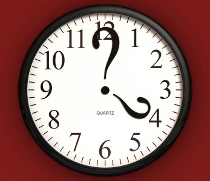

Надо ли убирать дату поста в блоге? А главное, зачем? Такими вопросами я задалась во время вчерашнего чтения. Я обратила внимание, что у некоторых блогеров дата публикации удалена. Мне кажется, что это существенный недостаток, и вот почему.

Предупреждаю, что данный пост отражает лишь моё субъективное мнение, и, может быть, это во мне профессиональный историк протестует :D 

### Падает доверие посетителей к иформации

Обычно пред чтением поста я смотрю, когда он был опубликован. И если **нельзя узнать дату, то доверие к информации падает**. Может быть, уже лет пять прошло. А если это, например, описание какого-то плагина для Wordpress или программы, то скорее всего уже вышли новые версии, и пост просто неактуален.

### Появляются сомнения в необходимости комментировать

У меня это происходит из тех же самых соображений. Особенно, если и у комментариев дата потерта. Вдруг обсуждение происходило год назад? А **поднимать старую тему не очень хочется**, многое могло поменяться. Опять же, для примера возьмём блоги IT-тематики. Посты, которые на них публикуются, в большинстве случаев устаревают в течение года.

### А если посмотреть с другой стороны...

Конечно, у удаления даты есть свои преимущества: ваши посты находятся как бы вне времени и пространства, и, по мнению некоторых, посты без даты актуальны всегда. В таких случаях можно [убрать дату публикации](http://oriolo.ru/wordpress/kak-ubrat-datu-publikatsii-v-wordpress/ "Как убрать дату публикации в WordPress?").

Я считаю, что смысл убирать дату имеет в блогах, информация на которых устаревает очень медленно или не устаревает вовсе. Или у вас не блог, а просто сайт, использующий Wordpress как CMS.

К примеру, у меня есть блог женской тематики, где публикации посвящены тому, как завить волосы феном или что подарить на день влюблённых. Понятно, что они морально не устареют, и будут пользоваться популярностью даже через пять лет, поэтому дату я убрала.
