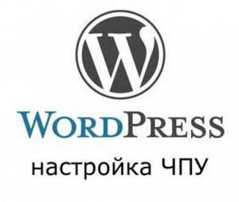
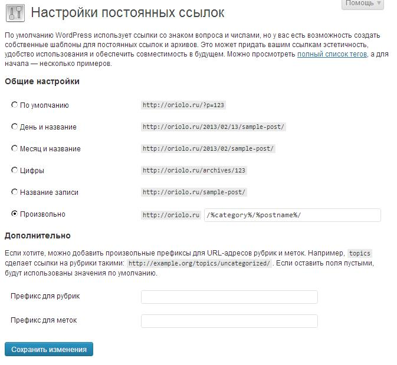

Мой сегодняшний пост написан, по большей части, для новичков, и посвящен такой важной теме, как **настройка чпу wordpress**. Из него вы узнаете, что такое ЧПУ, как настроить постоянные ссылки в блоге, и какой шаблон постоянных ссылок выбрать.



## Что такое ЧПУ

**ЧПУ**, или человеко-понятный урл, это адрес веб-страницы, который удобен для восприятия человеком. Система ЧПУ предлагает способ записи адреса, который логично описывает структуру сайта и пути по нему. Для большей наглядности, приведу в пример две ссылки на один и тот же пост:

- http://oriolo.ru/wordpress/nastroyka-chpu-wordpress/
- http://oriolo.ru/?p=1651

Первая ссылка использует ЧПУ, а вторая - нет, но обе они ведут на одну и ту же страницу блога.

**Использование постоянных ссылок** имеет неоспоримые преимущества:

- ЧПУ-ссылка позволяет заранее предположить о содержимом страницы, на которую она ведет
- такую ссылку легко запомнить и продиктовать
- польза для SEO продвижения - ЧПУ может содержать ключевые слова
- ЧПУ позволяет ориентироваться среди разделов и рубрик сайта

## Какой шаблон ЧПУ выбрать

Сейчас на большинстве блогов используется один из следуюших шаблонов постоянных сслылок:

### Шаблон с датой и названием публикации

Его удобно использовать для новостных блогов, которые часто обновляются, чтобы пользователю было сразу понятно, когда опубликована новость.

**Шаблон:** /%year%/%monthnum%/%postname%/ **Пример:** http://oriolo.ru/2012/11/sample-post/

### Шаблон с рубрикой и названием поста

Такой шаблон позволяет пользователю удалив последнюю часть URL перейти на страницу всех записей в рубрике. Я использую именно такой шаблон на этом блоге.

**Шаблон:** /%category%/%postname%/ **Пример:** http://oriolo.ru/wordpress/sample-post/

Обратите внимание, что по-умолчанию в вордпресс путь к странице категории пишется с префиксом category. Так, например, путь к рубрике "Работа с WordPress" на моем блоге будет выглядеть так: http://oriolo.ru/category/wordpress, а путь к записи в этой рубрике - http://oriolo.ru/wordpress/sample-post/. То есть, набрав в адресной строке просто http://oriolo.ru/wordpress/, без префикса, посетитель попадет на страницу с ошибкой 404.

Поэтому, если вы хотите использовать этот шаблон, то для удобства посетителей можно **удалить префикс category со страниц рубрик**. Сделать это можно с помощью плагина [WP No Category Base](http://wordpress.org/extend/plugins/wp-no-category-base/) или следующего кода, который надо вставить в конце файла functions.php:

```
add_filter('user_trailingslashit', 'remcat_function');
function remcat_function($link) {
    return str_replace("/category/", "/", $link);
}
  
add_action('init', 'remcat_flush_rules');
function remcat_flush_rules() {
    global $wp_rewrite;
    $wp_rewrite->flush_rules();
}
  
add_filter('generate_rewrite_rules', 'remcat_rewrite');
function remcat_rewrite($wp_rewrite) {
    $new_rules = array('(.+)/page/(.+)/?' => 'index.php?category_name='.$wp_rewrite->preg_index(1).'&paged='.$wp_rewrite->preg_index(2));
    $wp_rewrite->rules = $new_rules + $wp_rewrite->rules;
}
```

Этот код поможет **удалить category из пути в адресе wordpress**. Но он будет работать, только если используется шаблон /%category%/%postname%/ и префикс рубрик не установлен.

### Шаблон с названием записи

Этот шаблон удобен тем, что отсутствует привязка поста к рубрике или дате. Поэтому, такой шаблон позволяет легко менять структуру сайта, перемещая посты из одной рубрики в другую: при этом адрес страницы будет оставаться неизменным. Поэтому, блог с такой структурой постоянных ссылок проще оптимизировать для поисковых систем. А также те, этот шаблон будет полезен, если вы планируете [продавать ссылки](http://oriolo.ru/monetizatsiya/wordpress-sape/ "WordPress + Sape") со своего блога - все посты становятся страницами второго уровня, цена ссылки с них возрастает.

**Шаблон:** /%postname%/ **Пример:** http://oriolo.ru/sample-post/

В принципе, для блога можно выбрать любой из этих шаблонов, но лично я отдаю предпочтение второму и третьему.

## Настройка ЧПУ wordpress

Настройки постоянных ссылок в wordpress производятся в админ-панели по адресу Параметры - Произвольные ссылки.

[](http://oriolo.ru/wp-content/uploads/2013/02/nastroyki-postoyannyih-ssyilok-wordpress.jpg)

На появившейся странице вы можете выбрать один из предложенных стандартных шаблонов ЧПУ, либо ввести свой собственный.
