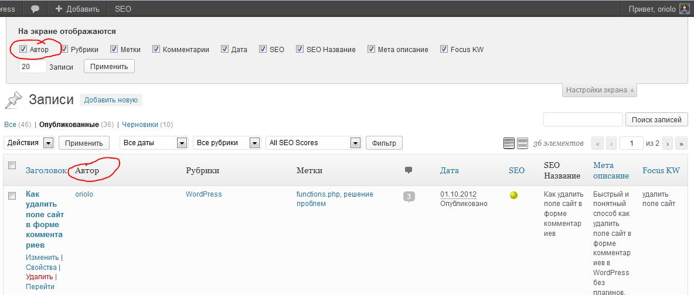
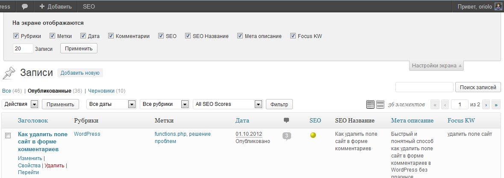

Всем доброго утра! В моем сегодняшнем посте я расскажу, как в админке **WordPress удалить ненужные столбцы в списке записей**. Для чего это может понадобится? Ну, например, если вы - единственный автор блога, то отображать колонку автор просто не имеет смысла.

Это было очень актуально для моего блога. Посмотрите, как по-умолчанию, выглядели столбцы на странице записей:

[](http://oriolo.ru/wp-content/uploads/2012/12/s-kolonkoy-avtor.jpg)

Из-за того, что плагин YOAST SEO добавил дополнительные столбцы, заголовок поста в списке растянулся, а столбец "Автор" занимал непростительно много места.

Конечно, **отключить отображение некоторых колонок** можно, убрав галочку с чекбокса в выпадающем меню настройки. Но что делать, если вы точно знаете, что этот столбец вам никогда не понадобится?

В таком случае, можно удалить столбец, при помощи специального кода, который необходимо вставить в конец файла functions.php вашей темы:

```php
// Вывод колонок в списке записей
function remove_post_columns($posts_columns) {
	$posts_columns = array(
		"cb" => "",
		"title" => "Заголовок",
		"author" => "Автор",
		"categories" => "Рубрики",
		"tags" => "Метки",
		"date" => "Дата",
		"comments" => '
		<div class="vers"></div>
		',
	);
	return $posts_columns;
}
add_filter('manage_posts_columns', 'remove_post_columns');
```

Строки с 4 по 12 отвечают за **вывод стандартных колонок на странице записей**. Удалив, например, строку 6, мы удалим и колонку "Автор". Также, путем изменения порядка строк, можно изменять порядок колонок.

С помощью приведенного выше кода я смогла сделать следующее:

[](http://oriolo.ru/wp-content/uploads/2012/12/bez-kolonki-avtor.jpg)

Колонка "Автор" удалена везде, где только можно: и из столбцов в записях, и из выпадающего меню "Настройки".

Остались вопросы? Спрашивайте в комментариях!
