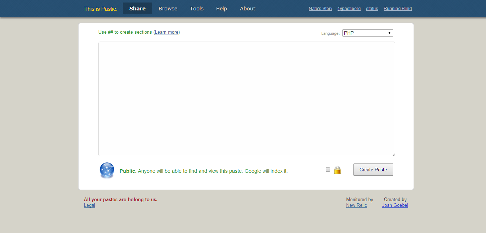
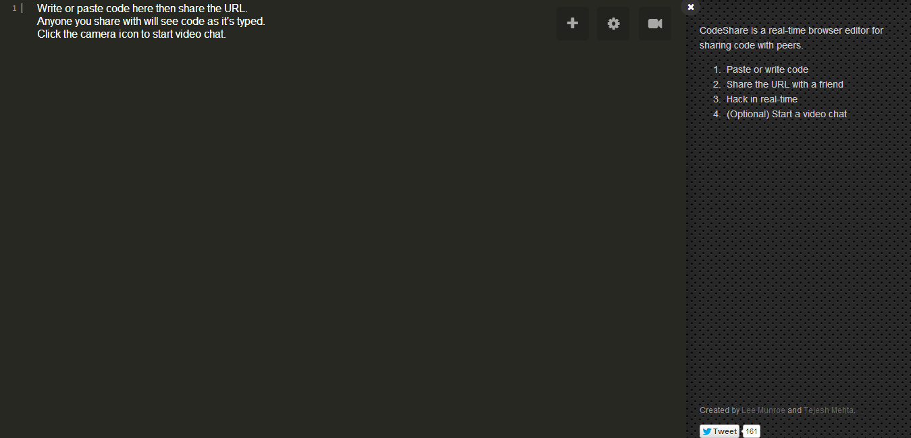
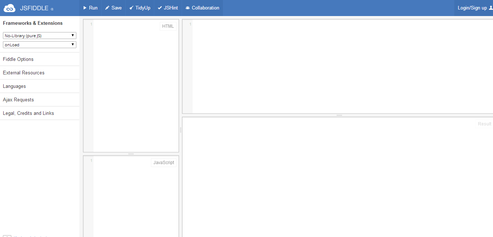
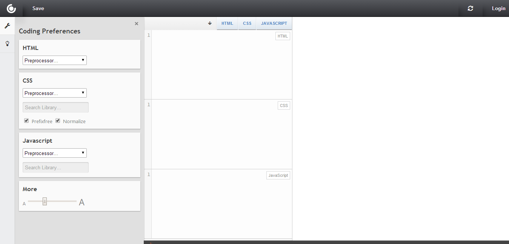

Очень часто бывает нужно поделиться частью своего кода на PHP, HTML, CSS и JS. Например, на форуме или в комментариях в блоге, или просто отправить сообщением по почте или в социальных сетях. Конечно, можно просто скопировать и вставить код, но в этом случае с большой вероятностью возникнут проблемы: движок блога или форума отрежет код из соображений безопасности, если код отпарвили просто письмом, то человеку, который его получит, будет очень неудобно разбираться в коде без подсветки и отступов. Что же делать?

На помощь придут специальные сервисы, которые позволяют разместить часть кода. Чтобы воспользоваться таким сервисом, регистрация не нужна, достаточно просто скопировать и вставить код, и можно отправлять ссылку. В этом обзоре я рассмотрю самые удобные, с моей точки зрения, сервисы для размещения кода.

## Как поделиться PHP кодом?

Чаще всего бывает нужно поделиться PHP-кодом. В этом случае нам помогут два сервиса: Pastie и Codeshare.

**Pastie** [http://pastie.org/](http://pastie.org/)  Чтобы разместить код на Pastie, нужно зайти на главную старницу сайта, в появившееся окно вставить код и нажать сохранить. Среди особенностей системы:

- Большое количество поддерживаемых языков
- Можно создавать приватный код, доступный только по прямой ссылке
- Нет регистрации
- Можно посмотреть список всех загруженных кодов с момента создания сайта

**Codeshare** [http://codeshare.io/](http://codeshare.io/) 

У этого сервиса главная особенность состоит в том, что вы сразу оказываетесь в области редактирования кода, для которой создается уникальный URL.

- Огромный список поддерживаемых языков и тем оформления
- Нет регистрации
- Поддержка совместной работы над кодом: если вы и человек, которому вы отправили ссылку, будете что-то менять одновременно, то система синхронизирует изменения
- Есть видеочат

## Где разместить HTML, CSS и JS код?

В размещении HTML, CSS и JS есть свои особенности :) Например, сервисы JSfiddle и CSSdeck позволяют не только разместить код, но и сразу посмотреть, как он работает.

**JSfiddle** [http://jsfiddle.net/](http://jsfiddle.net/) 

Этот сервис больше подходит для размещения JS-скриптов.

Особенности:

- Большой выбор поддерживаемых JS-библиотек
- Можно подключить свою JS-библиотеку
- Из препроцессоров CSS поддерживается только SCSS
- Можно зарегистрироваться

**CSSdeck** [http://cssdeck.com/labs](http://cssdeck.com/labs) 

Сервис больше подходит для размещения HTML и CSS.

Особенности:

- Можно выбрать препроцессор для HTML (HAML, Jade, Markdown, Slim) и CSS (Less, SCSS, Stylus, SASS и др.)
- Можно выбрать одну из поддерживаемых JS-библиотек, но список меньше, чем в JSfiddle
- Если зарегистрироваться, то появится доступ ко всем скриптам, которые вы сохраняли

В целом, если нужно разместить небольшой и несложный фрагмент кода, то особой разницы между JSfiddle и CSSdeck нет.

Я чаще всего исользую Codeshare и CSSdeck, просто потому, что лично для меня они кажутся удобнее. А какие сервисы для размещения фрагментов кода испольуете вы?
