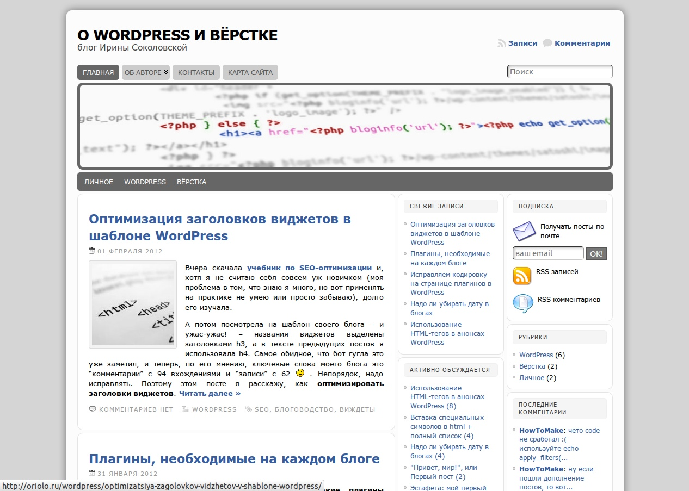

Привет, друзья! Сегодня произошло одно важное событие в жизни моего блога, к которому я готовилась очень долго: теперь у блога [oriolo.ru](http://oriolo.ru "Мой блог") **обновленный дизайн**.

Разница со старым дизайном практически не видна внешне, однако произошли серьезные внутренние изменения: шаблон стал уникальным, он сделан мной лично, и сверстан на HTML5 и CSS3.

Вот как выглядел старый дизайн.

Он был весьма интересным, но имел недостатки, такие как табличная верстка, невозможно убрать вторую боковую колонку, узкая главная колонка, большое количество нестандартных настроек (более 30 файлов в папке с темой!), из-за чего было невозможно использовать некоторые плагины. И из-за множества мелких деталей в правой колонке, казался "нагруженным".

Все эти недостатки я исправила в новом шаблоне, который сделала на основе темы-фреймворка [Toolbox](http://wordpress.org/extend/themes/toolbox "Toolbox").

В новом шаблоне я сделала следующее:

- полностью переделала формы поиска и комментирования,
- изменила правую колонку,
- вынесла вверх кнопки соц. сетей, тем самым избавившись от виджета
- добавила нижнюю область виджета

В результате, главная страница стала "весить" всего 11,6 Кб чистого html, или 132 Кб со всеми скриптами и стилями. jQuery теперь загружается с серверов Google. Сократилось количество запросов к БД на 10, даже с активированным виджетом тегов, и потребляемая память почти в два раза (!). Оказывается, смена шаблона - это отличный способ снизить нагрузку, создаваемую Wordpress :D

В итоге, как мне кажется, получилось достаточно симпатично :) А как вы думаете?

И еще, у меня есть **огромная просьба**: если вы заметили какие-то ошибки в новом шаблоне, если что-то не отображается, долго грузится, или просто выглядит криво, пожалуйста, сообщите мне в комментариях к этому посту, или любым другим способом, указанным на странице [Контакты](http://oriolo.ru/contacts/ "Контакты").
