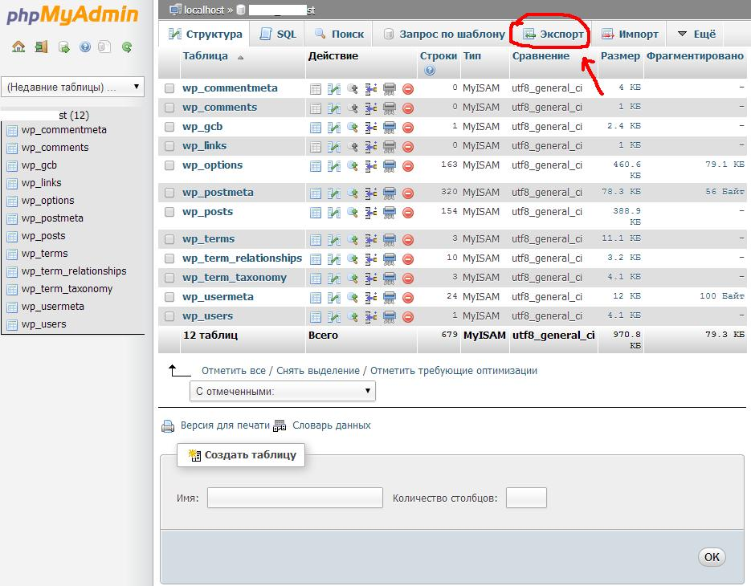
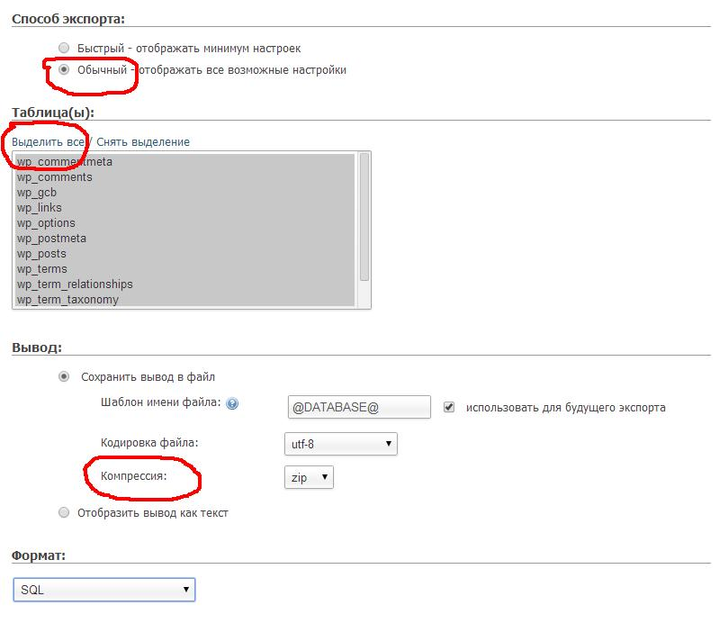
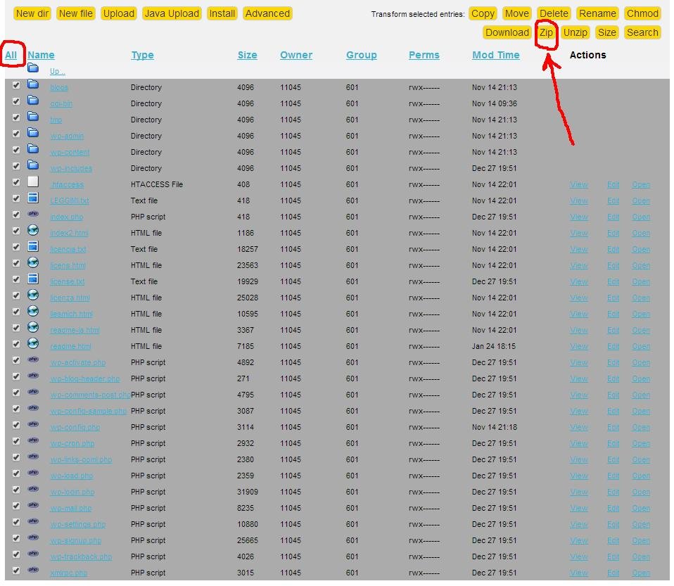
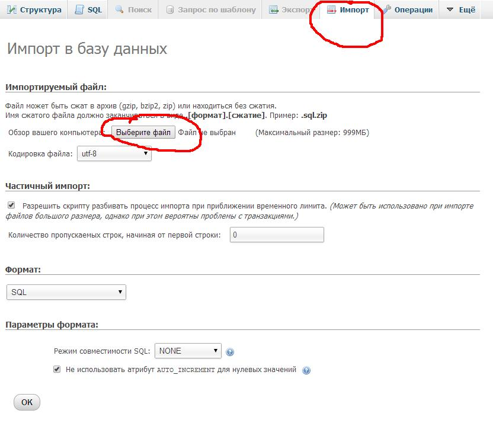
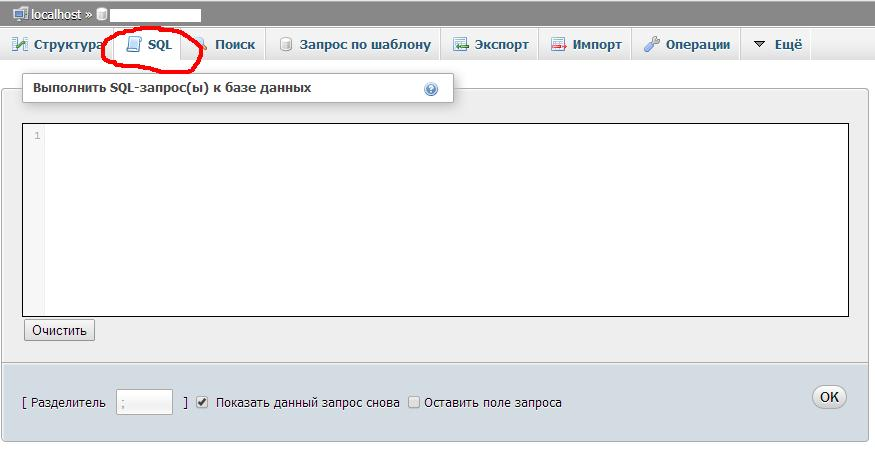
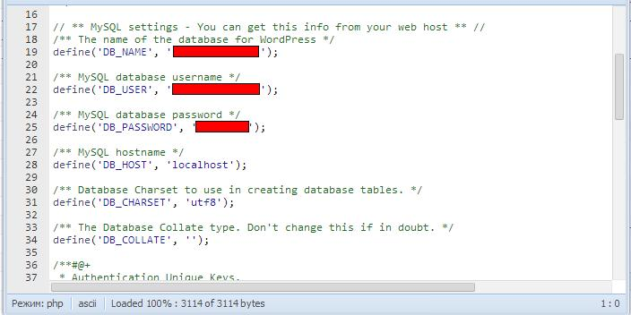

Очень часто бывает нужно **перенести сайт**, работающий на WordPress, **на новый домен и хостинг**. В этом посте я приведу простые шаги, позволяющие это сделать.

Это больше памятка для меня самой, чтобы каждый раз не искать заново всю эту информацию в интернете.

### 1\. Делаем бэкап базы данных MySQL через phpMyAdmin

Открываем нужную базу, нажимаем на вкладку Экспорт:

[](http://oriolo.ru/wp-content/uploads/2014/01/1.jpg)

 

После этого в появившемся окне выбираем Способ экспорта - Обычный, нажимаем Выделить все таблицы, выбираем Компрессию в формате zip.

[](http://oriolo.ru/wp-content/uploads/2014/01/2.jpg)

 

Сохраняем полученный файл у себя на компьютере.

### 2\. Делаем бэкап всех файлов сайта

Для этого удобно использовать онлайн FTP-клиент [Net2FTP](http://net2ftp.com/). Выделяем все файлы нажатием кнопки All, а потом нажимаем Zip, чтобы создать архив. Архив будет сохранен на сервере, его необходимо скачать на компьютер.

[](http://oriolo.ru/wp-content/uploads/2014/01/3.jpg)

### 3\. Заливаем архив файлов на новый хостинг

Можно через тот же [Net2FTP](http://net2ftp.com/). Рядом с кнопкой Zip есть кнопка Unzip, при нажатии которой все файлы архива будут извлечены в текущую папку. Распаковываем архив в корень аккаунта или другую нужную папку.

### 4\. Импортируем базу данных

Заходим в phpMyAdmin на новом хостинге. Создаем новую пустую базу данных, если у вас ее еще нет. Если база есть - открываем ее. Нажимаем кнопку Импорт.

[](http://oriolo.ru/wp-content/uploads/2014/01/4.jpg)

 

Выбираем файл базы, который вы экспортировали со старого хостинга. Нажимаем кнопку ОК для завершения импорта.

### 5\. Смена адреса сайта в БД

Теперь нам надо поменять адрес со старого сайта на новый в базе данных. Для этого необходимо выполнить несколько SQL-запросов. Не выходя из phpMyAdmin, где вы только что сделали импорт, перейдите на вкладку SQL:

[](http://oriolo.ru/wp-content/uploads/2014/01/5.jpg)

В появившемся поле по очериди выполняем следующие запросы. Вместо oldsite.ru подставьте название вашего старого домена, а вместо newsite.ru - название нового домена.

```
UPDATE wp_options SET option_value = replace(option_value, 'http://oldsite.ru', 'http://newsite.ru') WHERE option_name = 'home' OR option_name = 'siteurl';
```

Второй запрос:

```
UPDATE wp_posts SET guid = replace(guid, 'http://oldsite.ru','http://newsite.ru');
```

Третий запрос:

```
UPDATE wp_posts SET post_content = replace(post_content, 'http://oldsite.ru', 'http://newsite.ru');
```

Этими запросами мы поменяли старый адрес сайта на новый во всей базе.

### 6\. Настройка wp-config.php

Сейчас давайте настроим wp-config.php. Этот файл лежит в корне сайта, там, где вы распаковывали архив. Там необходимо указать название базы данных, имя пользователя и пароль:

[](http://oriolo.ru/wp-content/uploads/2014/01/6.jpg)

После этого сайт будет работать по новому адресу.
