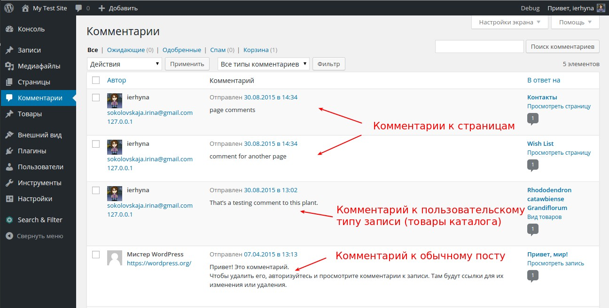
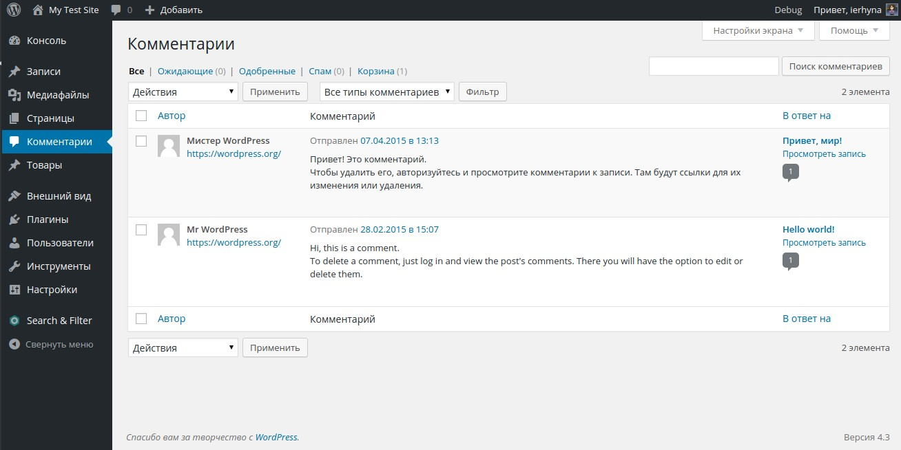
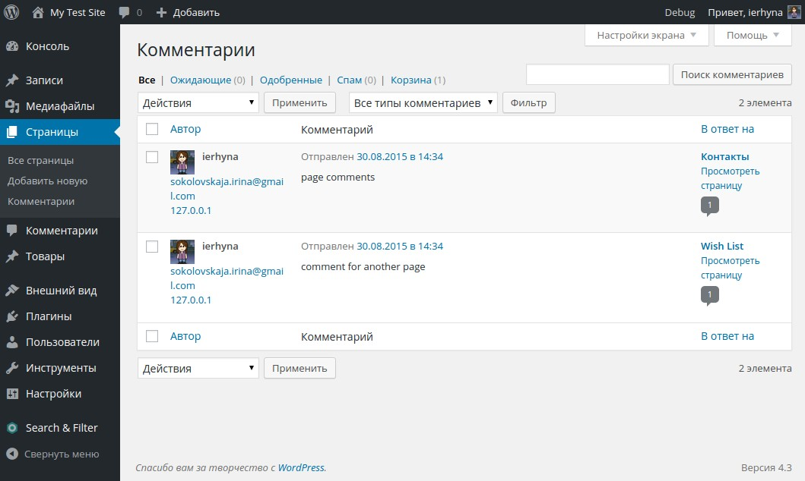
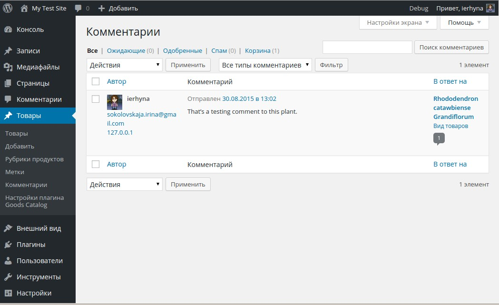

Возможность комментирования - одно из ключевых отличий блога. Однако иногда управление комментариями не очень удобно для администратора сайта.

### В чем проблема с комментариями?

Стандартная система работы с комментариями является не очень удобной для пользователя, если в блоге используется несколько типов записей, для которых разрешены комментарии.

Как минимум, в любом блоге есть страницы и посты - то есть, два типа записей. Кроме того, могут быть еще работы из портфолио или [товары из каталога](http://oriolo.ru/goods-catalog/), которые тоже являются записями по своей сути.

Теперь представим, что для всех видов записей посетители сайта могут оставлять коммментарии. В админке будет примерно следующее:

Все комментарии идут подряд, на одной странице. Причем в реальности, они будут отсортированы по дате добавления, а не по типу записи, к которой они относятся (просто у меня так случайно получилось).

Бардак, да. А если комментариев много, то вообще каша получается.

Когда я это увидела, то сразу возник вопрос: "Можно ли разделить комментарии по типам записей?"

### И что же делать?

Варианта, в общем-то, два. Первый: смириться. Второй: использовать плагин, который позволит **разделить комментарии** к разным типам записям по соответствующим пунктам меню.

Готовый плагин я не нашла, поэтому написала собственный.

Посмотрите, как будут организованы комментарии с использованием плагина **Comments by Post Type**:

По пункту меню "Комментарии" будут открываться комментарии к постам:

А для всех остальных типов записей будет добавлен собственный пункт меню "Комментарии". Вот, например, отдельные комментарии для страниц:

и отдельные комментарии для товаров:

Плагин без настроек, и будет автоматически работать с любыми типами записей, которые поддерживают комментирование. Все изменения касаются только администраторской части сайта, для посетителя визуально ничего не меняется.

На мой взгляд, использование плагина **Comments by Post Type** существенно улучшает систему работы с комментариям для администратора сайта. Буду рада, если кому-то еще он окажется полезным.

\[info\]Взять плагин можно в официальном репозитории плагинов WordPress [здесь](https://wordpress.org/plugins/comments-by-post-type/). Исходный код размещен [у меня на GitHub](https://github.com/ierhyna/comments-by-post-type/).\[/info\]

Мнения, комментарии и багрепорты, как обычно, приветствуются.
