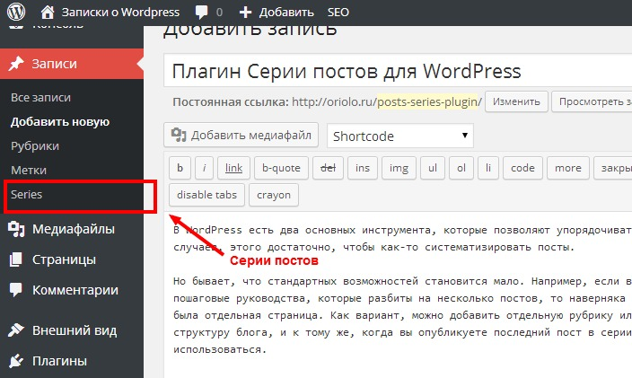
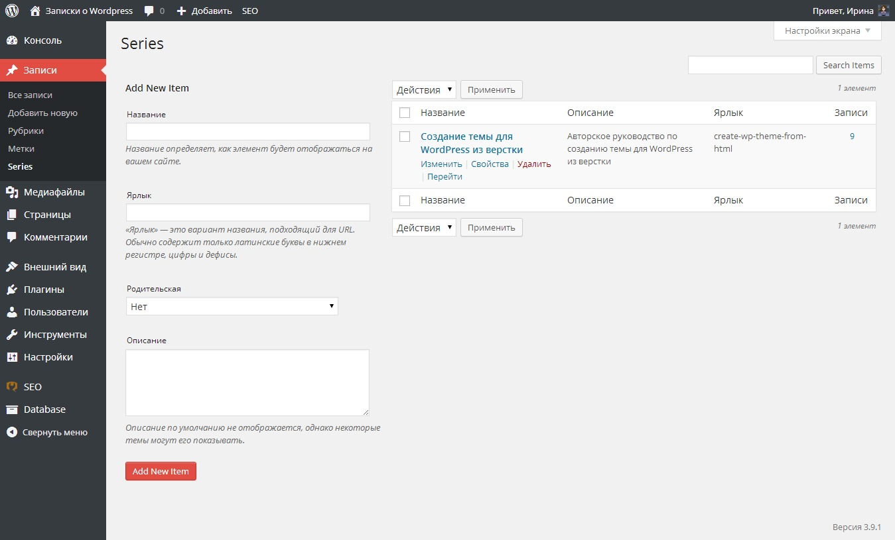
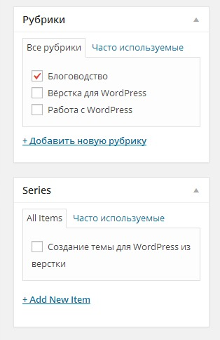
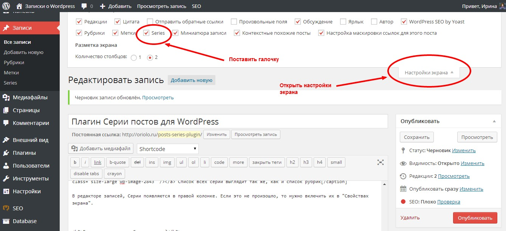

В WordPress есть два основных инструмента, которые позволяют упорядочивать записи: это рубрики и метки. В большинстве случаев, этого достаточно, чтобы как-то систематизировать посты.

Бывает, что стандартных возможностей рубрик и меток становится мало. Например, если вы периодически публикуете уроки или пошаговые руководства, которые разбиты на несколько постов, то наверняка хотели бы, чтобы для каждой серии постов была отдельная страница. Как вариант, можно добавить отдельную рубрику или метку, но это может нарушить существующую структуру блога, и к тому же, когда вы опубликуете последний пост в серии, рубрика или метка перестанет использоваться.

Для того, чтобы упростить работу с сериями постов, я создала небольшой плагин, который делает одну простую вещь: он **добавляет серии постов** к вашему блогу.

Пример работы плагина можно посмотреть на моем блоге, например, серия по разработке темы для вордпресс создана при помощи этого плагина: [http://oriolo.ru/series/create-wp-theme-from-html/](http://oriolo.ru/series/create-wp-theme-from-html/).

## Как добавить серии постов в блог?

После установки плагина, автоматически добавится новый пункт в меню "Записи". Посмотрите, как это выглядит.



Работа с сериями постов организована точно также, как работа с рубриками, поэтому проблем возникнуть не должно.



В редакторе записей, Серии появляются в правой колонке. Там можно выбрать, к какой серии принадлежит пост, или создать новую серию.



Если колонка с сериями не добавилась автоматически после установки плагина, то нужно включить ее в "Свойствах экрана".



Для того, чтобы страницы серий корректно открывались на сайте, нужно зайти в Консоли в Настройки - Постоянные ссылки. Там не нужно ничего менять, просто зайти.

## Немного кода

Для тех, кто хочет немного расширить возможности плагина, и использовать списки серий в виджетах, привожу ниже несколько кодов, которые можно разместить в сайдбаре в виджетах при помощи плагина [PHP Code Wigdet](https://wordpress.org/plugins/php-code-widget/).

### Вывод всех постов, с разделением по сериям

Этот код создаст список всех серий со списком записей в них. Названиями постов будут ссылками на них.

```
<?php
    //this loop returns all posts separated by series they belong to
    $post_type = 'post';
    $tax = 'series'; 
    $tax_terms = get_terms($tax);
    if ($tax_terms) {
      foreach ($tax_terms as $tax_term) {
        
        $args=array(
          'post_type' => $post_type,
          "$tax" => $tax_term->slug,
          'post_status' => 'publish',
          'posts_per_page' => -1,
          'caller_get_posts'=> 1
        );
    
        $my_query = null;
        $my_query = new WP_Query($args);
        if( $my_query->have_posts() ) {
          echo '<h3>';
          echo $tax_term->name;
          echo '</h3>';
          while ($my_query->have_posts()) : $my_query->the_post(); ?>
            <li><a href="<?php the_permalink() ?>" rel="bookmark" title="Permanent Link to <?php the_title_attribute(); ?>"><?php the_title(); ?></a></li>
            <?php
          endwhile;
        }
        wp_reset_query();
      }
    }
?>
```

### Вывод списка всех серий

Этот код создает список всех серий, названия серий являются ссылками на страницу с постами серии.

```
<?php 
$taxonomy     = 'series';
$orderby      = 'name'; 
$show_count   = 0;      // 1 for yes, 0 for no
$pad_counts   = 0;      // 1 for yes, 0 for no
$hierarchical = 1;      // 1 for yes, 0 for no
$title        = '';

$args = array(
  'taxonomy'     => $taxonomy,
  'orderby'      => $orderby,
  'show_count'   => $show_count,
  'pad_counts'   => $pad_counts,
  'hierarchical' => $hierarchical,
  'title_li'     => $title
);
?>

<ul>
<?php wp_list_categories( $args ); ?>
</ul>
```

### Вывод постов из одной серии

Код создает список всех постов из определенной серии. Чтобы задать серию, нужно указать ее ID в помеченной строке.

```
<?php
$args = array(
    'post_type' => 'post',
    'posts_per_page' => -1,
    'tax_query' => array(
        array(
            'taxonomy' => 'series',
            'field' => 'id',
            'terms' => '44' // here should be ID of the term
        )
    )
);
$series_term_query = new WP_Query( $args );
while ($series_term_query ->have_posts()) : $series_term_query->the_post();
?>
<li><a href="<?php the_permalink() ?>" rel="bookmark" title="Permanent Link to <?php the_title_attribute(); ?>"><?php the_title(); ?></a></li>
<?php
endwhile;
?>
```

## Где скачать плагин Серии постов?

Скачать самую последнюю версию плагин можно здесь: [https://github.com/ierhyna/taxonomy-series/archive/master.zip](https://github.com/ierhyna/taxonomy-series/archive/master.zip)

В ближайшее время я не планирую добавлять этот плагин в официальный каталог WordPress, а это значит, что автоматические обновления для него приходить не будут. Поэтому, пожалуйста, следите за обновлениями плагина на этой странице: [https://github.com/ierhyna/taxonomy-series/releases](https://github.com/ierhyna/taxonomy-series/releases)

## Вопросы и предложения

Все вопросы и предложения пишите в комментарии ;)
