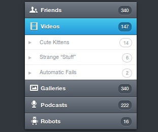

Всем привет! Сегодня мы рассмотрим пример по созданию красивого вертикального меню на jQuery и CSS3, которое было создано в PSD Орманом Кларком ([скачать .psd](http://www.premiumpixels.com/freebies/vertical-navigation-menu-psd/ "Orman Clark’s Vertical Navigation Menu")).

Мы будем использовать минимально возможное количество изображений - только для иконок возле названия. При желании, изображения можно объединить в спрайт при помощи [SpriteRight](http://spriterightapp.com/).

[](http://oriolo.ru/wp-content/uploads/2012/02/Vertikalnoe-menyu.jpeg)

### Шаг 1. Базовая HTML-разметка

Сначала давайте создадим пустой HTML5 документ:

```html
<!DOCTYPE html>
<html lang="en">
    <head>
        <meta charset="utf-8">
 
        <title>Vertical Navigation Menu: CSS3 Coded</title>
 
        <link rel="stylesheet" href="css/styles.css">
 
    </head>
<body>
 
</body>
</html>
```

А теперь - разметку самого меню; ненумерованный список, содержащийся внутри контейнера:

```html
<div id="wrapper">
 
    <ul class="menu">
        <li class="item1"><a href="#">Friends <span>340</span></a></li>
        <li class="item2"><a href="#">Videos <span>147</span></a></li>
        <li class="item3"><a href="#">Galleries <span>340</span></a></li>
        <li class="item4"><a href="#">Podcasts <span>222</span></a></li>
        <li class="item5"><a href="#">Robots <span>16</span></a></li>
    </ul>
 
</div>
```

Наконец, мы добавим подпункты путем создания ненумерованного списка в каждом из пунктов меню:

```html
<div id="wrapper">
 
    <ul class="menu">
        <li class="item1"><a href="#">Friends <span>340</span></a>
            <ul>
                <li class="subitem1"><a href="#">Cute Kittens <span>14</span></a></li>
                <li class="subitem2"><a href="#">Strange “Stuff” <span>6</span></a></li>
                <li class="subitem3"><a href="#">Automatic Fails <span>2</span></a></li>
            </ul>
        </li>
        <li class="item2"><a href="#">Videos <span>147</span></a>
            <ul>
                <li class="subitem1"><a href="#">Cute Kittens <span>14</span></a></li>
                <li class="subitem2"><a href="#">Strange “Stuff” <span>6</span></a></li>
                <li class="subitem3"><a href="#">Automatic Fails <span>2</span></a></li>
            </ul>
        </li>
        <li class="item3"><a href="#">Galleries <span>340</span></a>
            <ul>
                <li class="subitem1"><a href="#">Cute Kittens <span>14</span></a></li>
                <li class="subitem2"><a href="#">Strange “Stuff” <span>6</span></a></li>
                <li class="subitem3"><a href="#">Automatic Fails <span>2</span></a></li>
            </ul>
        </li>
        <li class="item4"><a href="#">Podcasts <span>222</span></a>
            <ul>
                <li class="subitem1"><a href="#">Cute Kittens <span>14</span></a></li>
                <li class="subitem2"><a href="#">Strange “Stuff” <span>6</span></a></li>
                <li class="subitem3"><a href="#">Automatic Fails <span>2</span></a></li>
            </ul>
        </li>
        <li class="item5"><a href="#">Robots <span>16</span></a>
            <ul>
                <li class="subitem1"><a href="#">Cute Kittens <span>14</span></a></li>
                <li class="subitem2"><a href="#">Strange “Stuff” <span>6</span></a></li>
                <li class="subitem3"><a href="#">Automatic Fails <span>2</span></a></li>
            </ul>
        </li>
    </ul>
 
</div>
```

На этом с HTML-разметкой закончено. Сейчас у нас есть ненумерованный список из пяти пунктов, с тремя подпунктами в каждом. Для каждого пункта и подпункта мы задали классы и анкоры, чтобы в дальнейшем прописать их в таблице стилей. Для чисел мы прописали тег `span`.

### Шаг 2. Шрифты с изменяющимся размером

Для начала убедимся, что меню отображается правильно. Добавим следующие правла в файл `css/styles.css`. Они установят для списка отступы равные нулю, и удалят стиль списка:

```css
ul,
ul ul {
    margin: 0;
    padding: 0;
    list-style: none;
}
```

Теперь, прежде чем начать прописывать стили для меню, давайте создадим контейнер с фиксированной шириной и размером шрифта 13px (переведенном в em). Сначала добавим правило для body, `font-size:100%;`. Теперь мы уверены, что наш стиль базируется на размере шрифта по-умолчанию в браузере (обычно это 16px).

Сейчас надо разобраться, как работает размер шрифта в контейнере. Нам надо указать его в `em`, пропорционально размеру шрифта-родителя. Мы хотим, чтобы он был равен 13px, и предполагая, что шрифт родителя равен 16px, размер в em будет равен 13 / 16 = 0.8125. 13px это 0.8125\*16px.

Указание размера шрифтов (и элементов страницы) в em делает их "резиновыми". Если мы изменим размер контейнера (или шрифта по-умолчанию в браузере), то размер меню будет к нему подстраиваться. Если вам нужна помощь в переводе из px в em, то я советую воспользоваться сервисом [pxtoem.com](http://pxtoem.com "pxtoem.com").

```css
body {
    font-size: 100%;
}
a {
    text-decoration: none;
}
ul,
ul ul {
    margin: 0;
    padding: 0;
    list-style: none;
}
#wrapper {
    width: 220px;
    margin: 100px auto;
    font-size: 0.8125em;
}
```

Мы задали для контейнера фиксированную ширину 220px, и выровняли его с помощью `margin:100px auto;`.

### Шаг 3. CSS стиль основного меню

Сейчас мы можем приступить к написанию стилей для меню. Мы установим ширину и высоту меню ul `auto`, и затем добавим тень. Благодаря автоматически устанавливаемой высоте, тень будет появляться, когда слайдер открывается.

Далее, для анкоров мы добавим ширину 100%; это будет означать, что их размер будет равен размеру контейнера (в нашем случае 220px). Для указания их высоты мы будем использовать em, для этого вернемся к нашему основному размеру шрифта, равному 13px. В .psd файле размер шрифта установлен в 36px, так что это будет нашей целью. Мы берем 36, и делим его на 13, получается примерно 2.75em (36 / 13 = 2.76923077). Поэтому мы укажем размер анкоров равным 2.75em, и такую же высоту строки, чтобы выровнять текст по вертикали по центру. Затем добавим небольшой отступ, чтобы оставить место для иконки.

Мы добавим CSS3 градиент для фона, потом поменяем шрифт (будем использовать Helvetica Neue) и добавим белую тень для шрифта. Обратите внимание, мы не используем font-size; так как мы установили размер шрифта для контейнера (в 13px), то он будет наследоваться.

```css
body {
    font-size: 100%;
}
a {
    text-decoration: none;
}
ul,
ul ul {
    margin: 0;
    padding: 0;
    list-style: none;
}
#wrapper {
    width: 220px;
    margin: 100px auto;
    font-size: 0.8125em;
}
.menu {
    width: auto;
    height: auto;
    -webkit-box-shadow: 0px 1px 3px 0px rgba(0,0,0,.73), 0px 0px 18px 0px rgba(0,0,0,.13);
    -moz-box-shadow: 0px 1px 3px 0px rgba(0,0,0,.73), 0px 0px 18px 0px rgba(0,0,0,.13);
    box-shadow: 0px 1px 3px 0px rgba(0,0,0,.73), 0px 0px 18px 0px rgba(0,0,0,.13);
}
.menu > li > a {
    background-color: #616975;
    background-image: -webkit-gradient(linear, left top, left bottom, from(rgb(114, 122, 134)),to(rgb(80, 88, 100)));
    background-image: -webkit-linear-gradient(top, rgb(114, 122, 134), rgb(80, 88, 100));
    background-image: -moz-linear-gradient(top, rgb(114, 122, 134), rgb(80, 88, 100));
    background-image: -o-linear-gradient(top, rgb(114, 122, 134), rgb(80, 88, 100));
    background-image: -ms-linear-gradient(top, rgb(114, 122, 134), rgb(80, 88, 100));
    background-image: linear-gradient(top, rgb(114, 122, 134), rgb(80, 88, 100));
    filter: progid:DXImageTransform.Microsoft.gradient(GradientType=0,StartColorStr='#727a86', EndColorStr='#505864');
    border-bottom: 1px solid #33373d;
    -webkit-box-shadow: inset 0px 1px 0px 0px #878e98;
    -moz-box-shadow: inset 0px 1px 0px 0px #878e98;
    box-shadow: inset 0px 1px 0px 0px #878e98;
    width: 100%;
    height: 2.75em;
    line-height: 2.75em;
    text-indent: 2.75em;
    display: block;
    position: relative;
    font-family: "Helvetica Neue", Helvetica, Arial, sans-serif;
    font-weight: 600;
    color: #fff;
    text-shadow: 0px 1px 0px rgba(0,0,0,.5);
}
```

Хорошо, теперь давайте изменим цвет фона страницы.

```css
body {
    background:#32373d;
}
```

#### Совет: запоминаем EM

Наверное, вы уже подумали о том, что значения размеров шрифта, указанного в em, очень легко забыть. Поэтому давайте добавим комментарии в CSS, чтобы в будущем вы знали, какой размер в px использовался. Запомните формулу: **желаемый размер в px / размер родителя в px = результат в em**, и используйте символ приблизительного значения ≈ если результат был округлен.

```css
#wrapper {
    font-size: 0.8125em;    /* 13/16 = 0.8125*/
}
 
.menu > li > a {
    height: 2.75em;         /* 36/13 ≈ 2.75*/
    line-height: 2.75em;    /* 36/13 ≈ 2.75*/
    text-indent: 2.75em;    /* 36/13 ≈ 2.75*/
}
```

### Шаг 4. Стиль подпунктов

Пришло время написать стили подпунктов меню. Необходимо сделать фон белым, а границы серыми. Заметьте, что у последнего элемента нет нижней границы, поэтому мы будем использовать псевдо-селектор `:last-child` чтобы её удалить. У него должна быть темно-синяя граница, поэтому мы заменим серый на синий.

Следующий шаг будет похож на предыдущий, мы опять добавим высоту и ширину, и изменим фон на белый. Также нам необходимо изменить размер шрифта. Нам нужно получить 12px, и используя формулу **желаемый размер в px / размер родителя в px = результат в em** получаем 0.923em.

Давайте также поменяем цвет шрифта на серый. Обратите внимание, мы используем `display:block`. Если бы использовался `float:left`, меню не было бы анимированным и с тенью. Также обратите внимание, на то, что для последнего элемента в подпунктах был добавлен дополнительный стиль, чтобы изменить цвет его границ.

```css
.menu ul li a {
    background: #fff;
    border-bottom: 1px solid #efeff0;
    width: 100%;
    height: 2.75em;
    line-height: 2.75em;
    text-indent: 2.75em;
    display: block;
    position: relative;
    font-family: "Helvetica Neue", Helvetica, Arial, sans-serif;
    font-size: 0.923em;
    font-weight: 400;
    color: #878d95;
}
.menu ul li:last-child a {
    border-bottom: 1px solid #33373d;
}
```

Сейчас меню уже выглядит очень красиво!

### Шаг 5. Стили при наведении и для активного пункта

Давайте укажем стили для элементов меню при наведении на них указателя мыши, и для открытого пункта. Также мы пропишем границу для активного пункта. Мы не добавили класс active, потому что это будет происходить при помощи jQuery.

```css
.menu > li > a:hover,
.menu > li > a.active {
    background-color: #35afe3;
    background-image: -webkit-gradient(linear, left top, left bottom, from(rgb(69, 199, 235)),to(rgb(38, 152, 219)));
    background-image: -webkit-linear-gradient(top, rgb(69, 199, 235), rgb(38, 152, 219));
    background-image: -moz-linear-gradient(top, rgb(69, 199, 235), rgb(38, 152, 219));
    background-image: -o-linear-gradient(top, rgb(69, 199, 235), rgb(38, 152, 219));
    background-image: -ms-linear-gradient(top, rgb(69, 199, 235), rgb(38, 152, 219));
    background-image: linear-gradient(top, rgb(69, 199, 235), rgb(38, 152, 219));
    filter: progid:DXImageTransform.Microsoft.gradient(GradientType=0,StartColorStr='#45c7eb', EndColorStr='#2698db');
    border-bottom: 1px solid #103c56;
    -webkit-box-shadow: inset 0px 1px 0px 0px #6ad2ef;
    -moz-box-shadow: inset 0px 1px 0px 0px #6ad2ef;
    box-shadow: inset 0px 1px 0px 0px #6ad2ef;
}
.menu > li > a.active {
    border-bottom: 1px solid #1a638f;
}
```

### Шаг 6. Иконки основного меню

Добавлять иконки мы будем при помощь псевдокласса `:before`. Сначала мы установим фон для всех ul в подпунктах, при помощи спрайта, и укажем, что он не должен повторяться. Мы задали размер 36px, хотя там нет текста, а т.к. мы используем 36px, то нам надо указать высоту и ширину равными 1em. Затем мы опустим элемент на 50% и отнимем .5em сверху чтобы выровнять его.

Используя классы каждого ul в подпунктах, мы установим нужное положение для изображения из спрайта.

```css
.menu > li > a:before {
    content: '';
    background-image: url(../images/sprite.png);
    background-repeat: no-repeat;
    font-size: 36px;
    height: 1em;
    width: 1em;
    position: absolute;
    left: 0;
    top: 50%;
    margin: -.5em 0 0 0;
}
.item1 > a:before {
    background-position: 0 0;
}
.item2 > a:before {
    background-position: -38px 0;
}
.item3 > a:before {
    background-position: 0 -38px;
}
.item4 > a:before {
    background-position: -38px -38px;
}
.item5 > a:before {
    background-position: -76px 0;
}
```

### Шаг 7. Цифры в пунктах меню

Помните, что в начале мы добавляли теги span? Давайте теперь создадим стиль для цифр!

Сначала мы добавим размер шрифта 11px (0.857em). Зададим абсолютное позиционирование, и подвинем на 1em справа. Опустим на 50% сверху и отменим margin-top чтобы выровнять их по центру. Фон будет немного затемненным.

Снова, чтобы сделать его резиновым, мы будем использовать padding со значениями в em. Мы даже использовали em для указания border-radius (закругление углов), так как если текст будет больше, появится диспропорция.

```css
.menu > li > a span {
    font-size: 0.857em;
    display: inline-block;
    position: absolute;
    right: 1em;
    top: 50%;
    background: #48515c;
    line-height: 1em;
    height: 1em;
    padding: .4em .6em;
    margin: -.8em 0 0 0;
    color: #fff;
    text-indent: 0;
    text-align: center;
    -webkit-border-radius: .769em;
    -moz-border-radius: .769em;
    border-radius: .769em;
    -webkit-box-shadow: inset 0px 1px 3px 0px rgba(0, 0, 0, .26), 0px 1px 0px 0px rgba(255, 255, 255, .15);
    -moz-box-shadow: inset 0px 1px 3px 0px rgba(0, 0, 0, .26), 0px 1px 0px 0px rgba(255, 255, 255, .15);
    box-shadow: inset 0px 1px 3px 0px rgba(0, 0, 0, .26), 0px 1px 0px 0px rgba(255, 255, 255, .15);
    text-shadow: 0px 1px 0px rgba(0,0,0,.5);
    font-weight: 500;
}
.menu > li > a:hover span, .menu > li a.active span {
    background: #2173a1;
}
```

### Шаг 8. Стрелки и цифры в подпунктах меню

Этот шаг похож на предыдущий. Особенность состоит в удалении фона, изменении цвета границ и добавлении стрелки в качестве указателя пункта. Стрелку мы добавим с помощью псевдокласса `:before`. Размеры мы также будем указывать в em.

Наконец, мы сделаем цвет ссылки при наведении на нее указателя более темным.

```css
.menu ul > li > a span {
    font-size: 0.857em;
    display: inline-block;
    position: absolute;
    right: 1em;
    top: 50%; /
    background: #fff;
    border: 1px solid #d0d0d3;
    line-height: 1em;
    height: 1em;
    padding: .4em .7em;
    margin: -.9em 0 0 0;
    color: #878d95;
    text-indent: 0;
    text-align: center;
    -webkit-border-radius: .769em;
    -moz-border-radius: 769em;
    border-radius: 769em;
    text-shadow: 0px 0px 0px rgba(255,255,255,.01));
}
.menu > li > ul li a:before {
    content: '▶';
    font-size: 8px;
    color: #bcbcbf;
    position: absolute;
    width: 1em;
    height: 1em;
    top: 0;
    left: -2.7em;
}
 
.menu > li > ul li:hover a,
.menu > li > ul li:hover a span,
.menu > li > ul li:hover a:before {
    color: #32373D;
}
```

### Шаг 9. Добавляем jQuery

Мы подошли к последнему шагу по созданию меню. Сейчас необходимо создать ссылку на библиотеку jQuery, которая расположена на сервере Google. Ее последняя версия 1.7.1. Для этого надо добавить следующую строку в секцию `head`.

```html
<script src="https://ajax.googleapis.com/ajax/libs/jquery/1.7.1/jquery.min.js"></script>
```

Сейчас в самый конец html-документа, перед закрывающимся тегом `body`, добавьте такой код:

```js
<script type="text/javascript">
$(function() {
 
    var menu_ul = $('.menu > li > ul'),
        menu_a  = $('.menu > li > a');
 
    menu_ul.hide();
 
    menu_a.click(function(e) {
        e.preventDefault();
        if(!$(this).hasClass('active')) {
            menu_a.removeClass('active');
            menu_ul.filter(':visible').slideUp('normal');
            $(this).addClass('active').next().stop(true,true).slideDown('normal');
        } else {
            $(this).removeClass('active');
            $(this).next().stop(true,true).slideUp('normal');
        }
    });
 
});
</script>
```

Сначала мы помещаем пункты меню и подменю в разные переменные, чтобы потом было удобно к ним обращаться:

```js
var menu_ul = $('.menu > li > ul'),
    menu_a  = $('.menu > li > a');
```

Затем сворачиваем все пункты меню, когда страница открывается:

```js
menu_ul.hide();
```

Потом мы сообщаем, что необходимо что-то сделать при нажатии на анкор:

```js
menu_a.click(function(e) {
```

Сейчас мы предотвращаем привязку анкоров к следующим ссылкам или изменение в адресной строке. То есть, когда вы будете нажимать на пункты меню, # не будет появляться в адресной строке.

```js
e.preventDefault();
```

Далее укажем, что если у `menu_a` класс `active`, его надо удалить.

```js
if(!$(this).hasClass('active')) {
    menu_a.removeClass('active');
```

Тут мы используем `.filter` и `:visible`. Если меню открыто, то его надо сдвинуть вверх с нормальной скоростью.

```js
menu_ul.filter(':visible').slideUp('normal');
```

Если меню открыто, то добавим класс `active`, и сдвинем его вниз с нормальной скоростью.

```js
$(this).addClass('active').next().stop(true,true).slideDown('normal');
```

Теперь, используя оператор `else`, удаляем класс `active`, и двигаем меню вверх чтобы скрыть его.

```js
} else {
    $(this).removeClass('active');
    $(this).next().stop(true,true).slideUp('normal');
```

Если вам необходимо изменить скорость меню, укажите вместо normal нужную скорость в миллисекундах.

### Заключение

В итоге у нас получилось вот такое красивое меню. По нажатию на картинку вы перейдете на страницу-демонстрацию.

[](http://d3pr5r64n04s3o.cloudfront.net/tuts/291_vertical_menu/demo/index.html)

К тому же, это меню резиновое.


Кстати, ещё примеры использования jQuery вы можете почитать в новом, но уже полном очень интересных статей, блоге Евгения Деденко. Например, в одном из последних постов он рассказывает, как сделать [выдвигающийся блок с просьбой о подписке](http://stilant.ru/vyiezzhayushhiy-blok-prosbyi-podpisatsya/ "Блог о jQuery").

_Эта статья является моим вольным переводом с английского оригинала: [Orman Clark’s Vertical Navigation Menu: The CSS3 Version](http://webdesign.tutsplus.com/tutorials/site-elements/orman-clarks-vertical-navigation-menu-the-css3-version/ "Orman Clark’s Vertical Navigation Menu: The CSS3 Version")._
