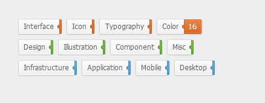
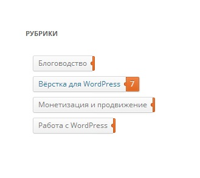

Недавно в комментариях к одному посту меня [спросили](http://oriolo.ru/wordpress/vyivod-spiska-rubrik-s-opisaniem/#comment-11020), как сделать список рубрик или меток с выдвигающимся числом записей, то есть оформить список также, как показано [в этом примере](http://codepen.io/Thibaut/pen/eCIkr).

[](http://oriolo.ru/wp-content/uploads/2014/02/rubriki1.jpg)

Как и обещала, я расскажу о том, как можно сделать подобный вывод списка рубрик на вордпресс.

Если вы хотите использовать приведенный ниже код, чтобы вывести список рубрик в сайдбаре с помощью виджета, то необходимо использовать плагин [PHP Code Widget](http://wordpress.org/plugins/php-code-widget/), чтобы разрешить использование PHP в виджетах.

### Шаг 1. Выводим список рубрик

Сначала при помощи функции get\_categories() выведем список рубрик:

```
<?php
// аргументы функции get_categories();
$args = array(
  'orderby' => 'name', // сортировка по названию
  'order' => 'ASC', // сортировка в прямом порядке 
  'taxonomy' => 'category' // выводим рубрики; чтобы вывести теги, напишите post_tag
);
echo '<div class="tags-container"><ul class="tags">';

// список рубрик
$categories = get_categories($args);
  foreach($categories as $category) { 
    echo '<li>';
    // вывод ссылки и названия рубрики
    echo '<a href="' . get_category_link( $category->term_id ) . '">' . $category->name.
    // вывод количества записей
    ' <span>' . $category->count . '</span></a>';
    echo '</li>';
    } 

echo '</ul></div>';
?>
```

Обратите внимание, в исходном HTML-коде список "обернут" в тег `<div class="container"<`, но если мы оставим такое название класса, то в некоторых темах на WordPress код работать не будет, так как такое название класса уже используется для div-а, в который "обернута" вся страница. Поэтому я переименовала класс в tags-container.

### Шаг 2. Добавляем стили

Теперь давайте добавим к нашему списку рубрик оформление при помощи CSS. CSS я возьму как в исходной версии [здесь](http://codepen.io/Thibaut/pen/eCIkr), но немного изменю названия классов, чтобы не было конфликтов с другими классами темы WordPress. Приведенный ниже код надо вставить в низ файла стилей используемой темы:

```
/*
 * Copyright (c) 2012 Thibaut Courouble
 * http://www.cssflow.com
 * Licensed under the MIT License
 *
 * Sass/SCSS source: http://goo.gl/KNp7z
 */

.tags-container {
  margin: 50px auto;
  width: 380px;
}

.tags {
  zoom: 1;
}

.tags:before, .tags:after {
  content: '';
  display: table;
}

.tags:after {
  clear: both;
}

.tags li {
  position: relative;
  float: left;
  margin: 0 0 8px 12px;
}

.tags li:active {
  margin-top: 1px;
  margin-bottom: 7px;
}

.tags li:after {
  content: '';
  z-index: 2;
  position: absolute;
  top: 10px;
  right: -2px;
  width: 5px;
  height: 6px;
  opacity: .95;
  background: #eb6b22;
  border-radius: 3px 0 0 3px;
  -webkit-box-shadow: inset 1px 0 #99400e;
  box-shadow: inset 1px 0 #99400e;
}

.tags a, .tags span {
  display: block;
  -webkit-box-sizing: border-box;
  -moz-box-sizing: border-box;
  box-sizing: border-box;
}

.tags a {
  height: 26px;
  line-height: 23px;
  padding: 0 9px 0 8px;
  font-size: 12px;
  color: #555;
  text-decoration: none;
  text-shadow: 0 1px white;
  background: #fafafa;
  border-width: 1px 0 1px 1px;
  border-style: solid;
  border-color: #dadada #d2d2d2 #c5c5c5;
  border-radius: 3px 0 0 3px;
  background-image: -webkit-linear-gradient(top, #fcfcfc, #f0f0f0);
  background-image: -moz-linear-gradient(top, #fcfcfc, #f0f0f0);
  background-image: -o-linear-gradient(top, #fcfcfc, #f0f0f0);
  background-image: linear-gradient(to bottom, #fcfcfc, #f0f0f0);
  -webkit-box-shadow: inset 0 0 0 1px rgba(255, 255, 255, 0.7), 0 1px 2px rgba(0, 0, 0, 0.05);
  box-shadow: inset 0 0 0 1px rgba(255, 255, 255, 0.7), 0 1px 2px rgba(0, 0, 0, 0.05);
}

.tags a:hover span {
  padding: 0 7px 0 6px;
  max-width: 40px;
  -webkit-box-shadow: inset 0 0 0 1px rgba(255, 255, 255, 0.15), 1px 1px 2px rgba(0, 0, 0, 0.2);
  box-shadow: inset 0 0 0 1px rgba(255, 255, 255, 0.15), 1px 1px 2px rgba(0, 0, 0, 0.2);
}

.tags span {
  position: absolute;
  top: 1px;
  left: 100%;
  z-index: 2;
  overflow: hidden;
  max-width: 0;
  height: 24px;
  line-height: 21px;
  padding: 0 0 0 2px;
  color: white;
  text-shadow: 0 -1px rgba(0, 0, 0, 0.3);
  background: #eb6b22;
  border: 1px solid;
  border-color: #d15813 #c85412 #bf5011;
  border-radius: 0 2px 2px 0;
  opacity: .95;
  background-image: -webkit-linear-gradient(top, #ed7b39, #df5e14);
  background-image: -moz-linear-gradient(top, #ed7b39, #df5e14);
  background-image: -o-linear-gradient(top, #ed7b39, #df5e14);
  background-image: linear-gradient(to bottom, #ed7b39, #df5e14);
  -webkit-transition: 0.3s ease-out;
  -moz-transition: 0.3s ease-out;
  -o-transition: 0.3s ease-out;
  transition: 0.3s ease-out;
  -webkit-transition-property: padding, max-width;
  -moz-transition-property: padding, max-width;
  -o-transition-property: padding, max-width;
  transition-property: padding, max-width;
}

.green li:after {
  background: #65bb34;
  -webkit-box-shadow: inset 1px 0 #3a6b1e;
  box-shadow: inset 1px 0 #3a6b1e;
}

.green span {
  background: #65bb34;
  border-color: #549b2b #4f9329 #4b8b27;
  background-image: -webkit-linear-gradient(top, #71ca3f, #5aa72e);
  background-image: -moz-linear-gradient(top, #71ca3f, #5aa72e);
  background-image: -o-linear-gradient(top, #71ca3f, #5aa72e);
  background-image: linear-gradient(to bottom, #71ca3f, #5aa72e);
}

.blue li:after {
  background: #56a3d5;
  -webkit-box-shadow: inset 1px 0 #276f9e;
  box-shadow: inset 1px 0 #276f9e;
}

.blue span {
  background: #56a3d5;
  border-color: #3591cd #318cc7 #2f86be;
  background-image: -webkit-linear-gradient(top, #6aaeda, #4298d0);
  background-image: -moz-linear-gradient(top, #6aaeda, #4298d0);
  background-image: -o-linear-gradient(top, #6aaeda, #4298d0);
  background-image: linear-gradient(to bottom, #6aaeda, #4298d0);
}
```

В итоге, полученный список рубрик будет выглядеть примерно так:

[](http://oriolo.ru/wp-content/uploads/2014/02/rubriki.jpg)

Если вы хотите поменять цвет ярлычка, то код, который мы написали в шаге 2, необходимо немного изменить, и добавить класс "green" или "blue" к тегу UL:

```
// ul class="tags green" - зеленые ярлыки
// ul class="tags blue" - синие ярлыки
echo '<div class="tags-container"><ul class="tags green">';
```

К сожалению, сделать так, чтобы одновременно использовались все три цвета, нельзя.

Как видите, сделать красивый вывод списка рубрик на wordpress совсем не сложно :) Если у вас есть какие-то вопросы или комментарии, пишите!
