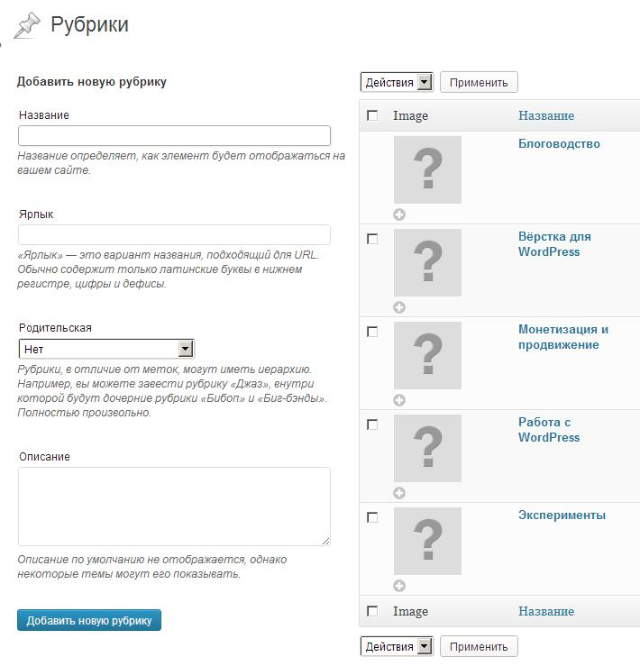
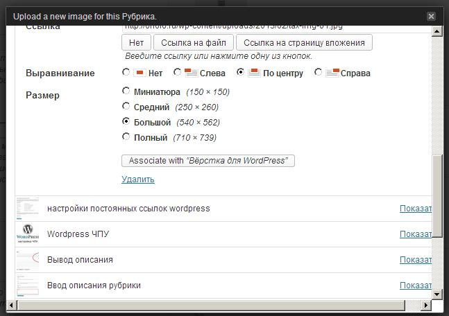

Недавно я писала о том, как [вывести список рубрик с описанием](http://oriolo.ru/wordpress/vyivod-spiska-rubrik-s-opisaniem/ "Вывод списка рубрик с описанием"), не используя плагины. Помните, я обещала, что покажу, как к списку, выводимому в том примере, добавить изображение рубрики? Так вот, этот пост будет именно том, как сделать вывод описаний и изображений рубрик на сайте.

## Добавляем изображения к рубрикам

Для реализации возможности прикрепления миниатюр изображений к рубрикам, понадобится плагин [Taxonomy Images](http://wordpress.org/extend/plugins/taxonomy-images/). Устанавливаем и активируем, как обычно. Затем переходим в "Параметры - Taxonomy Images" и ставим галочку напротив рубрик и\\или меток, в зависимости от того, к какой таксономии вы хотите добавить изображения.

После этого в настройках рубрик появятся специальные настройки, позволяющие прикрепить изображение.

[](http://oriolo.ru/wp-content/uploads/2013/02/tax-img-01.jpg)

При нажатии на плюсик, появляется окно, где можно загрузить или выбрать изображение и ассоциировать его с рубрикой.

[](http://oriolo.ru/wp-content/uploads/2013/02/tax-img-02.jpg)

Таким способом можно **добавить изображения к рубрикам**. Когда все изображения будут добавлены, можно переходить к следующему шагу - непосредственно выводу рубрик с прикрепленными к ним изображениями на сайте.

## Вывод изображения в списке рубрик

А теперь давайте немного модифицируем тот код, при помощи которого мы [вывели список рубрик с описанием](http://oriolo.ru/wordpress/vyivod-spiska-rubrik-s-opisaniem/ "Вывод списка рубрик с описанием"), добавив к нему возможность вывода изображения рубрики.

За вывод изображения рубрик здесь отвечает `taxonomy-images-get-terms`.

```php
/* вывод списка рубрик */
$args = array(
	'parent' => 0,
	'hide_empty' => 0,
	'exclude' => '', // ID рубрики, которую нужно исключить
	'number' => '0',
	'taxonomy' => 'category', // таксономия, для которой нужны изображения
	'pad_counts' => true
);
$catlist = get_categories($args); // получаем список рубрик
foreach($catlist as $categories_item)
	{
	// получаем данные из плагина Taxonomy Images
	$terms = apply_filters('taxonomy-images-get-terms', '', array(
		'taxonomy' => 'category' // таксономия, для которой нужны изображения
	));
	if (!empty($terms))
		{
		foreach((array)$terms as $term)
			{
			if ($term->term_id == $categories_item->term_id)
				{
				// выводим изображение рубрики
				print '<a href="' . esc_url(get_term_link($term, $term->taxonomy)) . '" title="Нажмите, чтобы перейти в рубрику">' . wp_get_attachment_image($term->image_id, 'thumbnail');
				echo '</a>';
				}
			}
		}
	// выводим описание и название рубрики
	echo "<li><a href=\"#\">" . $categories_item->cat_name . "</a><br /><span class=\"small-text\">" . $categories_item->category_description . "</span></li>";
	}
```

В строках 7 и 15 `'taxonomy' =&gt; 'category'` вместо category надо написать название таксономии, для которой вы хотите вывести изображения. Если это рубрики - то оставить без изменений, если метки - то написать `post_tag`, если пользовательская таксономия - то ее название, например, `portfolio`.

Итак, мы вывели список рубрик с описанием и изображением рубрики.

Теперь его можно оформить по вашему желанию при помощи CSS.
