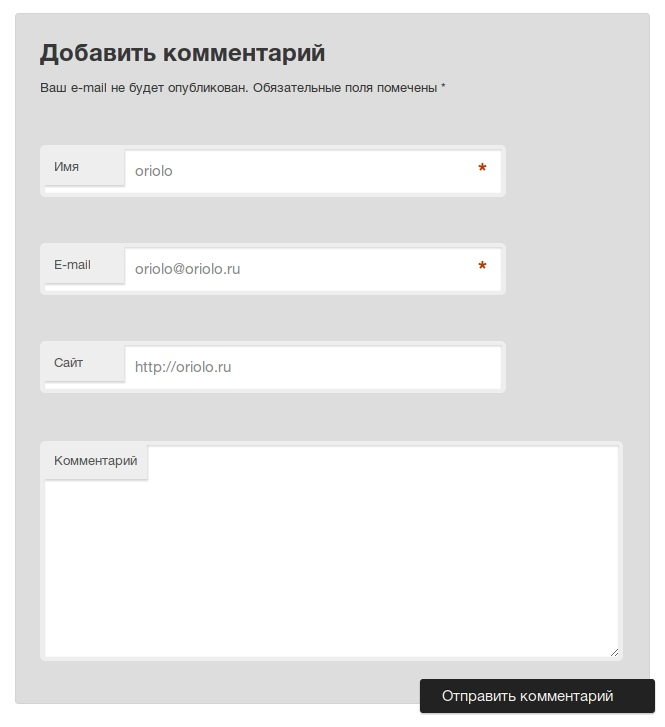

Привет всем читателям блога **"Записки о WordPress"**! Многие блогеры используют в качестве шаблона для своего блога стандартные Wordpress темы Twenty Eleven или Twenty Ten. Эти темы выбирают, потому что они стильные, красивые, минималистичные. Но вот форма комментирования выглядит громоздкой. В этой статье я расскажу, как **поменять вид формы комментирования** в теме Twenty Eleven.

Вот так форма комментирования в теме Twenty Eleven выглядит по-умолчанию. При нажатии на картинку можно посмотреть ее в 100% масштабе. Не кажется ли вам, что если сделать поля ввода "имя", "email" и "сайт" в одну строку, то форма станет намного компактнее?

[](http://oriolo.ru/wp-content/uploads/2012/01/screenshot_004.jpeg)

Конечно, про **изменение формы комментариев** писали уже много, но для современных тем, таких как Twenty Eleven и Twenty Ten, не подходят рекомендации для других, более старых тем.

### Шаг 1. Разбираем стандартный код формы

Вывод формы комментирования в теме Twenty Eleven осуществляется функцией `&lt;?php comment_form(); ?&gt;` из файла comments.php.

Стилизация осуществляется строками с 2039 по 2191 файла стилей.

Давайте с помощью FireBug посмотрим html-код формы комментариев:

[](http://oriolo.ru/wp-content/uploads/2012/02/screenshot_006.jpeg)

Как можно заметить, поля ввода `input` заключены внутрь тегов `p`. Именно эти теги нам и надо стилизовать.

### Шаг 2. Редактируем CSS

Сначала найдем и удалим ненужный код:

```css
#respond p {
	margin: 10px 0;
}
```

Теперь удалим отступы, добавив `margin: 0` для полей ввода. Установим ширину поля в 85% от ширины тега p, в котором оно находится. При необходимости, поменяйте высоту input'а.

```css
#respond input[type=text] {
	display: block;
	height: 24px;
	margin: 0;
	width: 85%;
}
```

Изменим ширину полей input до 30%, добавим следующий код после 2187 строки:

```css
p.comment-form-author,
p.comment-form-email,
p.comment-form-url {
	display: block;
	float: left;
	margin: 0 10px 0 5px;
	width: 30%;
}
```

Мы создали стили для полей ввода, задали для них обтекание по левому краю, установили ширину в 30%, и отступы между полями ввода.

Теперь форма комментирования выглядит почти как надо. Правда, лейбл "Комментарий" не на месте. Давайте это исправим.

### Шаг 3. Редактируем вывод формы комментариев

В файле comments.php найдите функцию `comment_form`, о которой я говорила в начале статьи. Замените ее на следующее:

```php
<?php comment_form (array (
'comment_field'=>'<div style="clear:both"></div><p class="comment-form-comment"><label for="comment">Комментарий</label><textarea id="comment" name="comment" cols="45" rows="8" aria-required="true"></textarea>'
)); ?>
```

Мы добавили div, сбрасывающий обтекание, перед выводом формы для текста комментария.

### Шаг 4. Последние штрихи

Давайте немного изменим положение звездочки, которая указывает на обязательные поля:

```css
#respond .comment-form-author .required,
#respond .comment-form-email .required {
	color: #bd3500;
	font-size: 22px;
	font-weight: bold;
	left: 90%;
	position: absolute;
	top: 40px;
	z-index: 1;
}
```

### Новый стиль формы комментариев в Twenty Eleven

В итоге, у вас должно было получиться примерно следующее:

[](http://oriolo.ru/wp-content/uploads/2012/02/screenshot_0071.jpeg)

Получившаяся форма будет одинаково отображаться в всех браузерах, а также изменять свой размер при изменении размера окна браузера.

Полный **CSS код формы комментариев**, который у меня получился, привожу ниже:

```css
/* Comment Form */
#respond {
	background: #ddd;
	border: 1px solid #d3d3d3;
	-moz-border-radius: 3px;
	border-radius: 3px;
	margin: 0 auto 1.625em;
	padding: 1.625em;
	position: relative;
	width: 68.9%;
}
#respond input[type="text"],
#respond textarea {
	background: #fff;
	border: 4px solid #eee;
	-moz-border-radius: 5px;
	border-radius: 5px;
	-webkit-box-shadow: inset 0 1px 3px rgba(204,204,204,0.95);
	-moz-box-shadow: inset 0 1px 3px rgba(204,204,204,0.95);
	box-shadow: inset 0 1px 3px rgba(204,204,204,0.95);
	position: relative;
	padding: 10px;
	text-indent: 80px;
}
#respond .comment-form-author,
#respond .comment-form-email,
#respond .comment-form-url,
#respond .comment-form-comment {
	position: relative;
}
#respond .comment-form-author label,
#respond .comment-form-email label,
#respond .comment-form-url label,
#respond .comment-form-comment label {
	background: #eee;
	-webkit-box-shadow: 1px 2px 2px rgba(204,204,204,0.8);
	-moz-box-shadow: 1px 2px 2px rgba(204,204,204,0.8);
	box-shadow: 1px 2px 2px rgba(204,204,204,0.8);
	color: #555;
	display: inline-block;
	font-size: 13px;
	left: 4px;
	min-width: 50px;
	padding: 4px 10px;
	position: relative;
	top: 40px;
	z-index: 1;
}
#respond input[type="text"]:focus,
#respond textarea:focus {
	text-indent: 0;
	z-index: 1;
}
#respond textarea {
	resize: vertical;
	width: 95%;
}
#respond .comment-form-author .required,
#respond .comment-form-email .required {
	color: #bd3500;
	font-size: 22px;
	font-weight: bold;
	left: 90%;
	position: absolute;
	top: 40px;
	z-index: 1;
}
#respond .comment-notes,
#respond .logged-in-as {
	font-size: 13px;
}
#respond .form-submit {
	float: right;
	margin: -20px 0 10px;
}
#respond input#submit {
	background: #222;
	border: none;
	-moz-border-radius: 3px;
	border-radius: 3px;
	-webkit-box-shadow: 0px 1px 2px rgba(0,0,0,0.3);
	-moz-box-shadow: 0px 1px 2px rgba(0,0,0,0.3);
	box-shadow: 0px 1px 2px rgba(0,0,0,0.3);
	color: #eee;
	cursor: pointer;
	font-size: 15px;
	margin: 20px 0;
	padding: 5px 42px 5px 22px;
	position: relative;
	left: 30px;
	text-shadow: 0 -1px 0 rgba(0,0,0,0.3);
}
#respond input#submit:active {
	background: #1982d1;
	color: #bfddf3;
}
#respond #cancel-comment-reply-link {
	color: #666;
	margin-left: 10px;
	text-decoration: none;
}
#respond .logged-in-as a:hover,
#respond #cancel-comment-reply-link:hover {
	text-decoration: underline;
}
.commentlist #respond {
	margin: 1.625em 0 0;
	width: auto;
}
#reply-title {
	color: #373737;
	font-size: 24px;
	font-weight: bold;
	line-height: 30px;
}
#cancel-comment-reply-link {
	color: #888;
	display: block;
	font-size: 10px;
	font-weight: normal;
	line-height: 2.2em;
	letter-spacing: 0.05em;
	position: absolute;
	right: 1.625em;
	text-decoration: none;
	text-transform: uppercase;
	top: 1.1em;
}
#cancel-comment-reply-link:focus,
#cancel-comment-reply-link:active,
#cancel-comment-reply-link:hover {
	color: #ff4b33;
}
#respond label {
	line-height: 2.2em;
}
#respond input[type=text] {
	display: block;
	height: 24px;
	margin: 0;
	width: 85%;
}
#respond p {
	font-size: 12px;
}
p.comment-form-comment {
	margin: 0;
}
p.comment-form-author,
p.comment-form-email,
p.comment-form-url {
	display: block;
	float: left;
	margin: 0 10px 0 5px;
	width: 30%;
}
.form-allowed-tags {
	display: none;
}
```

Может, вы также захотите [поменять форму поиска](http://oriolo.ru/wordpress/krasivaya-forma-poiska-dlya-bloga/ "Красивая форма поиска для блога") в своем блоге?

Если возникли вопросы, пишите, я обязательно отвечу!
