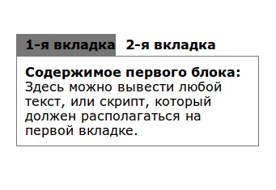

Во многих популярных темах для WordPress виджеты в сайдбаре оформлены во вкладках: это удобно, красиво, функционально, и, к тому же, позволяет экономить место и размещать большое количество информации одновременно. Поэтому не удивительно, что создано большое количество плагинов, позволяющих выводить **виджеты во вкладках** . Однако у большинства плагинов есть существенный недостаток. Они не позволяют создать два и более блоков с вкладками. Поэтому в сегодняшнем посте я расскажу, как сделать вкладки в сайдбаре без плагина.



[Демо](http://oriolo.ru/demo/vkladki/ "Демо")

## Шаг 1. Подготовка. Вывод php в сайдбаре

Выводить вкладки мы будем при помощи обычных текстовых виджетов, в которых поместим PHP-код. Так что на первом этапе нам необходимо разрешить **вывод php в сайдбаре**, если вы не сделали это раньше. Добавляем в файл функций темы такой код:

```
/* Разрешаем PHP в виджетах */
add_filter('widget_text','sp_widget_execute_php',100);
function sp_widget_execute_php($text) {
    if(strpos($text,'<?') !== false) {
        ob_start();
        eval('?>'.$text);
        $text = ob_get_contents();
        ob_end_clean();
    }
    return $text;
}
```

Добавить его можно в самом низу файла functions.php, либо там, где вам удобнее.

## Шаг 2. Подключение скрипта

Теперь необходимо подключить к вашему сайту jQuery, если вы это еще не сделали. Добавляем в между тегами head строку:

```
<script type="text/javascript" src="http://ajax.googleapis.com/ajax/libs/jquery/1.9.0/jquery.min.js?ver=1.9.0"></script>
```

После этого, надо создать сам скрипт переключения вкладок. Создаем пустой файл с любым названием и расширением .js следующего содержания:

```
(function($) {
$(function() {

  $('ul.tabs').delegate('li:not(.current)', 'click', function() {
    $(this).addClass('current').siblings().removeClass('current')
      .parents('div.section').find('div.box').eq($(this).index()).fadeIn(150).siblings('div.box').hide();
  })

})
})(jQuery)
```

И закачиваем файл по FTP на свой сайт. После этого подключаем скрипт к сайту:

```
<script type="text/javascript" src="http://ваш-сайт.ру/путь-к-скрипту/ваш-скрипт.js"></script>
```

## Шаг 3. Вывод вкладок

Ну, а теперь можно перейти к самому интересному, то есть непосредственно выводу вкладок с виджетами и их стилизацией через CSS! Зайдите в настройки виджетов в админке вордпресса, и разместите виджет "Текст" в сайдбаре там, где вы хотите вывести вкладки. В виджете необходимо разместить код:

```
<div class="section">
  <ul class="tabs">
    <li class="current">1-я вкладка</li>
    <li>2-я вкладка</li>
  </ul>
  <div class="box visible">
    Содержимое первого блока
  </div>
  <div class="box">
    Содержимое второго блока
  </div>
</div><!-- .section -->
```

Также необходимо дополнить файл стилей:

```
/* Вкладки в сайдбаре */
.box {
display: none; /* по умолчанию прячем все блоки */
border: 1px solid #777;
padding: 10px;
}
.box.visible {
display: block; /* по умолчанию показываем нужный блок */
border: 1px solid #777;
padding: 10px;
}
ul.tabs {
height: 27px;
background: #FFF;
border: none;
margin: -4px -4px 0 !important;
padding: 0 4px;
overflow: hidden;
list-style: none;
}
.tabs li.current {
background: #777;
}
.tabs li {
float: left;
line-height: 27px;
margin: 0 1px 0 0;
padding: 0 0 0 11px;
font-weight: bold;
cursor: pointer;
border: none;
}
.tabs li.current span {
color: #FFF;
}
.tabs li span {
float: left;
padding: 0 11px 0 0;
height: 27px;
color: #777;
}

```

## Шаг 4. Добавление виджетов во вкладки

Сейчас давайте определим, какие вкладки мы будем выводить. В соответствии с этим, может понадобится внести дополнительные изменения в файл функций. Чтобы не повторяться, приведу ссылки на несколько руководств:

- [Вывод последних постов](http://wp-kama.ru/id_80/funktsiya-dlya-vyivoda-poslednih-zapisey-v-wordpress.html)
- [Вывод популярных постов](http://wp-kama.ru/id_101/funktsiya-vyivoda-zapisey-po-kolichestvu-prosmotrov.html)
- [Вывод последних комментариев](http://wp-kama.ru/id_29/funktsiya-dlya-vyivoda-poslednih-kommentariev.html)
- [Вывод списка активных комментаторов](http://paperplane.su/top-kommentatorov-bez-plagina-v-wordpress/)

Теперь, если, например, нужно создать виджет, который будет называться "Посты" и иметь две вкладки, "Последние" и "Популярные", нужно дописать в текстовом виджете:

```
<div class="section">
  <ul class="tabs">
    <li class="current">Последние</li>
    <li>Популярные</li>
  </ul>
  <div class="box visible">
    <ul>  
      <?php kama_recent_posts (10); ?>  
    </ul> 
  </div>
  <div class="box">
    <ul>  
     <?php kama_get_most_viewed("num=10"); ?>  
    </ul>  
  </div>
</div><!-- .section -->
```

А чтобы вывести список рубрик, никаких изменений делать не надо, достаточно между <div class="box"></div> вставить такой код:

```
<?php wp_list_categories('orderby=name&show_count=1&title_li=0'); ?>
```

Кстати, перед добавлением, не забудьте провести [оптимизацию заголовков виджетов](http://oriolo.ru/wordpress/optimizatsiya-zagolovkov-vidzhetov-v-shablone-wordpress/)!

Следует добавить, что описанным способом можно создать какое угодно количество виджетов - надо просто создать новый текстовый виджет и скопировать в него код. Как видите, в том, чтобы создать виджеты с вкладками, нет ничего сложного ;)
