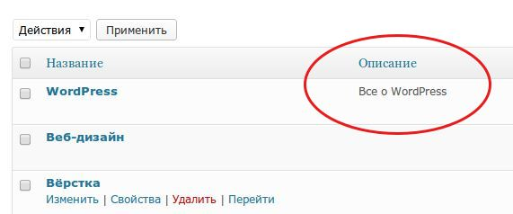

Всем привет! Сегодня я расскажу, как **вывести список рубрик с описанием**, используя стандартные возможности WordPress, то есть, без плагина. Приведенный пример можно будет использовать, например, при создании сайдбара для темы, или страниц различных каталогов.

Вывод списка рубрик будет ощуществляться при помощи функции `get_categories`.

В данном примере я буду работать со следующими параметрами функции

- **parent** - Если здесь установить 0, то будут выведены только родительские рубрики верхнего уровня. Если оставить пустым, то выведутся все рубрики.
- **hide\_empty** - скрывать или нет рубрики, в которых нет постов. По-умолчанию, скрывать (1).
- **exclude** - ID рубрик, которые не надо включать в список. Если необходимо отображать только некоторые рубрики, то замените этот параметр на include. По-умолчанию, пустое значение (отображать все рубрики)
- **number** - количество рубрик, которые будут выводиться. Значение 0 означает выводить все рубрики.
- **taxonomy** - Таксономия, которую будем выводить. По-умолчанию, имеет значение category. Если вы хотите вывести список меток, то используйте значение post\_tag.
- **pad\_counts** - Показывать или нет количество постов в рубрике. Значение false (не показывать) по-умолчанию.

Об остальных параметрах функции можно почитать [здесь](http://wp-kama.ru/function/get_categories).

За вывод описания рубрик отвечает функция `category_description`.

А теперь давайте создадим **список рубрик с описанием**. Этот код нужно вставить в то место шаблона, где вы хотите вывести рубрики:

```
/* вывод списка рубрик */
$args = array(
	'parent'                   => 0,
	'hide_empty'               => 0,
	'exclude'                  => '21',
	'number'                   => '0',
	'taxonomy'                 => 'category',
	'pad_counts'               => true );

$catlist = get_categories($args);
foreach ($catlist as $categories_item) {
	echo "<li><a href=\"#\">" . $categories_item->cat_name . "</a><br><span class=\"small-text\">" . $categories_item->category_description . "</span></li>";
} 
```

В этом примере выводятся только родительские рубрики, даже если в них не содержатся записи, за исключением рубрики с ID=21, и возле каждой рубрики отображается количество записей в ней. Ниже рубрики выводится текст ее описания.

Обратите внимание, что для того, чтобы приведенный код работал, нужно, чтобы у вас было заполнено описание рубрики на странице редактирования рубрик:



Если у вас есть какие-то вопросы, спрашивайте в комментариях. Кстати, скоро я напишу о том, как создать изображение-миниатюру для рубрики, и вывести его вместе с описанием. Так что подписывайтесь на обновления ;)
