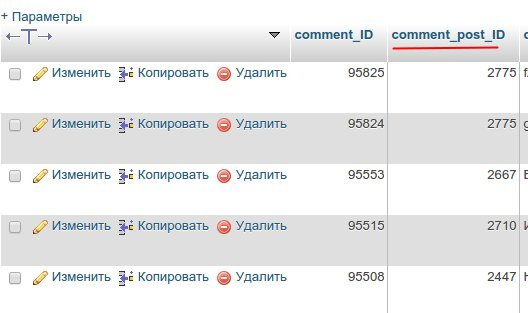
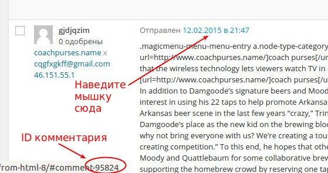

Бывает, что посетители блога по ошибке оставляют комментарий к другому посту. Сегодня я расскажу, как можно решить эту проблему, и **переместить комментарий из одного поста в другой**.

Есть два варианта, и оба они сводятся к тому, что необходимо изменить ID связанного поста в базе данных.

### Cпособ 1. Правка базы данных вручную

При помощи phpMyAdmin, нужно зайти в таблицу wp\_comments, найти там нужный комментарий, и изменить ID записи в ячейке в столбце comment\_post\_ID:

Чтобы узнать ID комментария, нужно навести в списке комментариев в Консоли курсор на дату комментария, см. на скриншоте:

Аналогичным способом можно узнать ID поста в WordPress.

Остается только заменить в базе ID поста, к которому привязан комментарий сейчас, на ID того поста, куда вы хотите перенести комментарий.

### Cпособ 2. Использование плагина Tako Movable Comments

Для тех, кто не хочет заморачиваться с правкой базы, или боится сделать там ошибку, существует специальный плагин, который позволяет переносить комментарии в другие посты. Плагин называется **[Tako Movable Comments](https://wordpress.org/plugins/tako-movable-comments/)**. Он поддерживает функции автоподстановки поста по названию и массовый перенос комментариев в другую запись. Также есть возможность перемещать комментарии не только в пост, но и в любой другой тип записи (страница или custom post type).

После установки плагина, в Консоли на странице Комментарии, в выпадающем списке "Действия" появится пункт "Move Comments", который позволяет применять действия массово к нескольким комментариям. А на странице редактирования комментария снизу добавится метабокс "Move Comments with Tako", при помощи которого быстро и легко можно переместить текущий комментарий в любую запись, которая есть в блоге.

А вы когда-нибудь переносили комментарии в WordPress в другую запись?
